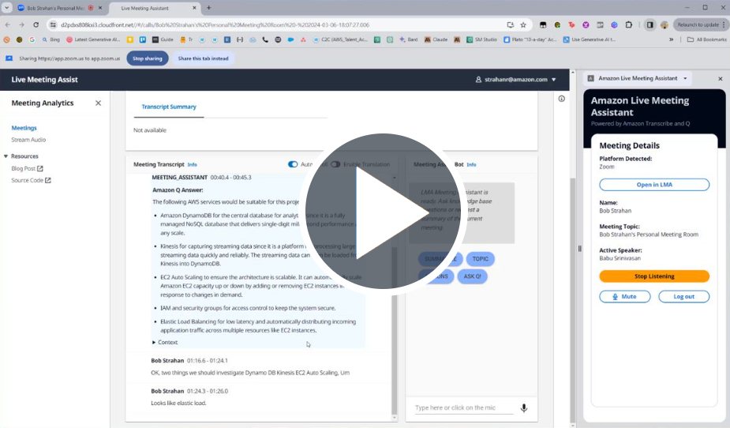
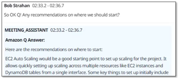

# Live Meeting Assistant (LMA) with Amazon Transcribe, Amazon Q Business Expert, and Amazon Bedrock 

_Companion AWS blog post: [Live meeting assist with Amazon language AI services](http://www.amazon.com/live-meeting-assist)_

_See [CHANGELOG](./CHANGELOG.md) for latest features and fixes._

## Introduction

I'm sure you've experienced the challenge of taking notes during a meeting while still paying attention to the conversation. And the need to quickly fact-check something that's been said, or look up information to answer a question that's just been asked in the call. And sometimes your boss joins the meeting late, and pings you on chat for a quick 'catchup' summary. 

Then are the times that everyone is talking in a language that's not your first language, and you'd love to have a live translation of what people are saying to make sure you're understanding correctly.

And, after the call is over, you usually want to capture a summary for your records, or to email to the participants, with a list of all the action items, owners, and due dates. 

All of this, and more, is now possible with our newest sample solution, Live Meeting Assistant (LMA). 

Here's a demo to whet your appetite: *(currently internal, on Broadcast)*

## Solution overview

The Live Meeting Assistant (LMA) sample solution captures speaker audio and metadata from your browser-based meeting app (Zoom for now, Chime, Teams coming), and uses [Amazon Transcribe](https://aws.amazon.com/transcribe/) for speech to text, [Amazon Q business expert](https://aws.amazon.com/q/business-expert/) for contextual queries against your company's documents and knowledge sources, and [Amazon Bedrock](https://aws.amazon.com/bedrock/) for customizable transcription insights and summaries. 

Everything you need is provided as open source in our [GitHub repo TBD](link). And it's easy to deploy in your AWS account - we will show you how. When you’re done, you’ll wonder how you ever managed without it!

Here are some of the things it can do:

- **Live transcription with speaker attribution** - powered by Amazon Transcribe's world class ASR models for low latency, high accuracy speech to text. You can easily teach it new vocabulary and domain specific language if needed using Transcribe's Custom Vocabulary and Custom Language model features - though the base models are so good that this is rarely needed.
  

- **Live translation** - uses Amazon Translate to optionally show each segment of the conversation translated into your choice language from a selection of around 75 languages.
  

- **Context aware meeting assistant "Q"** - uses Amazon Q business expert to provide answers from your trusted sources, using the live transcript as context for fact checking and follow-up questions. Saying *OK Q!*, or click the *Ask Q* button, or type your own question in the UI.
  

- **Ad Hoc summaries of the meeting** - click a button on the UI to generate a summary on demand - very handy when someone joins late and needs to get caught up. The summaries are generated from the transcript by Amazon Bedrock. You can easily try different models and prompts. LMA also provides easy buttons for identifying the current meeting topic, and for generating a list of action items with owners and due dates. You can easily create your own custom prompts and corresponding buttons.
  

- **Automated summary and insights** - when the meeting has ended, LMA automatically runs a set of LLM prompts on bedrock to summarize the meeting transcript and extract insights. Of course you can also easily customize these prompts too.
  

- **Meeting Recording** - the audio is (optionally) stored for you so you can replay important sections on the meeting later.
  

- **Inventory list of meetings** - LMA keeps track of all your meetings in a handy searchable list
  

- **Browser extension captures audio and meeting metadata from popular meeting apps** - an easy to install browser extension captures meeting metadata and audio from you (your microphone) and others (from the meeting browser tab). Browsers supported: Chrome (Firefox coming soon). Meeting Apps supported: Zoom (Chime and Teams coming soon). *Standalone meeting apps don't work with LMA - instead launch your meetings in the browser.*
  

## Prerequisites

You need to have an AWS account and an [AWS Identity and Access Management](https://aws.amazon.com/iam/) (IAM) role and user with permissions to create and manage the necessary resources and components for this application. If you don’t have an AWS account, see [How do I create and activate a new Amazon Web Services account?](https://aws.amazon.com/premiumsupport/knowledge-center/create-and-activate-aws-account/)

You also need to have an existing, working Amazon Q business expert application. If you haven’t set one up yet, see [Creating an Amazon Q application](https://docs.aws.amazon.com/amazonq/latest/business-use-dg/create-app.html). Populate your Amazon Q business expert knowledgebase with content to fuel LMA's context aware meeting assistant, "OK Q!". 

Finally, LMA uses Amazon Bedrock LLM models for its meeting summarization features. Before proceeding, if you have not previously done so, you must request access to the following Amazon Bedrock models – see [Amazon Bedrock Model Access](https://docs.aws.amazon.com/bedrock/latest/userguide/model-access.html):
- Titan Embeddings G1 – Text
- Anthropic:  All Claude models

## Deploy the CloudFormation stack

We’ve provided pre-built [AWS CloudFormation](http://aws.amazon.com/cloudformation) templates that deploy everything you need in your AWS account.

If you’re a developer and you want to build, deploy, or publish the solution from code, refer to the [Developer README](./README_DEVELOPERS.md).

Complete the following steps to launch the CloudFormation stack:

1. Log in to the [AWS Management Console](https://console.aws.amazon.com/).
1. Choose one of the following **Launch Stack** buttons for your desired AWS Region to open the AWS CloudFormation console and create a new stack.  

   Region | Easy Deploy Button | Template URL - use to upgrade existing stack to a new release  
   --- | --- | ---
   N. Virginia (us-east-1) |  | https://s3.us-east-1.amazonaws.com/bobs-artifacts-us-east-1/lma-prerelease-share/lma-main.yaml

1. For **Stack name**, use the default value, `LMA`.
1. For **Admin Email Address**, use a valid email address—your temporary password is emailed to this address during the deployment.
1. For **Authorized Account Email Domain**, use the domain name part of your corporate email address to allow users with email addresses in the same domain to create their own new UI accounts, or leave blank to prevent users from directly creating their own accounts.
1. For **Meeting Assist Amazon Q Business Application Id (existing)**, enter your existing Amazon Q business expert application ID (for example, 80xxxxx9-7xx3-4xx0-bxx4-5baxxxxx2af5). You can copy it from the Amazon Q business expert console.
1. For **all other parameters**, use the default values. If you want to customize the settings later, for example to add your own lambda functions, to use  custom vocabularies and language models to improve accuracy, enable PII redaction, and more, you can update the stack for these parameters.
1. Check the acknowledgement boxes, and choose Create stack.

The main CloudFormation stack uses nested stacks to create the following resources in your AWS account:

- S3 buckets to hold build artifacts and call recordings
- An [AWS Fargate](https://aws.amazon.com/fargate/) task with an [Application Load Balancer](https://aws.amazon.com/elasticloadbalancing/application-load-balancer/) providing a websocket server running code to consume stereo audio streams and relay to Amazon Transcribe, publish transcription segments in Kinesis Data Streams, and create and store stereo call recordings.
- [Amazon Kinesis Data Stream](https://aws.amazon.com/kinesis/data-streams/) to relay call events and transcription segments to the enrichment processing function.
- Meeting assist resources including the [QnABot on AWS solution](https://aws.amazon.com/solutions/implementations/aws-qnabot/) stack which interacts with [Amazon OpenSearch service](https://aws.amazon.com/opensearch-service/), Amazon Q business expert and Amazon Bedrock.
- [AWS AppSync API](https://aws.amazon.com/appsync), which provides a GraphQL endpoint to support queries and real-time updates
- Website components including S3 bucket, [Amazon CloudFront](https://aws.amazon.com/cloudfront/) distribution, and [Amazon Cognito](https://aws.amazon.com/cognito) user pool
- A downloadable pre-configured browser extension application for Chrome browsers.
- Other miscellaneous supporting resources, including [AWS Identity and Access Management](https://aws.amazon.com/iam/) (IAM) roles and policies (using least privilege best practices), [Amazon - Virtual Private Cloud](https://aws.amazon.com/vpc) (Amazon VPC) resources, [Amazon EventBridge](https://aws.amazon.com/eventbridge/) event rules, and [Amazon CloudWatch](https://aws.amazon.com/cloudwatch) log groups.

The stacks take about 35-40 minutes to deploy. The main stack status shows CREATE_COMPLETE when everything is deployed.

## Set your password
After you deploy the stack, you need to open the LMA web user interface and set your password.
  
1. On the AWS CloudFormation console, choose the main stack, LMA, and choose the **Outputs** tab.

    

  
1. Open your web browser to the URL shown as CloudfrontEndpoint in the outputs.  
   You’re directed to the login page.

     

1. Open the email your received, at the email address you provided, with the subject “Welcome to Live Call Analytics!”  
This email contains a generated temporary password that you can use to log in and create your own password. Your username is your email address.

1. Set a new password.  
Your new password must have a length of at least eight characters, and contain uppercase and lowercase characters, plus numbers and special characters.
  
Follow the directions to verify your email address, or choose **Skip** to do it later.

You’re now logged in to LMA.

## Download and install the Chrome browser extension

For the best meeting streaming experience, install the LMA browser plugin - currently available for Chrome.

1. Choose **Download Chrome Extension** to download the browser extension zip file (`lma-chrome-extension.zip`) 

    

1. Right click and expand the zip file (`lma-chrome-extension.zip`) to create a local folder named `lma-chrome-extension`.

1. Open Chrome and paste the link [chrome://extensions](chrome://extensions) into the address bar. 

    

1. Choose **Load unpacked**, navigate to the `lma-chrome-extension` folder (which you unzipped from the download), and click select.  This loads your extension.

1. Pin the new LMA extension to the browser tool bar as shown below. You will use it often to stream your meetings.

    

## Start using LMA!

Let's try it with a Zoom call. 

1. Open the LMA extension and login with your LMA credentials.

   
   
1. Join or start a Zoom meeting in your web browser (*do not use the separate Zoom client*). If you already have the Zoom meeting page loaded, please reload it.

   

   The LMA extension automatically detects that Zoom is running in the browser tab, and populates your name and the meeting name. 

   
   
1. Select **Start Listening**.  Choose **Allow** on the popup asking you to share the browser tab.

    The LMA extension automatically detects and displays the active speaker on the call. If you are alone in the meeting, invite some friends to join, and observe that the names they used to join the call are displayed in the extension when they speak, and attributed to their words in the LMA transcript.

   
 
1. Choose **Open in LMA** to see your live transcript in a new tab. Select your preferred transcript language, and interact with the meeting assistant using the wake phrase *"OK Q!"* and/or the **Meeting Assist Bot** panel on the right.

   

1. When you are done, choose **Stop Streaming** to end the meeting in LMA. Within a few seconds the automated end-of-meeting summaries appear, and the audio recording becomes available. You can continue to use the Meeting Assist Bot.

   

## Processing flow overview

How did LMA transcribe and analyze your meeting? Let’s take a quick look at how it works.

The following diagram shows the main architectural components and how they fit together at a high level.

TBC

## Monitoring and troubleshooting

TBC

## Cost assessment

TBC

## Customize your deployment

TBC

## Update an existing LMA stack

TBC

## Clean Up

Congratulations! :tada: You have completed all the steps for setting up your live call analytics sample solution using AWS services.

**To make sure you are not charged for any unwanted services, you can clean up by deleting the stack created in the _Deploy_ section and its resources.**

When you’re finished experimenting with this sample solution, clean up your resources by using the AWS CloudFormation console to delete the LMA stacks that you deployed. This deletes resources that were created by deploying the solution. The recording S3 buckets, the DynamoDB table and CloudWatch Log groups are retained after the stack is deleted to avoid deleting your data.

[(Back to top)](#overview)

## Live Call Analytics: Companion solution

Our companion solution, [Live Call Analytics and Agent Assist](https://www.amazon.com/live-call-analytics) (LCA), offers real-time transcription and analytics for contact centers (phone calls) rather than meetings. There are many similarities - in fact LMA has been built using an architecture and many components derived from LCA.

## Conclusion

TBC

## Contributing

Your contributions are always welcome! Please have a look at the [contribution guidelines](CONTRIBUTING.md) first. :tada:

[(Back to top)](#overview)

## Security

See [CONTRIBUTING](CONTRIBUTING.md#security-issue-notifications) for more information.

[(Back to top)](#overview)

## License Summary

This sample code is made available under the Apache-2.0 license. See the [LICENSE](LICENSE.txt) file.

[(Back to top)](#overview)
