# Live Meeting Assistant (LMA) with Amazon Transcribe, Amazon Bedrock, and Knowledge Bases for Amazon Bedrock 

_Companion AWS blog post: [Live Meeting Assistant with Amazon Transcribe, Amazon Bedrock, and Knowledge Bases for Amazon Bedrock](http://www.amazon.com/live-meeting-assistant)_

_See [CHANGELOG](./CHANGELOG.md) for latest features and fixes._

## Introduction

You’ve likely experienced the challenge of taking notes during a meeting while trying to pay attention to the conversation. You’ve probably also experienced the need to quickly fact-check something that’s been said, or look up information to answer a question that’s just been asked in the call. Or maybe you have a team member that always joins meetings late, and expects you to send them a quick summary over chat to catch them up.  

Then there are the times that others are talking in a language that’s not your first language, and you’d love to have a live translation of what people are saying to make sure you understand correctly.  

And after the call is over, you usually want to capture a summary for your records, or to send to the participants, with a list of all the action items, owners, and due dates.  

All of this, and more, is now possible with our newest sample solution, Live Meeting Assistant (LMA).  

Check out the following demo to see how it works.

https://github.com/aws-samples/amazon-transcribe-live-meeting-assistant/assets/10953374/d5979569-c99c-4141-be56-9f436b48b0ec

## Solution overview

The Live Meeting Assistant (LMA) sample solution captures speaker audio and metadata from your browser-based meeting app (Zoom and Chime currently), or audio only from any other browser-based meeting app, softphone or audio source. It uses [Amazon Transcribe](https://aws.amazon.com/transcribe/) for speech to text, [Knowledge Bases for Amazon Bedrock](https://aws.amazon.com/bedrock/knowledge-bases/) for contextual queries against your company's documents and knowledge sources, and [Amazon Bedrock](https://aws.amazon.com/bedrock/) for customizable transcription insights and summaries. 

Everything you need is provided as open source in this [GitHub repo](https://github.com/aws-samples/amazon-transcribe-live-meeting-assistant). It’s straightforward to deploy in your AWS account. When you’re done, you’ll wonder how you ever managed without it!

The following are some of the things LMA can do:

- **Live transcription with speaker attribution** - LMA is powered by Amazon Transcribe ASR models for low-latency, high-accuracy speech to text. You can teach it brand names and domain-specific terminology if needed, using custom vocabulary and custom language model features in Amazon Transcribe.
   
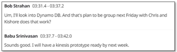

- **Live translation** - It uses Amazon Translate to optionally show each segment of the conversation translated into your language of choice, from a selection of 75 languages.
  
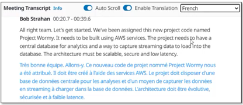

- **Context aware meeting assistant** - It uses Knowledge Bases for Amazon Bedrock to provide answers from your trusted sources, using the live transcript as context for fact-checking and follow-up questions. To activate the assistant, just say “*Okay, Assistant*,” choose the **ASK ASSISTANT!** button, or enter your own question in the UI.
  

- **On demand summaries of the meeting** - With the click of a button on the UI, you can generate a summary, which is useful when someone joins late and needs to get caught up. The summaries are generated from the transcript by Amazon Bedrock. LMA also provides options for identifying the current meeting topic, and for generating a list of action items with owners and due dates. You can also create your own custom prompts and corresponding options.
  

- **Automated summary and insights** - When the meeting has ended, LMA automatically runs a set of large language model (LLM) prompts on Amazon Bedrock to summarize the meeting transcript and extract insights. You can customize these prompts as well.
  

- **Meeting Recording** - The audio is (optionally) stored for you, so you can replay important sections on the meeting later.
  
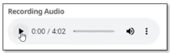

- **Inventory list of meetings** - LMA keeps track of all your meetings in a searchable list.
  
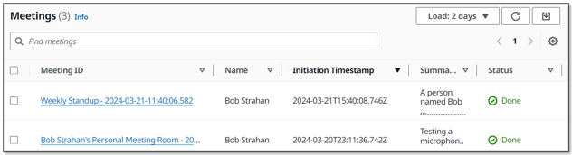

- **Browser extension captures audio and meeting metadata from popular meeting apps** - The browser extension captures meeting metadata — the meeting title and names of active speakers — and audio from you (your microphone) and others (from the meeting browser tab). As of this writing, LMA supports Chrome for the browser extension, and Zoom and Chime for meeting apps (with Teams and WebEx coming soon). *Standalone meeting apps don’t work with LMA — instead, launch your meetings in the browser.*
  
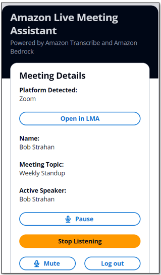

You are responsible for complying with legal, corporate, and ethical restrictions that apply to recording meetings and calls. Do not use this solution to stream, record, or transcribe calls if otherwise prohibited.

## Prerequisites

You need to have an AWS account and an [AWS Identity and Access Management](https://aws.amazon.com/iam/) (IAM) role and user with permissions to create and manage the necessary resources and components for this application. If you don’t have an AWS account, see [How do I create and activate a new Amazon Web Services account?](https://aws.amazon.com/premiumsupport/knowledge-center/create-and-activate-aws-account/)

You also need to have an existing, working, Knowledge Base of Amazon Bedrock. If you haven’t set one up yet, see [Create a knowledge base](https://docs.aws.amazon.com/bedrock/latest/userguide/knowledge-base-create.html). Populate your knowledge base with content to power LMA’s context aware meeting assistant. 

Finally, LMA uses Amazon Bedrock LLM models for its meeting summarization features. Before proceeding, if you have not previously done so, you must [request access](https://docs.aws.amazon.com/bedrock/latest/userguide/model-access.html) to the following Amazon Bedrock models:
- Titan Embeddings G1 – Text
- Anthropic:  All Claude models

## Deploy the CloudFormation stack

We’ve provided pre-built [AWS CloudFormation](http://aws.amazon.com/cloudformation) templates that deploy everything you need in your AWS account.

If you’re a developer and you want to build, deploy, or publish the solution from code, refer to the [Developer README](./README_DEVELOPERS.md).

Complete the following steps to launch the CloudFormation stack:

1. Log in to the [AWS Management Console](https://console.aws.amazon.com/).
1. 2.	Choose Launch Stack for your desired AWS Region to open the AWS CloudFormation console and create a new stack.  

   Region | Easy Deploy Button  
   --- | --- 
   US East (N. Virginia) |  

1. For **Stack name**, use the default value, `LMA`.
1. For **Admin Email Address**, use a valid email address—your temporary password is emailed to this address during the deployment.
1. For **Authorized Account Email Domain**, use the domain name part of your corporate email address to allow users with email addresses in the same domain to create their own new UI accounts, or leave blank to prevent users from directly creating their own accounts. You can enter multiple domains as a comma separated list.
1. For **MeetingAssistService** choose BEDROCK_KNOWLEDGE_BASE (currently the only available option!)  
1. For **Meeting Assist Bedrock Knowledge Base Id (existing)**, enter your existing Knowledge base ID (for example, JSXXXXX3D8). You can copy it from the Amazon Bedrock Knowledge bases console.
    

1. For **all other parameters**, use the default values. If you want to customize the settings later, for example to add your own lambda functions, to use  custom vocabularies and language models to improve accuracy, enable PII redaction, and more, you can update the stack for these parameters.
1. Check the acknowledgement boxes, and choose Create stack.

The main CloudFormation stack uses nested stacks to create the following resources in your AWS account:

- •	[Amazon Simple Storage Service](http://aws.amazon.com/s3) (Amazon S3) to hold build artifacts and call recordings
- An [AWS Fargate](https://aws.amazon.com/fargate/) task with an [Application Load Balancer](https://aws.amazon.com/elasticloadbalancing/application-load-balancer/) providing a websocket server running code to consume stereo audio streams and relay to Amazon Transcribe, publish transcription segments in Kinesis Data Streams, and create and store stereo call recordings.
- [Amazon Kinesis Data Stream](https://aws.amazon.com/kinesis/data-streams/) to relay call events and transcription segments to the enrichment processing function.
- Meeting assist resources including the [QnABot on AWS solution](https://aws.amazon.com/solutions/implementations/aws-qnabot/) stack which interacts with [Amazon OpenSearch service](https://aws.amazon.com/opensearch-service/) and Amazon Bedrock.
- [AWS AppSync API](https://aws.amazon.com/appsync), which provides a GraphQL endpoint to support queries and real-time updates
- Website components including S3 bucket, [Amazon CloudFront](https://aws.amazon.com/cloudfront/) distribution, and [Amazon Cognito](https://aws.amazon.com/cognito) user pool
- A downloadable pre-configured browser extension application for Chrome browsers.
- Other miscellaneous supporting resources, including [AWS Identity and Access Management](https://aws.amazon.com/iam/) (IAM) roles and policies (using least privilege best practices), [Amazon - Virtual Private Cloud](https://aws.amazon.com/vpc) (Amazon VPC) resources, [Amazon EventBridge](https://aws.amazon.com/eventbridge/) event rules, and [Amazon CloudWatch](https://aws.amazon.com/cloudwatch) log groups.

The stacks take about 35-40 minutes to deploy. The main stack status shows CREATE_COMPLETE when everything is deployed. You may want to skip ahead to review “Processing flow overview” while you wait for it, and then come back here when it’s deployed.

## Set your password
After you deploy the stack, you need to open the LMA web user interface and set your password.
  
1. Open the email you received, at the email address you provided, with the subject “Welcome to Live Meeting Assistant!” 

1. Open your web browser to the URL shown in the email. You’re directed to the login page.

     

1. The email contains a generated temporary password that you use to log in and create your own password. Your username is your email address.

1. Set a new password.  
Your new password must have a length of at least eight characters, and contain uppercase and lowercase characters, plus numbers and special characters.
  
Follow the directions to verify your email address, or choose **Skip** to do it later.

You’re now logged in to LMA.

*You also received a similar email with the subject “QnABot Signup Verification Code.” This email contains a generated temporary password that you use to log in and create your own password in the QnABot designer. You use QnABot designer only if you want to customize LMA meeting assistant easy buttons and prompts. Your username for QnABot is “Admin”. You can set your permanent QnABot Admin password now, or keep this email safe in case you want to customize things later.*

## Download and install the Chrome browser extension

For the best meeting streaming experience, install the LMA browser plugin - currently available for Chrome.

1. Choose **Download Chrome Extension** to download the browser extension zip file (`lma-chrome-extension.zip`) 

    

1. Right click and expand the zip file (`lma-chrome-extension.zip`) to create a local folder named `lma-chrome-extension`.

1. Open Chrome and paste the link [chrome://extensions](chrome://extensions) into the address bar. 

    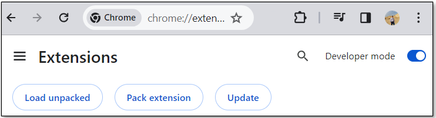

1. Enable Developer mode. 

1. Choose **Load unpacked**, navigate to the `lma-chrome-extension` folder (which you unzipped from the download), and click select.  This loads your extension.

1. Pin the new LMA extension to the browser tool bar as shown below. You will use it often to stream your meetings.

    

## Start using LMA

LMA provides two streaming options:

1. Use the **Chrome browser extension** to stream audio and speaker metadata from your meeting browser app. It currently works with Zoom and Chime, but we hope to add more meeting apps.
1. Use the **LMA Stream Audio tab** to stream audio from your microphone and any Chrome browser-based meeting app, softphone, or audio application.
We show you how to use both options in the following sections.

### Option 1: Use the Chrome browser extension to stream a Zoom call

1. Open the LMA extension and login with your LMA credentials.

   
   
1. Join or start a Zoom meeting in your web browser (*do not use the separate Zoom client*). If you already have the Zoom meeting page loaded, please reload it.

   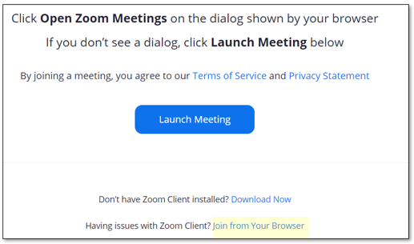

   The LMA extension automatically detects that Zoom is running in the browser tab, and populates your name and the meeting name. 

   

1.	Tell others on the call that you are about to start recording the call using LMA and obtain their permission. Do not proceed if participants object.

1. Choose **Start Listening**.  

1. Read and accept the disclaimer. Choose **Allow** on the popup asking you to share the browser tab.

   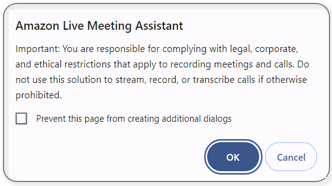

    The LMA extension automatically detects and displays the active speaker on the call. If you are alone in the meeting, invite some friends to join, and observe that the names they used to join the call are displayed in the extension when they speak, and attributed to their words in the LMA transcript.

   
 
1. Choose **Open in LMA** to see your live transcript in a new tab.  
1. Choose your preferred transcript language, and interact with the meeting assistant using the wake phrase *"OK Assistant!"* or the **Meeting Assist Bot** pane on the right. The **ASK ASSISTANT** button is fun to try – it asks the meeting assistant service (Bedrock knowledge base) to suggest a ‘good response’ based on the transcript of the recent interactions in the meeting. Your mileage may vary, so experiment!

   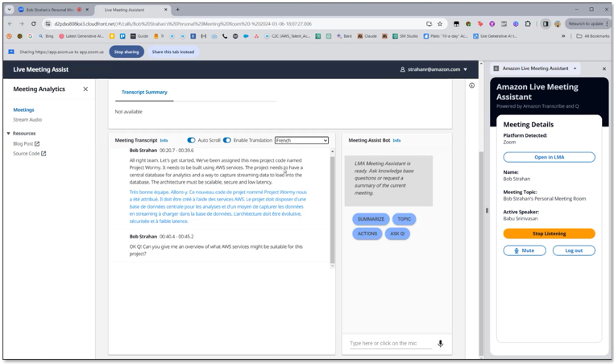

1. When you are done, choose **Stop Streaming** to end the meeting in LMA. Within a few seconds the automated end-of-meeting summaries appear, and the audio recording becomes available. You can continue to use the bot after the call has ended.

   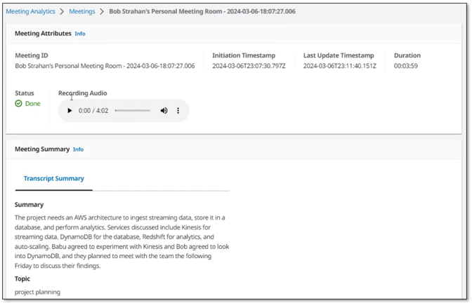

### Option 2: Use the LMA UI Stream Audio tab to stream from your microphone and any browser based audio application

The browser extension is the most convenient way to stream metadata and audio from the supported meeting web apps. However, you can also use LMA to stream from any browser based softphone, meeting app, or any other audio source playing in your Chrome browser, using the very convenient **Stream Audio** tab that is built into the LMA UI.

1. Open any audio source in a Chrome browser tab. For example, this could be a softphone (such as [Google Voice](https://voice.google.com/u/0/messages)), another meeting app, or for demo purposes, you can simply play a local audio recording or a YouTube video in your browser to emulate another meeting participant. If you just want to try it, open the following [YouTube video](https://www.youtube.com/watch?v=TcpSqbr0FnI) in a new tab.

   

1. In the LMA App UI, choose **Stream Audio (no extension)** to open the Stream Audio tab. 
1. For **Meeting ID**, enter a name for your meeting.  
1. For **Name**, enter a name for yourself (applied to audio from your microphone)
1. For **Participant Name(s)**, enter the names of the participants (applied to the incoming audio source). 
1. Choose **Start Streaming**

   

1. Choose the browser tab you opened earlier, and choose **Allow** to share.
1. Choose the LMA UI tab again tab again to view your new meeting ID listed, showing the meeting as **In Progress**. 
   
   

1. Choose the meeting ID to open the details page, and watch the transcript of the incoming audio, attributed to the participant names that you entered. If you speak, you'll see the transcription of your own voice.

   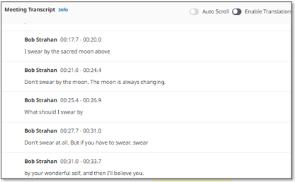

Use the **Stream Audio** feature to stream from any softphone app, meeting app, or any other streaming audio playing in the browser, along with your own audio captured from your selected microphone. Always obtain permission from others before recording them using LMA, or any other recording application.

## Processing flow overview

How did LMA transcribe and analyze your meeting? Let’s look at how it works. The following diagram shows the main architectural components and how they fit together at a high level.

   

The LMA user joins a meeting in their browser, enables the LMA browser extension, and authenticates using their LMA credentials. If the meeting app (for example, Zoom.us) is supported by the LMA extension, the user's name, meeting name, and active speaker names are automatically detected by the extension. If the meeting app is not supported by the extension, then the LMA user can manually enter their name and the meeting topic—active speakers’ names will not be detected. 

After getting permission from other participants, the LMA user chooses Start Listening on the LMA extension pane. A secure WebSocket connection is established to the preconfigured LMA stack WebSocket URL, and the user's authentication token is validated. The LMA browser extension sends a START message to the WebSocket containing the meeting metadata (name, topic, and so on), and starts streaming two-channel audio from the user's microphone and the incoming audio channel containing the voices of the other meeting participants. The extension monitors the meeting app to detect active speaker changes during the call, and sends that metadata to the WebSocket, enabling LMA to label speech segments with the speaker's name.

The WebSocket server running in Fargate consumes the real-time two-channel audio fragments from the incoming WebSocket stream. The audio is streamed to Amazon Transcribe, and the transcription results are written in real time to Kinesis Data Streams.

Each meeting processing session runs until the user chooses Stop Listening in the LMA extension pane, or ends the meeting and closes the tab. At the end of the call, the function creates a stereo recording file in Amazon S3 (if recording was enabled when the stack was deployed).

An AWS Lambda function, the Call Event Processor, fed by Kinesis Data Streams, processes and optionally enriches meeting metadata and transcription segments. The Call Event Processor integrates with the Meeting Assist services. LMA meeting assist is powered by Amazon Lex, Bedrock knowledge bases, and Amazon Bedrock large language models using the open source [QnABot on AWS solution](https://aws.amazon.com/solutions/implementations/qnabot-on-aws/) for answers based on FAQs and as an orchestrator for request routing to the appropriate AI service. The Call Event Processor also invokes the Transcript Summarization lambda when the call ends, to generate a summary of the call from the full transcript.

The Call Event Processor function interfaces with AWS AppSync to persist changes (mutations) in DynamoDB and to send real-time updates to the LMA user's logged in web clients (conveniently opened by choosing the Open in LMA option shown in the browser extension.)

The LMA web UI assets are hosted on Amazon S3 and served via CloudFront. Authentication is provided by Amazon Cognito. 

When the user is authenticated, the web application establishes a secure GraphQL connection to the AWS AppSync API, and subscribes to receive real-time events such as new calls and call status changes for the meetings list page, and new or updated transcription segments and computed analytics for the meeting details page. When translation is enabled, the web application also interacts securely with Amazon Translate to translate the meeting transcription into the selected language.

The entire processing flow, from ingested speech to live webpage updates, is event driven, and so the end-to-end latency is small—typically just a few seconds.

## Monitoring and troubleshooting

AWS CloudFormation reports deployment failures and causes on the relevant stack **Events** tab. See [Troubleshooting CloudFormation](https://docs.aws.amazon.com/AWSCloudFormation/latest/UserGuide/troubleshooting.html) for help with common deployment problems. Look out for deployment failures caused by limit exceeded errors; the LMA stacks create resources that are subject to default account and Region service quotas, such as elastic IP addresses and NAT gateways. When troubleshooting CloudFormation stack failures, always navigate into any failed nested stacks to find the first nested resource failure reported—this is almost always the root cause.

Amazon Transcribe has a default limit of 25 concurrent transcription streams, which limits LMA to 25 concurrent meetings in a given AWS account or Region. Request an increase for the number of concurrent HTTP/2 streams for streaming transcription if you have many users and need to handle a larger number of concurrent meetings in your account.

LMA provides runtime monitoring and logs for each component using CloudWatch:

- **Websocket processing and transcribing Fargate task** – On the [Amazon Elastic Container Service](https://us-east-1.console.aws.amazon.com/ecs/v2/clusters) (Amazon ECS) console, navigate to the Clusters page and open the `LMA-WEBSOCKETSTACK-xxxx-TranscribingCluster` function. Choose the **Tasks** tab and open the task page. Choose **Logs** and **View in CloudWatch** to inspect the WebSocket transcriber task logs.
- **Call Event Processor Lambda function** – On the Lambda console, open the `AISTACK-CallEventProcessor` function. Choose the **Monitor** tab to see function metrics. Choose **View logs in CloudWatch** to inspect function logs.
- **AWS AppSync API** – On the AWS AppSync console, open the `CallAnalytics-LMA` API. Choose Monitoring in the navigation pane to see API metrics. Choose **View logs in CloudWatch** to inspect AWS AppSync API logs.
  
For QnABot on AWS for Meeting Assist, refer to the [Meeting Assist README](./lma-meetingassist-setup-stack/README.md), and the [QnABot solution implementation guide](https://docs.aws.amazon.com/solutions/latest/qnabot-on-aws/welcome.html) for additional information.

## Cost assessment

LMA provides a websocket server using Fargate (2vCPU) and VPC networking resources costing about $0.025/hr (~$18/mth) - see [Fargate pricing](https://aws.amazon.com/fargate/pricing/).

Meeting Assist is enabled using QnABot and Knowledge bases for Amazon Bedrock. You create your own Knowledge base which you use for LMA and potentially other use cases – see [Amazon Bedrock pricing](https://aws.amazon.com/bedrock/pricing/) for more. Additional AWS services used by the QnABot solution cost about $0.77/hour – see [QnABot on AWS solution costs](https://docs.aws.amazon.com/solutions/latest/qnabot-on-aws/cost.html). 

The remaining solution costs are based on usage.

The usage costs add up to about $0.17 for a 5-minute call, although this can vary based on options selected (such as translation), number of LLM summarizations and total usage because usage affects Free Tier eligibility and volume tiered pricing for many services. For more information about the services that incur usage costs, see the following:

- [AWS AppSync pricing](https://aws.amazon.com/appsync/pricing/)
- [Amazon Translate pricing](https://aws.amazon.com/translate/pricing/)
- [Amazon Cognito Pricing](https://aws.amazon.com/cognito/pricing/)
- [Amazon DynamoDB pricing](https://aws.amazon.com/dynamodb/pricing/)
- [AWS Lambda Pricing](https://aws.amazon.com/lambda/pricing/)
- [Amazon S3 pricing](https://aws.amazon.com/s3/pricing/)
- [Amazon Transcribe Pricing](https://aws.amazon.com/transcribe/pricing/)
- [Amazon Bedrock pricing](https://aws.amazon.com/bedrock/pricing/)
- [QnABot on AWS costs](https://docs.aws.amazon.com/solutions/latest/qnabot-on-aws/cost.html)

To explore LMA costs for yourself, use AWS Cost Explorer or choose Bill Details on the AWS Billing Dashboard to see your month-to-date spend by service.

   

## Customize your deployment

Use the following CloudFormation template parameters when creating or updating your stack to customize your LMA deployment:

- To use your own S3 bucket for meeting recordings, use **Call Audio Recordings Bucket Name** and **Audio File Prefix**.
- To redact PII from the transcriptions, set **Enable Content Redaction for Transcripts** to `true`, and adjust **Transcription PII Redaction Entity Types** as needed. For more information, see [Redacting or identifying PII in a real-time stream](https://docs.aws.amazon.com/transcribe/latest/dg/pii-redaction-stream.html).
- To improve transcription accuracy for technical and domain-specific acronyms and jargon, set **Transcription Custom Vocabulary Name** to the name of a custom vocabulary that you already created in Amazon Transcribe and/or set **Transcription Custom Language Model Name** to the name of a previously created custom language model. For more information, see [Improving Transcription Accuracy](https://docs.aws.amazon.com/transcribe/latest/dg/improving-accuracy.html).
- To transcribe meetings in a supported language other than US English, chose the desired value for **Language for Transcription**.
- To customize transcript processing, optionally set **Lambda Hook Function ARN for Custom Transcript Segment Processing** to the ARN of your own Lambda function. For more information, see [Using a Lambda function to optionally provide custom logic for transcript processing](./lma-ai-stack/TranscriptLambdaHookFunction.md).
- To customize the Meeting Assist capabilities based on the QnABot on AWS solution, Amazon Lex, Amazon Bedrock, and Bedrock Knowledge base integration, see the [Meeting Assist README](./lma-meetingassist-setup-stack/README.md).
- To customize Transcript Summarization by configuring LMA to call your own Lambda function, see [Transcript Summarization LAMBDA option](./lma-ai-stack/TranscriptSummarization.md#lambda).
- To customize Transcript Summarization by modifying the default prompts or adding new ones, see [Transcript Summarization](./lma-ai-stack/TranscriptSummarization.md).
- To change the retention period, set **Record Expiration In Days** to the desired value. All call data is permanently deleted from the LMA DynamoDB storage after this period. Changes to this setting apply only to new calls received after the update.

LMA is an open-source project. You can fork the LMA GitHub repository, enhance the code, and send us pull requests so we can incorporate and share your improvements!

## Update an existing LMA stack

1. Log into the [AWS console](https://console.aws.amazon.com/) if you are not already.
   _Note: If you are logged in as an IAM user, ensure your account has permissions to create and manage the necessary resources and components for this application._
2. Select your existing LMA stack
3. Choose **Update**
4. Choose **Replace current template**
5. Use one of the **published template** below for your region, or use the **Template URL** output of the publish.sh script if you have build your own artifacts from the repository:

| Region name           | Region code | Template URL                                                                         |
| --------------------- | ----------- | ------------------------------------------------------------------------------------ |
| US East (N. Virginia) | us-east-1   | https://s3.us-east-1.amazonaws.com/aws-ml-blog-us-east-1/artifacts/lma/lma-main.yaml |

6. Choose **Next** and review the stack parameters.
7. Choose **Next** two more times.
8. Check the blue boxes for creating IAM resources, and choose **Update stack** to start the update.

## Clean Up

Congratulations! :tada: You have completed all the steps for setting up your live call analytics sample solution using AWS services.

**To make sure you are not charged for any unwanted services, you can clean up by deleting the stack created in the _Deploy_ section and its resources.**

When you’re finished experimenting with this sample solution, clean up your resources by using the AWS CloudFormation console to delete the LMA stacks that you deployed. This deletes resources that were created by deploying the solution. The recording S3 buckets, the DynamoDB table and CloudWatch Log groups are retained after the stack is deleted to avoid deleting your data.

## Live Call Analytics: Companion solution

Our companion solution, [Live Call Analytics and Agent Assist](https://www.amazon.com/live-call-analytics) (LCA), offers real-time transcription and analytics for contact centers (phone calls) rather than meetings. There are many similarities - in fact LMA has been built using an architecture and many components derived from LCA.

## Conclusion

The Live Meeting Assistant sample solution offers a flexible, feature-rich, and customizable approach to provide live meeting assistance to improve your productivity during and after meetings. It uses Amazon AI/ML services like Amazon Transcribe, Amazon Lex, Knowledge Bases for Amazon Bedrock, and Amazon Bedrock LLMs to transcribe and extract real-time insights from your meeting audio.

The sample LMA application is provided as open source—use it as a starting point for your own solution, and help us make it better by contributing back fixes and features via GitHub pull requests. Browse to the [LMA GitHub repository](https://github.com/aws-samples/amazon-transcribe-live-meeting-assistant) to explore the code, choose **Watch** to be notified of new releases, and check the [README](./README.md) for the latest documentation updates.

For expert assistance, [AWS Professional Services](https://aws.amazon.com/professional-services/) and other [AWS Partners(https://aws.amazon.com/partners/)] are here to help.

We’d love to hear from you. Let us know what you think in the comments section, or use the issues forum in the [LMA GitHub repository](https://github.com/aws-samples/amazon-transcribe-live-meeting-assistant).

## Contributing

Your contributions are always welcome! Please have a look at the [contribution guidelines](CONTRIBUTING.md) first. :tada:

## Security

See [CONTRIBUTING](CONTRIBUTING.md#security-issue-notifications) for more information.

## License Summary

This sample code is made available under the MIT-0 license. See the [LICENSE](LICENSE) file.

