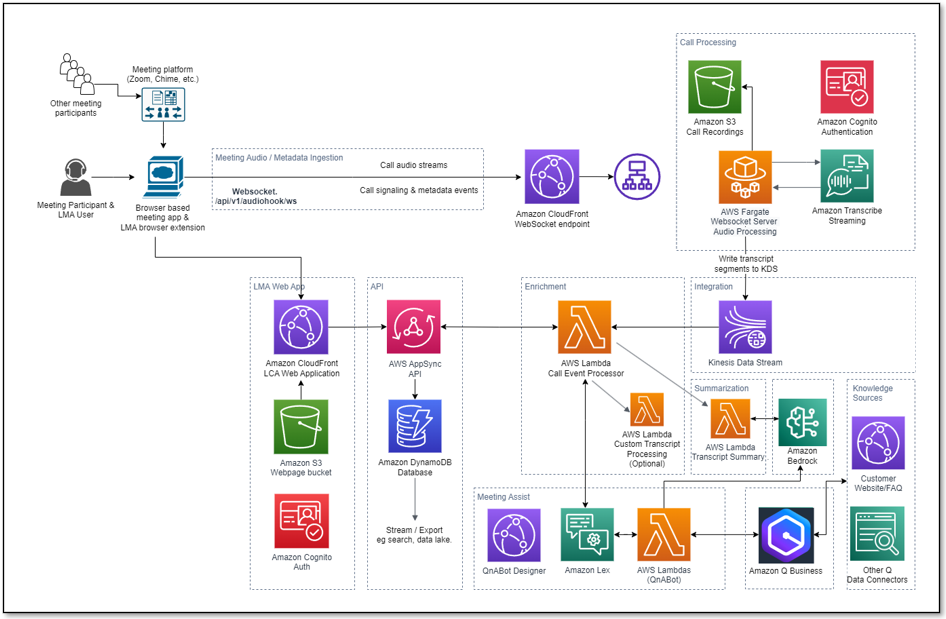

# Live Meeting Assistant (LMA) with Amazon Transcribe, Amazon Bedrock, Amazon Quick Suite, and Strands Agents

_Companion AWS blog post: [Live Meeting Assistant with Amazon Transcribe, Amazon Bedrock, and Strands Agents](http://www.amazon.com/live-meeting-assistant)_

_See [CHANGELOG](./CHANGELOG.md) for latest features and fixes._

**Questions?** 

## Introduction

You've likely experienced the challenge of taking notes during a meeting while trying to pay attention to the conversation. You've probably also experienced the need to quickly fact-check something that's been said, or look up information to answer a question that's just been asked in the call. Or maybe you have a team member that always joins meetings late, and expects you to send them a quick summary over chat to catch them up.

All of this, and more, is now possible with the Live Meeting Assistant (LMA).

Check out our demo to see many of the latest features.

https://github.com/user-attachments/assets/7642f659-ed9e-4abf-8baf-2f6fb27b08cb

> Need to embed this video elsewhere (e.g. WordPress, blog posts, or other sites)? Use the stable GitHub Pages-hosted copy instead — the `user-attachments` URL above only works inside github.com: [https://aws-samples.github.io/amazon-transcribe-live-meeting-assistant/videos/LMADemo0426.mp4](https://aws-samples.github.io/amazon-transcribe-live-meeting-assistant/videos/LMADemo0426.mp4)

## Key Features

- **Live transcription with speaker attribution** — Powered by Amazon Transcribe with custom vocabulary and language model support
- **Live translation** — 75+ languages via Amazon Translate
- **AI meeting assistant** — Strands Agents SDK with Amazon Bedrock, with built-in tools for transcript search, web search, document search, and meeting history
- **MCP server integration** — Extend the assistant with external tools (Salesforce, Amazon Quick Suite, custom servers)
- **On-demand and automatic summaries** — Generate summaries, action items, and insights during and after meetings
- **Virtual Participant** — Headless Chrome bot joins Zoom, Teams, Chime, Google Meet, and WebEx meetings
- **Voice assistant** — Nova Sonic 2 or ElevenLabs voice responses with optional Simli animated avatar
- **Meetings Query Tool** — Semantic search across all past meeting transcripts via Bedrock Knowledge Base
- **Embeddable components** — iframe integration for embedding LMA in external applications
- **Meeting recording** — Optional stereo audio recordings stored in S3
- **Meeting inventory** — Searchable list of all meetings with sharing and access control

## Documentation

**📖 Browse the docs site: [aws-samples.github.io/amazon-transcribe-live-meeting-assistant](https://aws-samples.github.io/amazon-transcribe-live-meeting-assistant/)**

Full documentation source: [docs/INDEX.md](./docs/INDEX.md)

Quick links:
- [Prerequisites & Deployment](./docs/prerequisites-and-deployment.md)
- [Quick Start Guide](./docs/quick-start-guide.md)
- [Meeting Assistant](./docs/meeting-assistant.md)
- [Virtual Participant](./docs/virtual-participant.md)
- [Voice Assistant](./docs/voice-assistant.md)
- [MCP Servers](./docs/mcp-servers.md)
- [Developer Guide](./docs/developer-guide.md)

## Architecture

   

The LMA user starts a meeting session using the Stream Audio tab or Virtual Participant feature. A secure WebSocket connection streams two-channel audio to a Fargate-based WebSocket server, which relays it to Amazon Transcribe. Transcription results flow through Kinesis Data Streams to the Call Event Processor Lambda, which integrates with the Strands Agents SDK, Amazon Bedrock, and optionally Bedrock Knowledge Bases. Results are persisted to DynamoDB and pushed to the React web UI in real time via AppSync GraphQL subscriptions.

For full architecture details, see [Infrastructure & Security](./docs/infrastructure-and-security.md).

## Quick Deploy

| Region | Launch Stack |
|--------|-------------|
| US East (N. Virginia) |  |
| US West (Oregon) |  |
| AP Southeast (Sydney) |  |

See [Prerequisites & Deployment](./docs/prerequisites-and-deployment.md) for full deployment instructions.

You are responsible for complying with legal, corporate, and ethical restrictions that apply to recording meetings and calls. Do not use this solution to stream, record, or transcribe calls if otherwise prohibited.

## Cost Assessment

- Base infrastructure: ~$10/month (Fargate WebSocket server + VPC networking)
- VP EC2 instances: ~$33/month per warm instance
- Per-meeting usage: ~$0.17 per 5-minute call (varies by options)

See [Troubleshooting](./docs/troubleshooting.md#cost-assessment) for detailed cost breakdown and service pricing links.

## Contributing

Your contributions are always welcome! See [CONTRIBUTING](CONTRIBUTING.md) for more information.

## Security

See [CONTRIBUTING](CONTRIBUTING.md#security-issue-notifications) for more information.

## License

This sample code is made available under the MIT-0 license. See the [LICENSE](LICENSE) file.
