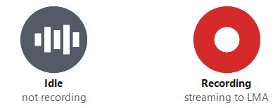

# Desktop Capture App

The **Desktop Capture App** (**LMA Capture Client**) is a lightweight native
application (macOS and Windows) that streams your **microphone**, your computer's
**system (meeting) audio**, and — optionally — your **screen video** directly to
LMA. Because it captures the operating system's audio, not a browser tab, it can
transcribe meetings you join from a **native desktop app** (Zoom, Microsoft Teams,
Cisco Webex, Slack huddles, phone bridges, …), which the
[Chrome Extension](browser-extension.md) and [Stream Audio](stream-audio.md)
options cannot. It adds **no bot** or extra attendee to the meeting.

> **Status:** macOS and Windows are available today. The app is distributed as
> source that you build locally with a one-step script — a native app using
> ScreenCaptureKit (macOS) or WASAPI/WPF (Windows) cannot be cross-compiled by
> LMA's Linux build pipeline, and code-signing tools are OS-specific, so building
> on your own machine is both required and the most trustworthy option.


https://github.com/user-attachments/assets/9b323496-4eb9-4f22-aa45-0f2f05afaa2e


## How it works

- Your **microphone** is transcribed as the meeting owner — the **"My Mic"**
  channel (the AGENT channel downstream).
- Your computer's **system audio** — the remote participants — is the
  **"Meeting Audio"** channel (the CALLER channel downstream).
- Audio streams to the **same** secure WebSocket transcriber endpoint the
  browser options use; the server is unchanged. From there it flows through the
  identical pipeline (real-time transcription, Meeting Assistant, summaries,
  knowledge base).
- **macOS** captures system audio via **ScreenCaptureKit** (loopback) and the
  mic via **AVAudioEngine**. **Windows** captures system audio via **WASAPI
  loopback** and the mic via **WASAPI capture**. On both, the two mono sources
  are interleaved into 2-channel 16-bit PCM.

> On **Windows**, system-audio (loopback) capture is built into the OS and needs
> **no special permission** — there is no equivalent of the macOS Screen
> Recording prompt. The only OS gate is the microphone privacy setting.

## Optional: record screen video

In addition to audio, the app can **capture and stream desktop video** — a
screen or a specific window — so LMA saves a **video recording of the meeting**
alongside the audio, just like the Virtual Participant does. It's **off by
default**; turn it on per user in **Settings (⚙)**:

- **macOS** encodes the chosen display/window with **ScreenCaptureKit +
  VideoToolbox** (H.264). It reuses the **Screen Recording** permission the app
  already needs for system audio — **no new prompt**.
- **Windows** encodes with **Windows.Graphics.Capture + Media Foundation**
  (H.264). No extra permission is required.

The video is streamed to the transcriber over a **second WebSocket connection**
(so it never delays real-time audio/transcription), muxed with the meeting
audio into a single **MP4** at the end of the call, saved to the LMA recordings
bucket, and shown in the call detail page's **Recording Video** player — the
same place Virtual Participant recordings appear. Capture runs at ~5 fps and up
to 1080p, which keeps CPU and bandwidth modest while staying legible for slides.

When screen video is enabled, the one-time consent gate and the live recording
view both show a **"Screen video is ON"** notice, since screen contents are more
sensitive than audio alone. Video recording can be disabled deployment-wide with
the `EnableVideoRecording` CloudFormation parameter (the server then discards any
video a client sends).

> **Backward compatible.** The video stream is a purely additive, second WebSocket
> announced by a new `START_VIDEO` message. Clients that don't send it, and
> servers that predate it, behave exactly as before — audio streaming is
> untouched.

## Recording consent

You are responsible for complying with the legal, corporate, and ethical
restrictions that apply to recording meetings and calls — in many jurisdictions
**all participants must consent** to being recorded. Do not use this app to
stream, record, or transcribe calls if otherwise prohibited.

The app shows this disclaimer **before your first recording** and requires you
to agree (the same consent gate as the browser extension and the web UI's
Stream Audio tab). After that:

- A one-line reminder — *"Ensure all participants have consented to
  recording"* — stays visible next to the **Start** button; hovering it shows
  **when you agreed** and the exact text you agreed to.
- **Settings (⚙ gear)** keeps your **consent record**: the date/time you
  agreed and the full disclaimer text, expandable for review.
- If the deployment's disclaimer wording is **changed** by your administrator,
  the app asks you to agree to the **new** text once — your recorded consent
  covers the text you actually saw.

The text is configurable per deployment via the `RecordingDisclaimer`
CloudFormation parameter, so organizations can substitute their own legal
wording; the app picks it up from the `lma-config.json` baked into the
download.

## Download and install (macOS)

1. In the LMA web app, open **Meeting Assistant ▸ Sources ▸ Desktop Capture App
   (Native)** and click **Download for macOS**. The zip is **preconfigured for
   your deployment** (endpoint + Cognito settings baked in), so you only sign in
   with your normal LMA username and password.
2. Unzip it.
3. If you don't already have Apple's command-line tools, install them once:
   ```bash
   xcode-select --install
   ```
4. In Terminal, `cd` into the unzipped folder and run the installer **with
   `bash`** (not `./`):
   ```bash
   bash install-macos.sh
   ```
   It clears the macOS download quarantine, checks prerequisites, builds the
   app, and installs it to `/Applications/LMACaptureClient.app`. (Terminal is only
   used to build and install — you won't run the app from Terminal.)

   > ⚠️ **Use `bash install-macos.sh`, not `./install-macos.sh`.** On recent
   > macOS, running a freshly downloaded script directly makes the kernel
   > `execve()` a quarantined file, which Gatekeeper blocks with *"Apple could
   > not verify … is free of malware"* **before the script runs** — so its own
   > quarantine-clearing never happens. Running it via `bash` reads the script as
   > data (no `execve` on a quarantined file), so it runs and clears the flag
   > from the rest of the folder itself.
5. **Launch it like a normal app.** Click its **Dock icon** (the installer pins
   it), press **⌘-Space** (Spotlight) and type **LMACaptureClient**, or
   double-click it in Finder. An **LMA** item appears in the menu bar
   (top-right) and the app's icon appears in the Dock.

   > **Searching for it:** in the Dock and menu bar the app is labelled
   > **LMA Capture Client (&lt;Stack&gt;)**, but Spotlight and `open -a` match the
   > bundle's *filename* — `LMACaptureClient-&lt;stack&gt;` — so search for that (the
   > installer prints the exact name when it finishes).

   > ⚠️ **Don't launch it from Terminal.** Always launch via Spotlight, Finder,
   > or `open /Applications/LMACaptureClient-<stack>.app` — never the binary
   > inside `Contents/MacOS`.
   > Only launching through macOS gives the app its own privacy identity; running
   > it from Terminal makes macOS attribute Microphone / Screen Recording to
   > **Terminal**, and system-audio capture silently won't work.
6. Approve the **Microphone** prompt. Then open **System Settings ▸ Privacy &
   Security ▸ Screen Recording**, enable **LMA Capture Client**, and **quit and
   relaunch** it (Screen Recording requires a restart to take effect). Screen
   Recording is what lets macOS capture system/meeting audio, even for audio-only
   capture.
7. Left-click the **LMA** menu-bar item, sign in with your LMA username and
   password, and click **Start**. Your meeting appears in the
   [Meetings List](web-ui-guide.md) with a live transcript.

> **Tip: use headphones.** Otherwise your speakers' meeting audio can bleed into
> your microphone and appear faintly on both transcript channels.

> **Later:** to move to a newer LMA release see
> [Updating to a new version](#updating-to-a-new-version); to remove the app see
> [Uninstalling](#uninstalling).

### "Apple could not verify… is free of malware" (Gatekeeper)

macOS flags files downloaded from a browser, and on recent versions it **blocks
running a downloaded script directly** (`./install-macos.sh`) — the kernel
`execve()`s a quarantined file, Gatekeeper kills it, and the script's own
quarantine-clearing never gets to run. Run it via `bash` instead, which isn't
blocked:

```bash
bash install-macos.sh
```

To clear the whole folder up front instead (then either form works):

```bash
xattr -dr com.apple.quarantine .
./install-macos.sh
```

## Download and install (Windows)

On Windows, loopback (system) audio capture is built into the OS and needs
**no special permission** — the only OS gate is the microphone privacy toggle.

1. In the LMA web app, open **Meeting Assistant ▸ Sources ▸ Desktop Capture App
   (Native)**, choose **Windows**, and click **Download for Windows**. The zip is
   **preconfigured for your deployment** (endpoint + Cognito settings baked in),
   so you only sign in with your normal LMA username and password.
2. Unzip it (right-click ▸ **Extract All**).
3. Install the **.NET 8 SDK** once from
   [dotnet.microsoft.com](https://dotnet.microsoft.com/download/dotnet/8.0). No
   admin is required — it can install into your user folder.
4. In **PowerShell**, `cd` into the unzipped folder and run the
   build-and-install script:
   ```powershell
   ./build-windows.ps1 -SelfContained -Install
   ```
   It builds a standalone app, runs a built-in self-test, installs it to
   `%LOCALAPPDATA%\Programs\LMA Capture Client (<Stack>)` (no admin needed), and adds a
   **Start Menu** shortcut — so you don't have to dig into the build output. It
   ends with **INSTALL SUCCEEDED**; that banner is the thing to look for.
   - Omit `-Install` to just build (the exe lands in
     `bin\Release\net8.0-windows\win-x64\publish\`).
   - Add `-DesktopShortcut` for a desktop icon too.
   - Add `-ProgramFiles` to install machine-wide under `%ProgramFiles%` instead
     (prompts for admin to do the copy).
5. **Launch it** from the **Start Menu** (press the **Windows key**, type **LMA
   Capture Client**, Enter). **No window opens** — the app lives in the **system
   tray**, at the bottom-right next to the clock:

   

   **Left-click that icon** for the controls panel. (Once you start recording, a
   **taskbar button** appears too — see
   [Using the system-tray + taskbar app](#using-the-system-tray--taskbar-app-windows).)
   If SmartScreen warns about an unrecognized app, choose **More info ▸ Run
   anyway** — expected for a locally built, unsigned app.
6. If Windows blocks microphone access, enable it in **Settings ▸ Privacy &
   security ▸ Microphone** (turn on *Microphone access* and *Let desktop apps
   access your microphone*), then restart the app. **System/meeting audio needs
   no permission.**
7. Left-click the **LMA** tray icon, sign in with your LMA username and password,
   and click **Start**. Your meeting appears in the
   [Meetings List](web-ui-guide.md) with a live transcript.

> **Tip: use headphones.** Otherwise your speakers' meeting audio can bleed into
> your microphone and appear faintly on both transcript channels.

> **Later:** to move to a newer LMA release see
> [Updating to a new version](#updating-to-a-new-version); to remove the app see
> [Uninstalling](#uninstalling).

### "Windows protected your PC" (SmartScreen)

Expected for a locally built, unsigned app. Click **More info**, then **Run
anyway**. (A future release may ship an Authenticode-signed build to avoid this.)

## Using the menu-bar + Dock app (macOS)

Launched with no arguments (the normal case), the app lives in **two places**:
an **LMA** item at the top-right of the menu bar, and an icon in the **Dock**
(the installer pins it there).

Menu-bar item:

- **Left-click** the item for the controls popover: sign in / out,
  **Start** / **Stop** / **Pause**, **mute mic**, **mute system audio**, live
  per-channel **level meters**, and **Open in LMA** (jumps to the live meeting in
  your browser).
- While recording, the icon turns **red** so it's obvious at a glance.
- **Right-click** the item for **Quit** (kept out of the popover so it isn't
  confused with *Stop*).

Dock icon:

- While recording, the Dock icon shows a **red dot** and a **REC** badge
  (**⏸** while paused), and it clears when you stop.
- **Right-click** the Dock icon for quick controls: **Start / Pause / Resume /
  Stop Recording** and **Open Control Panel**.
- **Click** the Dock icon to open the control panel as a regular window (same
  controls as the popover).

> **Why both?** On MacBooks with a notch, macOS silently hides menu-bar icons
> that don't fit — and starting a recording adds the system's orange mic
> indicator to the menu bar, which can push the LMA icon out of view at the
> exact moment you need it. The Dock icon is always visible, so you always have
> a way to see recording state and stop the recording. If your menu bar is
> crowded, you can also **⌘-drag** the LMA menu-bar icon further right so it's
> among the last to be hidden.

Popover options:

- **Remember my email** — prefills your login next launch (email only; the
  password is never stored).
- **Start automatically at login** — registers the app as a macOS login item.
  The installer already placed the app in `/Applications`, so this works out of
  the box. You can also manage it in **System Settings ▸ General ▸ Login Items**.
- **Elapsed time** — while recording, the panel and the menu-bar item show how
  long the recording has been running (also in the icon's hover text).
- **Notifications** — macOS notifies you when recording starts and stops; the
  stop notification opens the meeting in LMA when clicked. You are also notified
  if a window you chose for screen video closes and capture falls back to the
  whole screen.
- **Recent meeting names** — the clock button beside the meeting-name field
  re-uses a recent name (handy for recurring meetings).
- **What will be captured** — a summary box above **Start Recording** (and again
  while recording) names the **microphone** in use and, when screen video is on,
  **which screen or window** will be recorded, with a small preview of it. This
  is deliberately on the main panel rather than buried in Settings: sharing the
  wrong screen is easy to do and hard to undo.
- **Settings (⚙ gear, top-right of the popover)** — opens a separate, resizable
  **Settings window** where you customize how the two channels are labeled in the
  LMA transcript, which microphone is captured, and screen video. Closing the
  Settings window brings the main panel back.
  - **My mic** speaker label — defaults to your signed-in email address.
  - **System** speaker label — defaults to **"Other participants"**.
  - **Microphone** — pick a specific input device, or leave **System Default**
    to follow your Sound settings. If a chosen mic is unplugged, recording
    falls back to the default. Changes are saved immediately and apply to the
    **next** recording (the gear is disabled while recording).
  - **Also record screen video** — off by default. When on, choose from a list of
    your **screens and windows**, each with a **thumbnail preview**, its name as
    macOS reports it (e.g. *DELL U2720Q*), and its **resolution** — so two
    similar monitors are easy to tell apart. **Refresh** re-scans and re-captures
    the previews. The chosen screen/window is recorded with the meeting and saved
    as a video in LMA (see
    [Optional: record screen video](#optional-record-screen-video)).

    > Thumbnail previews need **macOS 14 or later**. On macOS 13 the list still
    > shows each source's name and resolution.

### Running it in the background

The app uses no audio or CPU when idle, so the intended usage is to leave it
running and click **Start** when a meeting begins. **To relaunch after
quitting**, click its Dock icon, press **⌘-Space** (Spotlight) and type
**LMACaptureClient**, or run `open /Applications/LMACaptureClient-<stack>.app`.

## Using the system-tray + taskbar app (Windows)

Launched with no arguments (the normal case), the app lives in the **system
tray** — the notification area at the bottom-right, next to the clock — with
**no window**. While recording, it *also* takes a **taskbar button**, so a live
recording is always visible and always stoppable.

Tray icon:


- **Left-click** the icon for the controls panel: sign in / out,
  **Start** / **Stop** / **Pause**, **mute mic**, **mute system audio**, live
  per-channel **level meters**, and **Open in LMA** (jumps to the live meeting in
  your browser).
- While recording, the icon turns **red** so it's obvious at a glance. The app
  asks Windows to keep it out of the ▲ overflow so the red icon stays visible; if
  Windows still hides it, drag it onto the taskbar once.
- **Right-click** the icon for **Quit** (kept out of the panel so it isn't
  confused with *Stop*).
- Want it one click away even when idle? Right-click **LMA Capture Client** in the
  Start Menu ▸ **More** ▸ **Pin to taskbar**. (Windows 10+ removed the API that
  would let the installer do this for you.)
- **Only one copy runs at a time.** Opening the app again — from that pinned
  shortcut, the Start Menu, or the .exe — **opens the controls panel** of the copy
  already running instead of adding a second tray icon.

Taskbar button (while recording):

- A taskbar button appears when you **Start** and disappears when you **Stop** —
  nothing clutters your taskbar between meetings.
- Its icon carries a **red dot**, and the button glows **green while recording /
  yellow while paused**.
- **Hover** it for **Pause/Resume** and **Stop** buttons right in the thumbnail
  preview — no need to open a window.
- **Right-click** it for quick actions: **Start / Pause / Resume / Stop
  Recording** and **Open Control Panel**.
- **Click** it to open the control panel as a regular window (same controls as
  the tray panel).
- **Closing or minimizing that window does not stop the recording** — it stays in
  the taskbar and keeps streaming. Recording only stops when you choose **Stop**.

> **Why both?** Windows 11 tucks tray icons it hasn't seen before into the ▲
> overflow flyout, and can hide them again later — potentially at the exact
> moment you want to check or stop a recording. The taskbar button can't be
> hidden that way, so while you're recording you always have a visible indicator
> and a one-click Stop. When nothing is recording the app goes back to tray-only
> and stays out of your way.

Panel options:

- **Remember my email** — prefills your login next launch (email only; the
  password is never stored).
- **Start automatically at login** — adds a per-user startup entry that launches
  the tray app when you sign in; the toggle reflects the real system state.
- **Elapsed time** — while recording, the panel, the tray tooltip, and the
  taskbar button show how long the recording has been running.
- **Notifications** — a tray balloon appears when recording starts and stops;
  clicking the stop balloon opens the meeting in LMA. You are also notified if a
  window you chose for screen video closes and capture falls back to the whole
  screen.
- **Recent meeting names** — the clock button beside the meeting-name field
  re-uses a recent name (handy for recurring meetings).
- **What will be captured** — a summary box above **Start Recording** (and again
  while recording) names the **microphone** in use and, when screen video is on,
  **which screen or window** will be recorded. This is deliberately on the main
  panel rather than buried in Settings: sharing the wrong screen is easy to do
  and hard to undo.
- **Settings (⚙ gear, top-right of the panel)** — opens a separate, resizable
  **Settings window** where you customize how the two channels are labeled in the
  LMA transcript, which microphone is captured, and screen video. Closing the
  Settings window brings the main panel back.
  Each label field shows its **default in grey**; leave the field blank to use
  it, or type to override.
  - **My mic** speaker label — defaults to your signed-in email address.
  - **System audio** speaker label — defaults to **"Other participants"**.
  - **Microphone** — pick a specific input device, or leave **System Default**
    to follow Windows' input device setting. If a chosen mic is unplugged,
    recording falls back to the default. Changes are saved immediately and
    apply to the **next** recording (the gear is disabled while recording).
  - **Also record screen video** — off by default. When on, choose from a list of
    your **screens and windows**, each with a **thumbnail preview**, the monitor's
    own name (e.g. *DELL U2720Q*), and its **resolution**, so two similar monitors
    are easy to tell apart. The chosen screen/window is recorded with the meeting
    and saved as a video in LMA (see
    [Optional: record screen video](#optional-record-screen-video)).

The app uses no audio or CPU when idle, so the intended usage is to leave it in
the tray and click **Start** when a meeting begins. **To relaunch after
quitting**, press the **Windows key**, type **LMA Capture Client**, and press
Enter. If it's already running, that just brings up its controls panel — you
can't accidentally end up with two.

> **Developer / headless mode.** Any command-line flag runs a headless CLI that
> streams to stdout with a live VU meter (`--cli` forces it). `--selftest`
> validates the login crypto offline, and `--capture-test <seconds> <out.wav>`
> records the exact streamed stereo PCM with no server — useful for confirming
> **ch0/Left = system, ch1/Right = mic** by measuring per-channel RMS.

## Updating to a new version

The app **does not update itself**. When your LMA deployment is upgraded to a
new release, download the new package and re-run the same install command — it
replaces the installed copy in place. There is **no need to uninstall first**.

**1. Check which version you have.** The controls panel footer and the
**Settings (⚙)** window show a line like
`LMA Capture Client v0.3.6 · stack LMA-Bob`. Compare it with the version shown
on the download button in the web app (**Meeting Assistant ▸ Sources ▸ Desktop
Capture App (Native)** — e.g. *Download for macOS (0.3.7)*). If they match,
you're current.

**2. Download the new package** from that same page. It is re-generated for your
deployment on every LMA upgrade, so it always carries the current
`lma-config.json` (endpoint, Cognito ids, recording disclaimer).

**3. Unzip it into a new folder** — don't extract over the old one — and re-run
the installer from the **new** folder:

```bash
# macOS — quit the app first (right-click the "LMA" menu-bar item ▸ Quit)
bash install-macos.sh
```

```powershell
# Windows — closes the running copy for you, then replaces it
./build-windows.ps1 -SelfContained -Install
```

On Windows, pass the **same flags you used originally** — add `-ProgramFiles` if
you installed machine-wide (re-run from an elevated PowerShell), and
`-DesktopShortcut` if you want the desktop icon kept.

**What is preserved across an update** (as long as it's the *same* LMA stack):

- Your **saved settings** — remembered email, speaker labels, microphone choice,
  screen-video preference, recent meeting names.
- Your **recording-consent record** — you are not re-prompted, unless your
  administrator changed the disclaimer wording, in which case you agree to the
  new text once.
- **macOS permissions** — Microphone and Screen Recording stay granted. The
  installer signs with a persistent local identity, so rebuilds don't invalidate
  the grants. (If macOS does re-ask, see
  [Troubleshooting ▸ macOS](#macos).)
- **Windows** needs no permission for system audio, and the microphone grant
  persists.

That's because everything machine-scoped (bundle id, install path, registry key,
login item) is derived from the **stack name**, which doesn't change between
releases. A package downloaded from a **different** LMA stack installs
**alongside** the existing one rather than replacing it — see
[Multiple LMA deployments on one machine](#multiple-lma-deployments-on-one-machine).

You can delete the old package folder once the new install succeeds. Keeping it
is harmless — its `--uninstall` / `-Uninstall` still works for the same stack.

## Uninstalling

Both platforms have a single command that removes the app **and everything it
put on your machine**. Run it from any unzipped package folder for that stack
(newest is fine):

```bash
# macOS
bash install-macos.sh --uninstall
```

```powershell
# Windows
./build-windows.ps1 -Uninstall
```

On **Windows** you can equally uninstall from **Settings ▸ Apps ▸ Installed
apps** — the entry is **LMA Capture Client (*Stack*)** — which does the same
thing and doesn't need the package folder at all.

**macOS `--uninstall` removes:** the running app (quit first if open), the
`LMACaptureClient-<slug>.app` bundle from `/Applications` (and `~/Applications`),
the Start-at-login item, the Dock pin, saved settings, and the Screen Recording +
Microphone privacy grants. It **leaves** the one-time local signing certificate
in your login keychain (harmless, and reused if you reinstall) and leaves the
package folder itself — delete that yourself if you're done.

> To remove the certificate too: **Keychain Access ▸ login ▸ My Certificates**,
> delete **LMA Capture Client Local Signing**.

**Windows `-Uninstall` removes:** the running app, the install folder
(`%LOCALAPPDATA%\Programs\LMA Capture Client (<Stack>)` and the `%ProgramFiles%`
copy if present), the Start Menu and Desktop shortcuts, the per-user settings key
(`HKCU\Software\AmazonLMA\CaptureClient\<slug>`), the start-at-login entry, and
the **Apps & features** registration. If you installed machine-wide with
`-ProgramFiles`, run it from an **elevated (admin)** PowerShell — otherwise it
warns that it couldn't remove the `%ProgramFiles%` copy.

Uninstalling only affects this machine. Meetings, transcripts, and recordings
already in LMA are untouched.

If you have clients for **several stacks** installed, each has its own
app/entry and its own uninstall — run the command from that stack's package
folder (or pick that stack's entry in **Apps & features**) to remove just it.

## Multiple LMA deployments on one machine

If you work with more than one LMA stack, you can install **one client per
stack** and run them side by side. Each download is stamped with the stack it
came from, and the app namespaces everything machine-scoped by that name:

| What | macOS | Windows |
| --- | --- | --- |
| App / install name | `LMACaptureClient-<slug>.app` (shown as `LMA Capture Client (<Stack>)`) | `LMA Capture Client (<Stack>)` |
| Identity | bundle id `com.amazon.lma.captureclient.<slug>` | registry `HKCU\Software\AmazonLMA\CaptureClient\<slug>` |
| Settings + consent record | per-stack preferences | per-stack registry key |
| Start at login | separate login item | separate `Run` entry |
| Single instance | separate app | separate mutex, so both can run at once |
| OS permissions | separate Screen Recording / Microphone grants | n/a (loopback needs none) |

The stack name is shown under the app title, in the window titles, in the tray /
menu-bar tooltip, and in the About line at the bottom of the panel (alongside the
app version) — so it's always clear which deployment you are recording into.

`<slug>` is the stack name lowercased with non-alphanumerics replaced by dashes,
plus a short hash of the exact name — e.g. `LMA-VideoTest` becomes
`lma-videotest-4581d5`. The hash is what keeps stacks whose names differ only in
case or punctuation (`LMA-Bob` and `lma-bob` are both valid CloudFormation names)
from sharing settings, permissions, or the single-instance lock.

## Desktop Capture App vs Virtual Participant

Both transcribe meetings without a browser tab, but make different trade-offs.
See the [Meeting Sources overview](meeting-sources.md) for the full comparison
of all capture options.

| Dimension                   | Desktop Capture App                                        | [Virtual Participant](virtual-participant.md)          |
| --------------------------- | -------------------------------------------------------- | ------------------------------------------------------ |
| How it captures             | Runs on your computer; captures OS system audio + mic locally | Headless bot joins the meeting in the cloud       |
| Meeting platforms           | Any native or web app that plays audio on your computer  | Only platforms it can automate (Zoom, Teams, Chime, Webex, Meet) |
| Speaker identification      | ❌ No per-speaker names (one "Meeting Audio" channel)    | ✅ Active-speaker names from the meeting platform      |
| In-meeting voice assistant  | ❌ Web-UI chat assistant only                            | ✅ Optional Nova Sonic voice assistant in the meeting  |
| Visible to others           | ✅ No bot / extra attendee                               | ❌ Visible bot joins the meeting                       |
| Who must be present         | You, with the app running on your computer               | ✅ Runs unattended in the cloud                        |
| Video / screen recording    | ✅ Optional (screen or window, off by default)           | ✅ Records the meeting screen/video                    |

**In short:** choose the **Desktop Capture App** when you're attending yourself,
want no visible bot, or need a platform the Virtual Participant doesn't support.
Choose the **Virtual Participant** when you need per-speaker names, an in-meeting
voice assistant, or hands-off unattended recording.

## Supported platforms

| Platform      | Audio capture                                 | Screen video capture (optional)          |
| ------------- | --------------------------------------------- | ---------------------------------------- |
| macOS 13+     | ScreenCaptureKit loopback + AVAudioEngine mic  | ScreenCaptureKit + VideoToolbox (H.264)  |
| Windows 10/11 | WASAPI loopback + WASAPI mic capture           | Windows.Graphics.Capture + Media Foundation (H.264) |

## Troubleshooting

### macOS

- **No remote-participant audio in the transcript.** Grant **Screen Recording**
  to "LMA Capture Client" in System Settings and relaunch. Audio-only capture
  still requires the Screen Recording permission on macOS.
- **macOS keeps asking for Screen Recording permission even though it's
  enabled.** This happens when the app was rebuilt with an ad-hoc signature —
  macOS ties the permission to the exact binary, so every rebuild invalidates
  it while System Settings still shows it "enabled". Fix: rebuild with the
  current `install-macos.sh` (it now signs with a persistent local identity),
  then clear the stale records and re-grant once:
  `tccutil reset ScreenCapture com.amazon.lma.captureclient.<stack>`, relaunch the app,
  start a recording, and approve the prompt. If System Settings shows duplicate
  "LMA Capture Client" rows, remove them with the **–** button first.
- **Build errors / `xcode-select: command not found`.** Install Apple's
  command-line tools (`xcode-select --install`), complete the popup, and re-run
  `bash install-macos.sh`.
- **Updating / uninstalling.** Re-run `bash install-macos.sh` from the new
  package folder to update in place; run `bash install-macos.sh --uninstall` to
  remove it completely. See [Updating to a new version](#updating-to-a-new-version)
  and [Uninstalling](#uninstalling).

### Windows

- **"Windows protected your PC" (SmartScreen).** Expected for a locally built,
  unsigned app. Click **More info**, then **Run anyway**.
- **No microphone / "access denied".** Enable **Settings ▸ Privacy & security ▸
  Microphone** (both *Microphone access* and *Let desktop apps access your
  microphone*), then restart the app. System audio is unaffected.
- **Unfamiliar errors scroll past during install (e.g. `log4net:ERROR …
  lockingModel`).** If the script ends with **INSTALL SUCCEEDED**, the install
  worked. Messages like that come from **other software already on the PC** —
  corporate sync, backup or security tools that register Windows Explorer (shell)
  extensions and get loaded into any process that talks to the shell. LMA doesn't
  use log4net at all. The signals that matter are `All self-tests PASSED` and
  **INSTALL SUCCEEDED**.
- **`dotnet` is not recognized / build errors.** Install the
  [.NET 8 SDK](https://dotnet.microsoft.com/download/dotnet/8.0), open a fresh
  PowerShell window, and re-run `./build-windows.ps1 -SelfContained -Install`.
- **No remote-participant audio.** Make sure meeting audio is playing through
  your default playback device (the app captures the default render endpoint).
  Switching the default device mid-meeting is handled automatically.
- **Updating / uninstalling.** Re-run `./build-windows.ps1 -SelfContained
  -Install` from the new package folder to update in place (it closes the running
  copy for you). To remove it, use **Settings ▸ Apps ▸ Installed apps ▸ LMA
  Capture Client (*Stack*) ▸ Uninstall**, or run `./build-windows.ps1
  -Uninstall`. See [Updating to a new version](#updating-to-a-new-version) and
  [Uninstalling](#uninstalling).
- **"Access to the path … is denied" when re-installing.** A file in the install
  folder is still in use. Quit the app (right-click the tray icon ▸ **Quit**) and
  re-run. For a machine-wide (`-ProgramFiles`) install, re-run from an elevated
  (admin) PowerShell.

### Both platforms

- **Sign-in fails.** Use the same email and password you use for the LMA web
  app. If your organization uses SSO, this app's username/password sign-in may
  not apply — use the [Chrome Extension](browser-extension.md) instead.
- **"Your session expired and could not be renewed. Please sign in again."**
  Your sign-in session is renewed automatically in the background, including
  across sleep, so long meetings and a Start hours after signing in both work
  without you doing anything. This message means the renewal itself was
  refused — most often because your password changed, an administrator signed
  you out everywhere, or you have been signed in for longer than the
  deployment's refresh-token lifetime (30 days by default). Sign in again in
  the app and start a new recording. The app stays running; you should never
  need to quit and relaunch it to recover. (Earlier versions did quit
  themselves in this situation — if the app *disappears* instead of showing
  this message, update to the current version. See
  [issue #535](https://github.com/aws-samples/amazon-transcribe-live-meeting-assistant/issues/535).)
- **Signing in again after quitting the app.** The session is held in memory
  only, so a fresh launch always asks for your password again — that is
  expected, not a fault.

## See also

- [Meeting Sources overview](meeting-sources.md) — compare all capture options
- [Chrome Extension](browser-extension.md)
- [Virtual Participant](virtual-participant.md)
