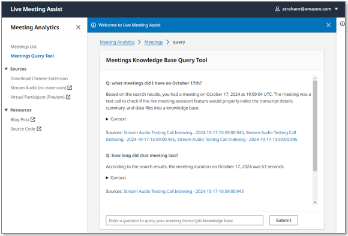

# Meetings Query Tool

## Table of Contents

- [Overview](#overview)
- [How It Works](#how-it-works)
- [Using the Query Tool](#using-the-query-tool)
- [User-Based Access Control](#user-based-access-control)
- [Configuration](#configuration)
- [Related Documentation](#related-documentation)

## Overview

The Meetings Query Tool provides a chat interface for performing semantic search across all past meeting transcripts, summaries, and metadata. Powered by a dedicated Amazon Bedrock Knowledge Base, it enables users to ask natural-language questions about their meeting history and receive answers with citations and direct links to the relevant meeting records.

## How It Works

The Meetings Query Tool relies on a Bedrock Knowledge Base that is automatically created and maintained by LMA:

1. **Knowledge Base creation** -- When the **Transcript Knowledge Base** CloudFormation parameter is set to **BEDROCK_KNOWLEDGE_BASE (Create)** (the default), LMA provisions a dedicated Bedrock Knowledge Base for meeting data.

2. **Data ingestion** -- When each meeting ends, LMA writes the meeting summary, full transcript, and metadata (including owner, callId, timestamps, and duration) to an S3 bucket.

3. **Retention management** -- An S3 lifecycle policy manages data retention based on the transcript retention parameter (default: 90 days). Expired meeting data is automatically deleted.

4. **Knowledge Base synchronization** -- An Amazon EventBridge scheduler triggers a sync of the KB data source every 15 minutes, ingesting any new or updated meeting data from S3.

5. **Availability** -- New meetings typically become available for querying within 15-30 minutes after the meeting ends, depending on when the next sync cycle runs.

## Using the Query Tool

1. Navigate to **Meetings Query Tool** in the LMA UI navigation menu.
2. Enter your question about past meetings in the chat interface. For example:
   - "What did we discuss about the product roadmap last week?"
   - "Were there any action items from Monday's standup?"
   - "Summarize recent meetings about the Q3 budget."
3. The assistant returns an answer based on your meeting history, including citations that reference the source meetings.
4. Click **Open Context** to view the referenced meeting excerpts and sources.
5. **Shift+Click** on meeting links to open the full meeting details in a new browser tab.

## User-Based Access Control

The Meetings Query Tool enforces User-Based Access Control (UBAC) to ensure users can only query meetings they are authorized to access:

- Your authenticated username is matched against the **owner** field in the meeting metadata.
- **Non-admin users** can only query and receive results from meetings they own.
- **Admin users** can query all meetings across all users.

This ensures that sensitive meeting content is only accessible to authorized participants.

## Configuration

The Meetings Query Tool is controlled by the **Transcript Knowledge Base** CloudFormation parameter:

| Value | Description |
|---|---|
| **BEDROCK_KNOWLEDGE_BASE (Create)** | Creates and maintains a Bedrock Knowledge Base for meeting transcripts. This is the default setting and enables the Meetings Query Tool. |
| **DISABLED** | Disables the Transcript Knowledge Base. The Meetings Query Tool will not be available. |

## Related Documentation

- [Meeting Assistant](meeting-assistant.md)
- [User-Based Access Control](user-based-access-control.md)
