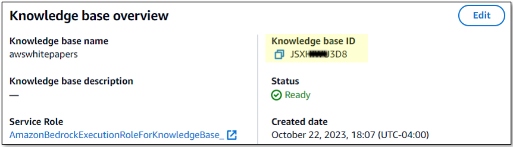
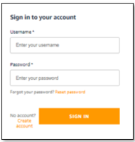
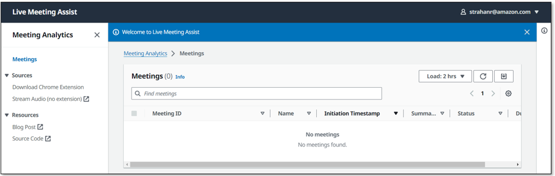

# Prerequisites and Deployment Guide

This guide covers everything you need to deploy the Live Meeting Assistant (LMA) solution, from AWS account requirements through your first login.

## Table of Contents

- [AWS Account Requirements](#aws-account-requirements)
- [Amazon Bedrock Model Access](#amazon-bedrock-model-access)
- [Knowledge Base Options](#knowledge-base-options)
- [Deploy the CloudFormation Stack](#deploy-the-cloudformation-stack)
- [Key Parameters to Configure](#key-parameters-to-configure)
- [What the Stack Creates](#what-the-stack-creates)
- [Deployment Time](#deployment-time)
- [Setting Your Password](#setting-your-password)
- [Next Steps](#next-steps)

## AWS Account Requirements

You need an AWS account with permissions to create and manage the following services:

- Amazon S3
- Amazon CloudFront
- Amazon Cognito
- AWS AppSync
- Amazon Kinesis
- AWS Fargate (ECS)
- Elastic Load Balancing (ALB)
- Amazon Bedrock
- Amazon VPC
- AWS IAM (roles and policies)
- AWS Lambda
- AWS CloudFormation

Your IAM user or role must have sufficient privileges to create IAM roles and policies, launch CloudFormation stacks, and provision resources across these services. Using an account with **AdministratorAccess** is the simplest approach for initial deployment.

## Amazon Bedrock Model Access

Before deploying LMA, you must enable access to the following foundation models in your target AWS region via the Amazon Bedrock console:

**Required models:**

- **Amazon Titan Text Embeddings V2** -- Used for generating text embeddings in the knowledge base.
- **Anthropic Claude models (Claude 4+)** -- LMA supports Claude Sonnet 4.5, Claude Opus 4, and Claude Haiku 4.5 for the meeting assistant and summarization.
- **Amazon Nova models** -- Supported as alternative LLM options for the meeting assistant and summarization.

To enable model access:

1. Open the [Amazon Bedrock console](https://console.aws.amazon.com/bedrock/).
2. Navigate to **Model access** in the left sidebar.
3. Click **Manage model access**.
4. Select the models listed above and submit your access request.
5. Wait for access status to show **Access granted** before proceeding.

## Knowledge Base Options

LMA offers three options for configuring the Bedrock Knowledge Base, which enables the meeting assistant to answer questions using your organization's documents:

### Option 1: No Knowledge Base (STRANDS_BEDROCK)

Select **STRANDS_BEDROCK** as the MeetingAssistService parameter. This deploys the Strands-based meeting assistant without a knowledge base. The assistant can still answer questions about the current meeting transcript, but will not have access to supplemental documents.

### Option 2: Auto-Create Knowledge Base (STRANDS_BEDROCK_WITH_KB Create)

Select **STRANDS_BEDROCK_WITH_KB** as the MeetingAssistService and choose **Create** for the Transcript Knowledge Base option. LMA will automatically provision a Bedrock Knowledge Base for you.

To populate the knowledge base with your own content, you can provide:

- **S3 bucket with documents** -- Specify an S3 bucket containing your documents (PDFs, text files, etc.) that the assistant should reference.
- **Web crawling URLs** -- Provide URLs for the knowledge base to crawl and index.

You can configure both sources to give the assistant access to a broad set of reference material.

### Option 3: Use an Existing Knowledge Base (STRANDS_BEDROCK_WITH_KB Use Existing)

Select **STRANDS_BEDROCK_WITH_KB** as the MeetingAssistService and choose **Use Existing** for the Transcript Knowledge Base option. You will need to provide your existing **Knowledge Base ID**.

You can find the Knowledge Base ID in the Amazon Bedrock console under **Knowledge bases**.



## Deploy the CloudFormation Stack

### Option 1: Using LMA CLI (Recommended)

Install the CLI and deploy in one command:

```bash
pip install -e lib/lma_sdk lib/lma_cli_pkg
lma-cli deploy --stack-name LMA --admin-email user@example.com --wait
```

The CLI auto-selects the correct template for your region and streams deployment events in real-time. See the [LMA CLI Reference](lma-cli.md) for all options.

### Option 2: Using AWS Console

Launch the LMA stack in one of the supported AWS regions using the buttons below:

| Region | Launch Stack |
|--------|-------------|
| **US East (N. Virginia)** | [Launch Stack](https://us-east-1.console.aws.amazon.com/cloudformation/home?region=us-east-1#/stacks/create/review?templateURL=https://s3.us-east-1.amazonaws.com/aws-ml-blog-us-east-1/artifacts/lma/lma-main.yaml&stackName=LMA) |
| **US West (Oregon)** | [Launch Stack](https://us-west-2.console.aws.amazon.com/cloudformation/home?region=us-west-2#/stacks/create/review?templateURL=https://s3.us-west-2.amazonaws.com/aws-ml-blog-us-west-2/artifacts/lma/lma-main.yaml&stackName=LMA) |
| **AP Southeast (Sydney)** | [Launch Stack](https://ap-southeast-2.console.aws.amazon.com/cloudformation/home?region=ap-southeast-2#/stacks/create/review?templateURL=https://s3.ap-southeast-2.amazonaws.com/aws-bigdata-blog-replica-ap-southeast-2/artifacts/lma/lma-main.yaml&stackName=LMA) |

Clicking the link opens the CloudFormation console with the LMA template pre-loaded. Review the parameters, acknowledge the IAM capabilities checkbox, and click **Create stack**.

## Key Parameters to Configure

While the stack has many configurable parameters, pay special attention to these:

- **Admin Email** -- The email address for the initial admin user. A temporary password will be sent to this address. Using a plus-alias format (e.g., `jdoe+admin@example.com`) is recommended so you can easily create additional test users later.

- **Authorized Account Email Domain** -- The email domain (e.g., `example.com`) that restricts which users can create accounts. Only email addresses matching this domain will be allowed to sign up.

- **MeetingAssistService** -- Choose the meeting assistant backend:
  - `STRANDS_BEDROCK` -- Strands agent without a knowledge base.
  - `STRANDS_BEDROCK_WITH_KB` -- Strands agent with a Bedrock Knowledge Base.

- **Transcript Knowledge Base** -- Default value is `BEDROCK_KNOWLEDGE_BASE`. When using `STRANDS_BEDROCK_WITH_KB`, choose **Create** to auto-provision a new knowledge base or **Use Existing** to reference one you already have.

For a complete list of all available parameters, see the [CloudFormation Parameters Reference](cloudformation-parameters.md).

## What the Stack Creates

The CloudFormation deployment provisions the following resources:

- **Amazon S3 buckets** -- For storing recordings, documents, and web application assets.
- **AWS Fargate WebSocket server with ALB** -- Handles real-time audio streaming from the browser.
- **Amazon Kinesis Data Streams** -- Ingests and processes streaming transcript data.
- **Strands agent resources** -- Powers the AI meeting assistant, including Lambda functions and agent configuration.
- **Amazon Bedrock Knowledge Base** (optional) -- Provides document-grounded answers when configured.
- **AWS AppSync GraphQL API** -- Manages real-time data synchronization between the backend and the web UI.
- **Amazon CloudFront distribution and Amazon Cognito** -- Serves the LMA web application with user authentication and authorization.
- **Amazon VPC** -- Network isolation for Fargate tasks and other compute resources.
- **IAM roles and policies** -- Least-privilege permissions for all service components.

## Deployment Time

The full stack deployment typically takes **35 to 40 minutes** to complete. You can monitor progress in the CloudFormation console under the **Events** tab for your stack.

Do not attempt to use the application until the stack status shows **CREATE_COMPLETE**.

## Setting Your Password

Once deployment is complete, you will receive an email at the Admin Email address you specified during setup. This email contains a temporary password.

1. Open the LMA application URL (found in the CloudFormation stack **Outputs** tab).
2. Enter the Admin Email and the temporary password from the email.

   

3. You will be prompted to create a new password. Your new password must meet the following requirements:
   - At least 8 characters long
   - Contains at least one uppercase letter
   - Contains at least one lowercase letter
   - Contains at least one number
   - Contains at least one special character

   

4. After setting your new password, you will be logged in to the LMA application.

## Next Steps

- [Quick Start Guide](quick-start-guide.md) -- Walk through your first meeting with LMA.
- [CloudFormation Parameters Reference](cloudformation-parameters.md) -- Detailed descriptions of every stack parameter.
- [Developer Guide](developer-guide.md) -- Instructions for building LMA from source.
