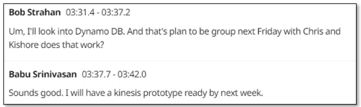
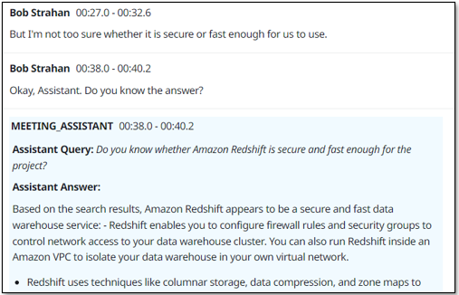
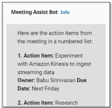

# Quick Start Guide

This guide walks you through your first meeting with the Live Meeting Assistant (LMA). You will learn how to stream audio, view transcripts, interact with the meeting assistant, and generate summaries.

## Table of Contents

- [Streaming Options Overview](#streaming-options-overview)
- [Option 1: Stream Audio from Your Browser](#option-1-stream-audio-from-your-browser)
- [Option 2: Virtual Participant](#option-2-virtual-participant)
- [Viewing Your First Meeting](#viewing-your-first-meeting)
- [Using the Meeting Assistant](#using-the-meeting-assistant)
- [Generating Summaries](#generating-summaries)
- [Next Steps](#next-steps)

## Streaming Options Overview

LMA provides two ways to capture meeting audio:

1. **Stream Audio** -- Share a browser tab's audio directly from Chrome. Works with any audio source including meeting applications, YouTube, and other media.
2. **Virtual Participant** -- Send an AI-powered bot that joins the meeting on your behalf. Supports Zoom, Microsoft Teams, Amazon Chime, Google Meet, and WebEx.

Choose whichever option fits your workflow. Both produce real-time transcripts and support the full set of LMA features.

## Option 1: Stream Audio from Your Browser

The Stream Audio option captures audio from a Chrome browser tab and sends it to LMA for real-time transcription.

### Step 1: Open Your Audio Source

Open the meeting or audio source you want to transcribe in a Chrome browser tab. This can be a web-based meeting application, a YouTube video, a podcast, or any other audio playing in the browser.

### Step 2: Go to the Stream Audio Tab

In the LMA web application, navigate to the **Stream Audio** tab.

### Step 3: Enter Meeting Details

Fill in the following fields:

- **Meeting Topic** -- A descriptive name for the meeting (e.g., "Weekly Team Standup").
- **Meeting owner (microphone)** -- Your name. Audio captured from your microphone will be attributed to this participant.
- **Participants (stream)** -- The name to attribute to audio coming from the shared browser tab.

### Step 4: Start Streaming

Click **Start Streaming**. Chrome will prompt you to select which browser tab to share. Choose the tab with your meeting or audio source, then click **Allow** to begin sharing.

### Step 5: View the In-Progress Meeting

After streaming starts, an **Open in progress meeting** link appears. Click it to open the live transcript view where you can watch the conversation being transcribed in real time.

### Step 6: Manage Your Microphone

While streaming, you can mute and unmute your microphone using the microphone control in the Stream Audio panel. Mute when you are not speaking to reduce background noise in the transcript.

### Step 7: Stop Streaming

When the meeting is over, click **Stop Streaming** to end the audio capture. LMA will finalize the transcript and automatically generate a meeting summary.

## Option 2: Virtual Participant

The Virtual Participant (VP) option sends a bot directly into your meeting room. This is useful when you want hands-free capture or when the meeting is not running in a browser tab.

### Step 1: Go to the Virtual Participant Tab

In the LMA web application, navigate to the **Virtual Participant** tab.

### Step 2: Enter Meeting Details

Enter the meeting URL or joining details. The Virtual Participant supports the following platforms:

- **Zoom**
- **Microsoft Teams**
- **Amazon Chime**
- **Google Meet**
- **WebEx**

Provide the meeting link and any other required information such as the meeting topic.

### Step 3: Join the Meeting

Click **Join Now** to dispatch the Virtual Participant.

### Step 4: Wait for the VP to Connect

The Virtual Participant takes a short time to spin up and join the meeting:

- **EC2-based VP**: Joins in approximately 30 to 60 seconds.
- **Fargate-based VP**: Joins in approximately 1 to 2 minutes.

Once connected, the VP posts an introductory message in the meeting chat to let participants know it is present and recording.

### Step 5: Monitor VP Status

Back in the LMA UI, you can see the Virtual Participant's status and a VNC preview showing what the VP sees in the meeting. Use this to confirm the VP has successfully joined and is capturing audio.

## Viewing Your First Meeting

After starting a stream or dispatching a Virtual Participant, your meeting appears in the **Meetings** list.

Each meeting in the list shows its current status (in progress, completed, etc.). Click on a meeting to open the detailed view, which includes:

- The live or completed transcript with speaker labels and timestamps.
- The meeting assistant chat panel.
- Summary and action item sections.

## Using the Meeting Assistant

The meeting assistant is an AI-powered chat interface that can answer questions about your meeting in real time.

### Text Chat

In the meeting detail view, use the chat panel on the right side to type questions. For example:

- "What decisions have been made so far?"
- "Summarize the last 5 minutes."
- "What action items have been discussed?"

The assistant uses the meeting transcript (and your knowledge base, if configured) to provide grounded answers.

### Voice Activation

During a live meeting, you can activate the assistant by voice. Say **"OK Assistant"** followed by your question. The assistant will process your spoken question and respond.

## Generating Summaries

LMA provides both on-demand and automatic meeting summaries.

### On-Demand Summaries

While a meeting is in progress or after it has ended, click the summary buttons in the meeting detail view to generate specific summaries. Options typically include:

- General meeting summary
- Action items and follow-ups
- Key decisions

### Automatic Summary

When a meeting ends (either by stopping the stream or the Virtual Participant leaving), LMA automatically generates a comprehensive summary. This includes a meeting overview, key discussion points, action items, and decisions.

You can view the completed meeting and its summary at any time from the meetings list.

## Next Steps

Now that you have completed your first meeting, explore these additional LMA features:

- [Meeting Assistant](meeting-assistant.md) -- Deep dive into the AI meeting assistant capabilities and configuration.
- [Voice Assistant](voice-assistant.md) -- Learn about voice-activated assistant features and "OK Assistant" usage.
- [MCP Servers](mcp-servers.md) -- Connect LMA to external tools and data sources using Model Context Protocol servers.
- [Prerequisites and Deployment](prerequisites-and-deployment.md) -- Revisit deployment options and configuration.
