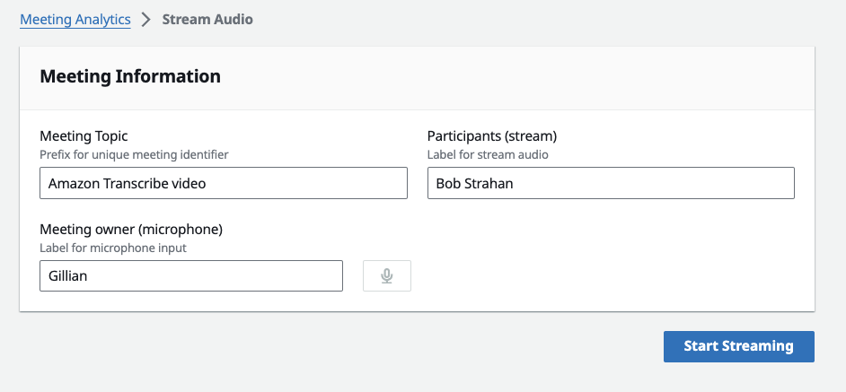
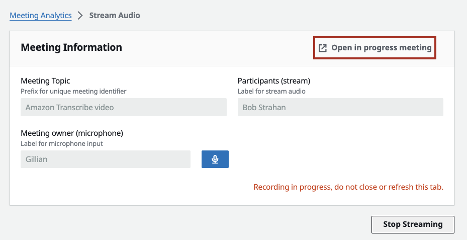
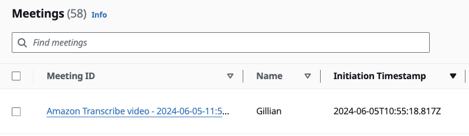
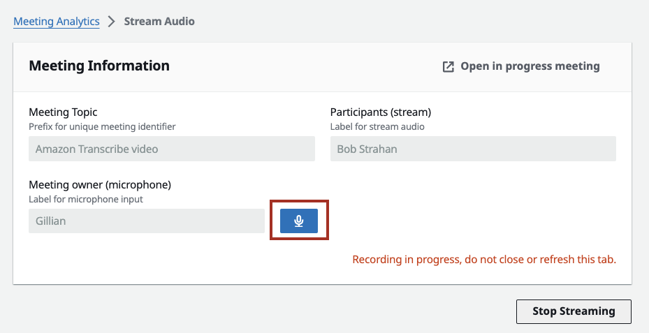
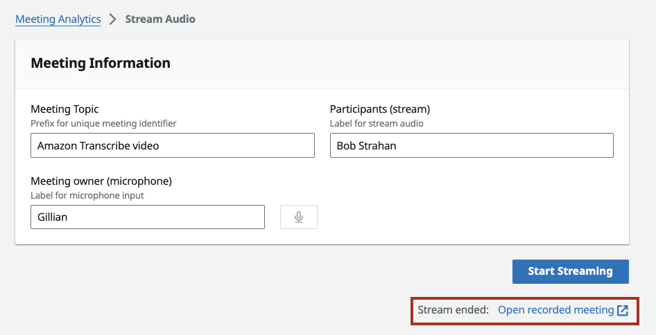

# Stream Audio

## Table of Contents

- [Overview](#overview)
- [Use Cases](#use-cases)
- [Step-by-Step Walkthrough](#step-by-step-walkthrough)
- [Browser Compatibility](#browser-compatibility)
- [Technical Details](#technical-details)
- [Important Notice](#important-notice)
- [See Also](#see-also)

## Overview

The Stream Audio tab in the LMA web UI lets you capture stereo audio from your Chrome browser -- combining your microphone with any incoming audio source (meeting app, softphone, YouTube, etc.).

## Use Cases

Use Stream Audio with any browser-based audio application when you want to stay in your browser. It works with any audio source playing in Chrome, including:

- Browser-based meeting applications (Amazon Chime, Google Meet, etc.)
- Softphone or VoIP applications running in a browser tab
- YouTube videos or other media for demo and testing purposes
- Any web application that produces audio output

## Step-by-Step Walkthrough

1. **Open any audio source** in a Chrome browser tab (meeting app, softphone, or for demo purposes, a YouTube video).

2. In the LMA UI, navigate to **Stream Audio**.

3. Enter a **Meeting Topic** -- this is appended to the timestamp to create a unique meeting ID.

4. Enter the **Meeting owner (microphone)** -- your name, which is applied to microphone audio for speaker attribution.

5. Enter **Participants (stream)** -- other participants' names, applied to incoming audio for speaker attribution.

6. Click **Start Streaming**.

7. Select the Chrome tab with your audio source, then click **Allow** to share the tab audio.

8. Use the "Open in progress meeting" link to view live transcription. It may take a few seconds for the first transcript segments to appear.

9. The meeting also appears in the meeting list as "In Progress".

10. Use the **mute/unmute button** to control your microphone during the stream.

11. Click **Stop Streaming** to end the session.

12. A link to the recorded meeting appears at the bottom of the Stream Audio page.

## Browser Compatibility

Chrome browser is required. Stream Audio relies on Chrome's tab audio capture API to capture audio from other browser tabs. Other browsers do not support this capability.

## Technical Details

Stream Audio combines your microphone input and the selected tab's audio into a stereo (two-channel) audio stream. Your microphone is assigned to one channel while the tab audio is assigned to the other, enabling speaker attribution during transcription. The combined stream is sent via WebSocket to the Fargate-based transcription server for real-time processing.

## Important Notice

Always obtain permission from all participants before recording a meeting or conversation. Recording others without their knowledge or consent may violate local laws and organizational policies.

## See Also

- [Virtual Participant](virtual-participant.md) -- Join meetings as a separate automated participant
- [WebSocket Streaming API](websocket-streaming-api.md) -- Technical details on the streaming protocol
