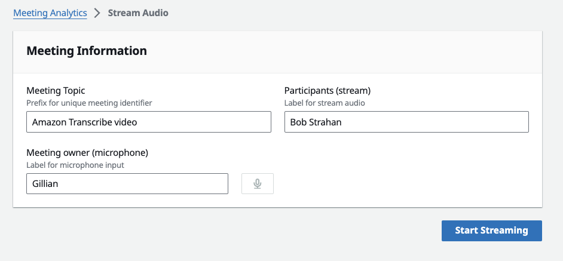
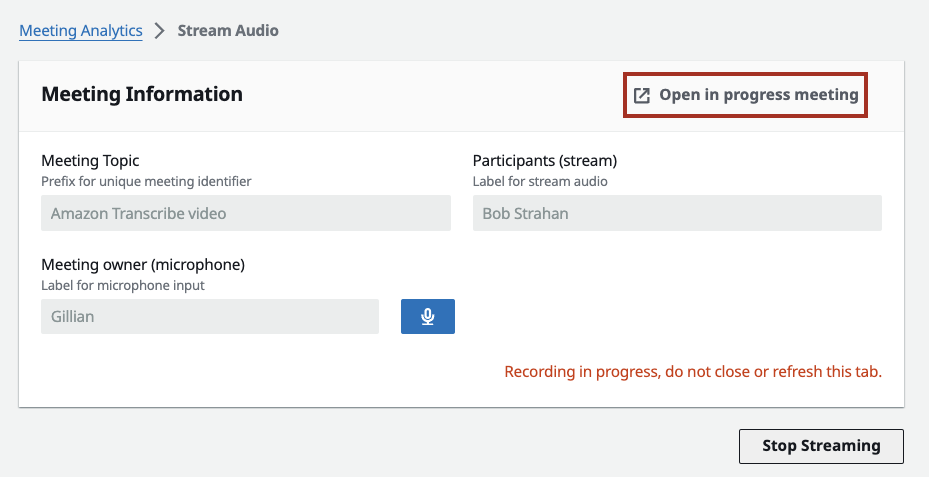
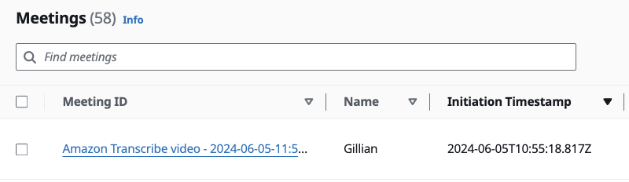
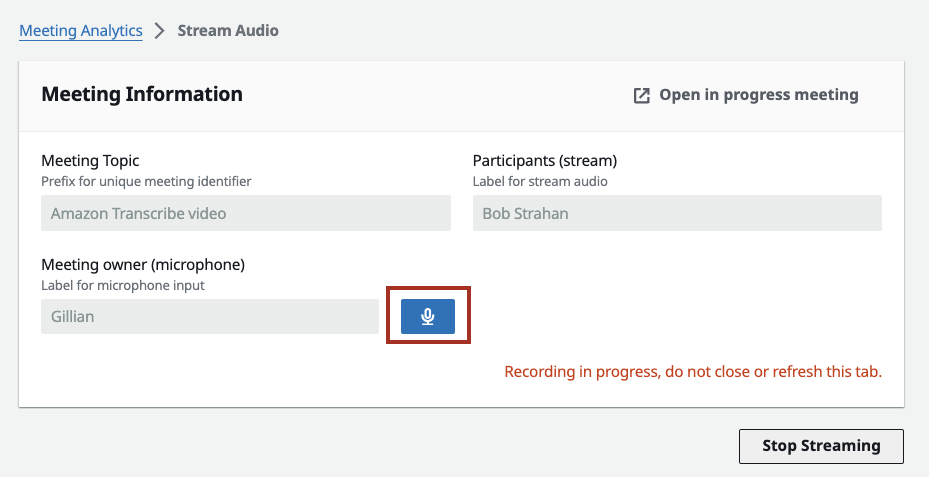
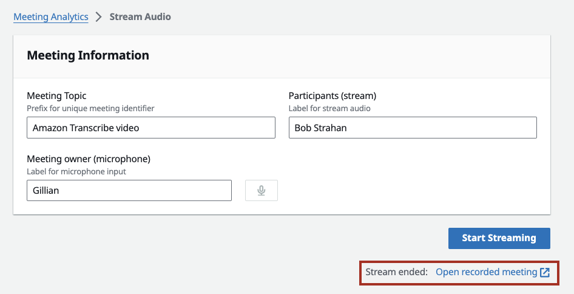

# Stream Audio

## Table of Contents

- [Overview](#overview)
- [Use Cases](#use-cases)
- [Step-by-Step Walkthrough](#step-by-step-walkthrough)
- [Speaker Identification](#speaker-identification)
- [Browser Compatibility](#browser-compatibility)
- [Technical Details](#technical-details)
- [Important Notice](#important-notice)
- [See Also](#see-also)

## Overview

> **Not sure which capture option to use?** See [Meeting Sources](meeting-sources.md) for a side-by-side comparison of the Chrome Extension, Stream Audio, and Virtual Participant.

The Stream Audio tab in the LMA web UI lets you capture stereo audio from your Chrome browser -- combining your microphone with any incoming audio source (meeting app, softphone, YouTube, etc.).

## Use Cases

Use Stream Audio with any browser-based audio application when you want to stay in your browser. It works with any audio source playing in Chrome, including:

- Browser-based meeting applications (Amazon Chime, Google Meet, etc.)
- Softphone or VoIP applications running in a browser tab
- YouTube videos or other media for demo and testing purposes
- Any web application that produces audio output

## Step-by-Step Walkthrough

1. **Open any audio source** in a Chrome browser tab (meeting app, softphone, or for demo purposes, a YouTube video).

2. In the LMA UI, navigate to **Stream Audio**.

3. Enter a **Meeting Topic** -- this is appended to the timestamp to create a unique meeting ID.

4. Enter the **Meeting owner (microphone)** -- your name, which is applied to microphone audio for speaker attribution.

5. Enter **Participants (stream)** -- other participants' names, applied to incoming audio for speaker attribution.

6. Optionally enable **Speaker identification** for either channel -- see
   [Speaker Identification](#speaker-identification) below.

7. Click **Start Streaming**.

8. Select the Chrome tab with your audio source, then click **Allow** to share the tab audio.

9. Use the "Open in progress meeting" link to view live transcription. It may take a few seconds for the first transcript segments to appear.

10. The meeting also appears in the meeting list as "In Progress".

11. Use the **mute/unmute button** to control your microphone during the stream.

12. Click **Stop Streaming** to end the session.

13. A link to the recorded meeting appears at the bottom of the Stream Audio page.

## Speaker Identification

The names you enter above give one speaker name per channel: everything from the
shared tab is attributed to **Participants (stream)** and everything from your mic
to **Meeting owner (microphone)**. That is enough for a one-to-one conversation,
but not when several people share a channel.

Enable **Speaker identification** to have Amazon Transcribe tell those voices
apart. Each channel is controlled independently, so you can turn on either, both,
or neither:

| Setting | Turn it on when |
|---|---|
| Identify separate speakers in the shared tab audio | The captured call has several remote participants |
| Identify separate speakers on my microphone | Several people share your microphone, e.g. in a meeting room |

Distinct voices are appended to the channel's name as `(spk_0)`, `(spk_1)`, and so
on -- for example `Other Participant (spk_0)` and `Other Participant (spk_1)`. The
transcript then shows each voice as its own turn, and the labels also reach the
meeting summary and the Meeting Assistant.

Notes:

- Both settings are **off by default** and can only be changed before you start
  streaming.
- Speakers are numbered **per channel**, each starting at `spk_0`.
- A segment gets its label when it finalizes, so it briefly appears without one
  while still being transcribed.
- Accuracy is best with **five or fewer voices per channel**.
- Labels are numbers, not names -- Transcribe distinguishes voices but does not
  identify who they belong to. If you need real names for meeting participants,
  use the [Chrome Extension](browser-extension.md) or a
  [Virtual Participant](virtual-participant.md), which read them from the meeting.
- There is no additional Amazon Transcribe charge for speaker identification.

## Browser Compatibility

Chrome browser is required. Stream Audio relies on Chrome's tab audio capture API to capture audio from other browser tabs. Other browsers do not support this capability.

## Technical Details

Stream Audio combines your microphone input and the selected tab's audio into a stereo (two-channel) audio stream. Your microphone is assigned to one channel while the tab audio is assigned to the other, enabling speaker attribution during transcription. The combined stream is sent via WebSocket to the Fargate-based transcription server for real-time processing.

Your speaker-identification choices are sent once, in the session's opening
message, and the server enables Amazon Transcribe speaker partitioning
accordingly. See [WebSocket Streaming API](websocket-streaming-api.md#speaker-identification-diarization)
for the protocol details.

## Important Notice

Always obtain permission from all participants before recording a meeting or conversation. Recording others without their knowledge or consent may violate local laws and organizational policies.

## See Also

- [Upload Audio](upload-audio.md) -- Transcribe an existing audio/video recording instead of streaming live
- [Virtual Participant](virtual-participant.md) -- Join meetings as a separate automated participant
- [WebSocket Streaming API](websocket-streaming-api.md) -- Technical details on the streaming protocol
