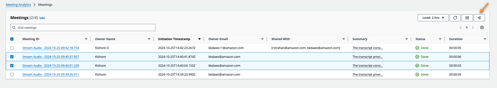
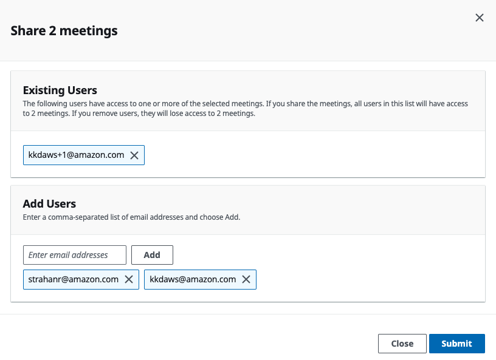
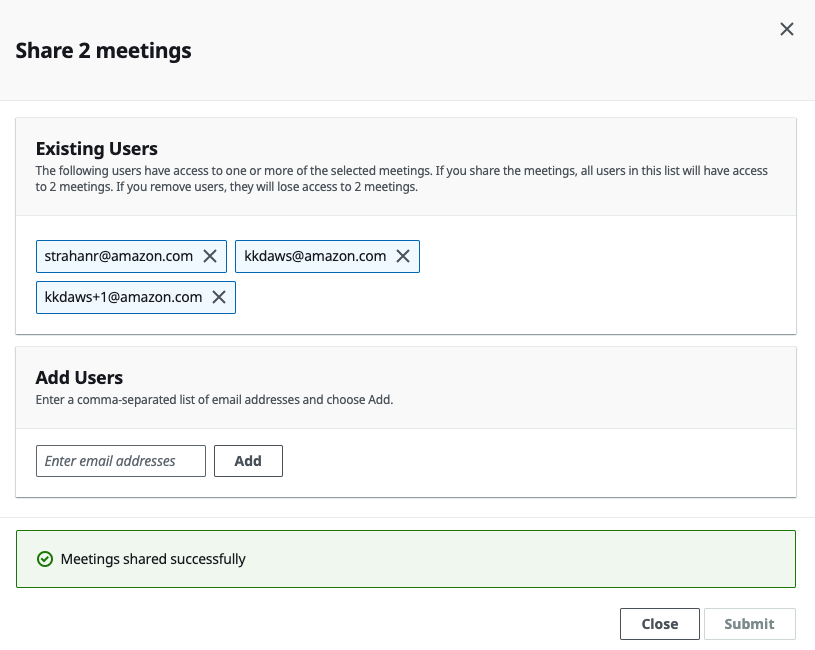
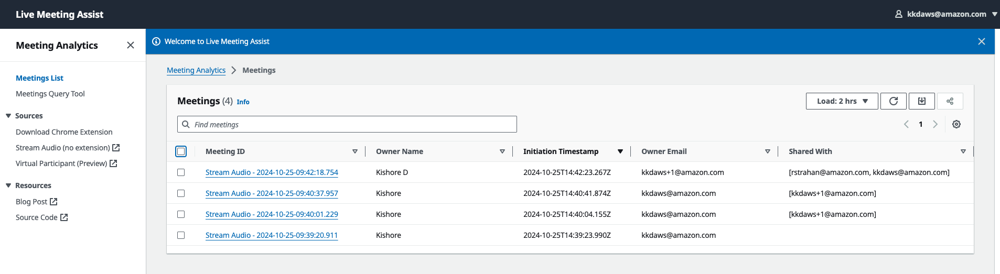
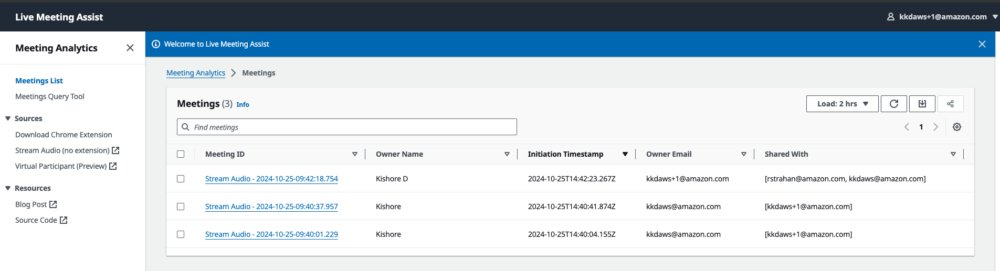
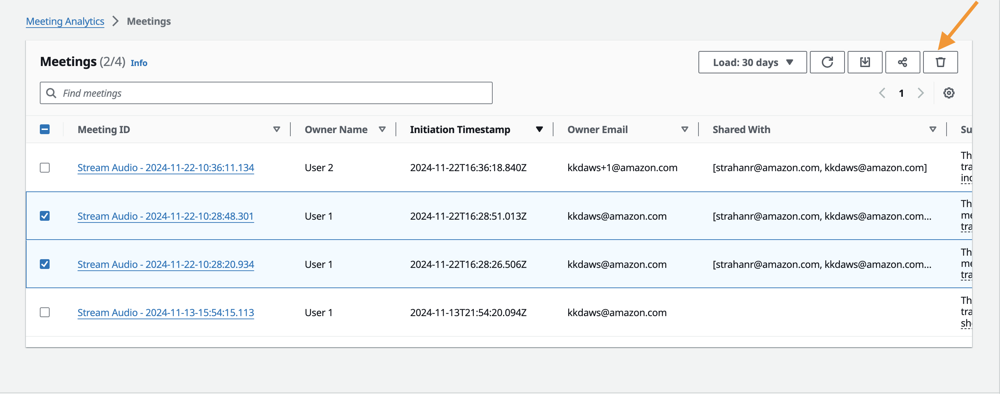
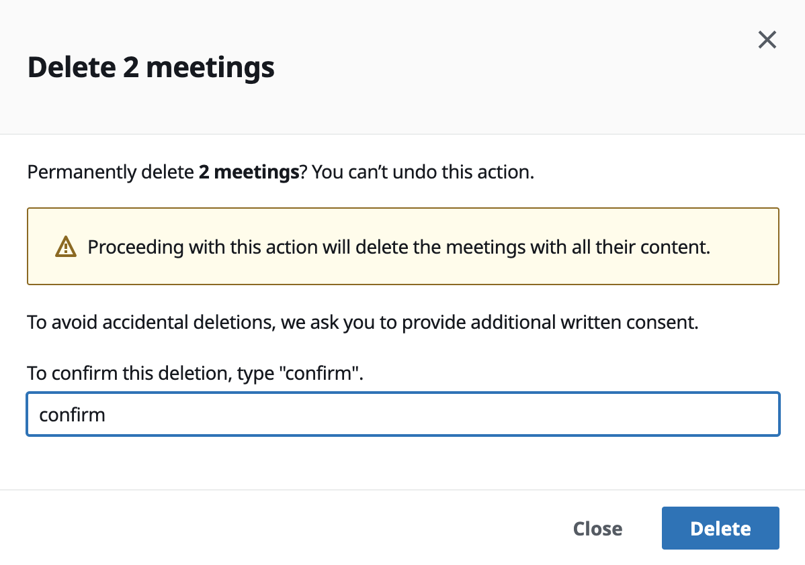
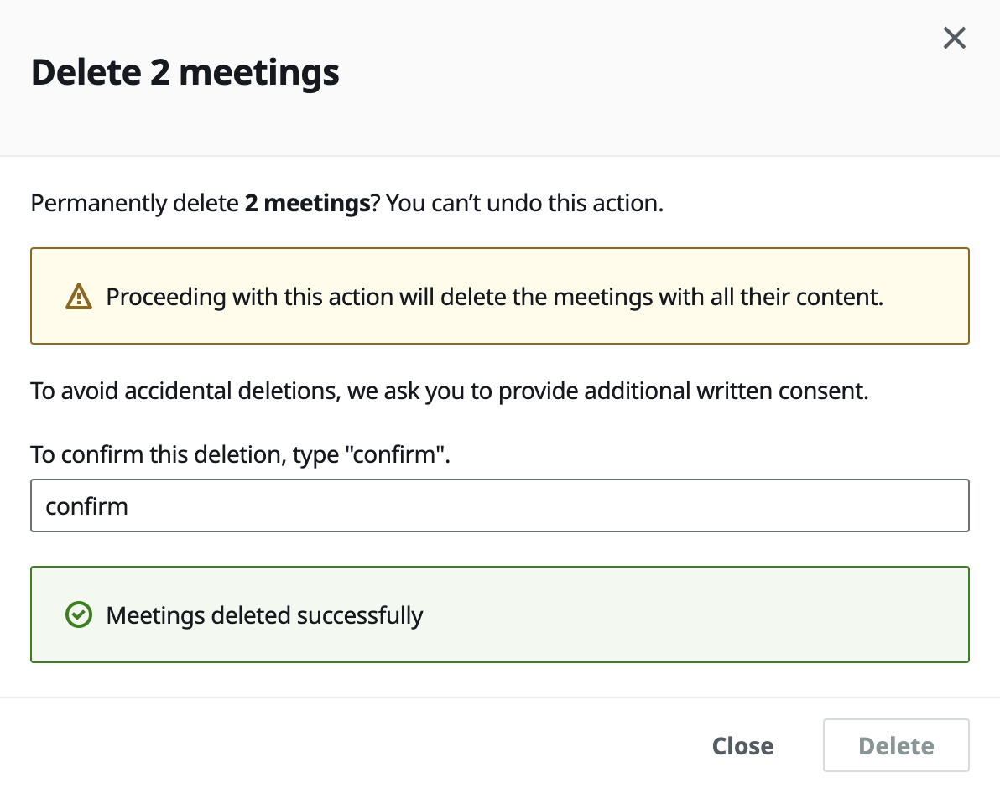

# User-Based Access Control

## Table of Contents

- [Overview](#overview)
- [Admin User](#admin-user)
- [Non-Admin User](#non-admin-user)
- [Authorized Account Email Domain](#authorized-account-email-domain)
- [Meeting Sharing](#meeting-sharing)
- [Meeting Deletion](#meeting-deletion)
- [Upgrading from v0.1.9 or Earlier](#upgrading-from-v019-or-earlier)
- [Service Limits](#service-limits)

## Overview

Starting with v0.2.0, LMA provides User-Based Access Control (UBAC). Each non-admin user sees only their own meetings and meetings that have been explicitly shared with them. Admin users can see all meetings across all users. This ensures meeting privacy while still allowing collaboration through sharing.

## Admin User

The stack creator or updater is automatically assigned the "Admin" role in Amazon Cognito.

Admin users have the following privileges:
- Can see **all meetings** across all users
- Can share any meeting with other users
- Can delete any meeting

**Recommendation**: Use the `jdoe+admin@example.com` email format for your admin account. This separates your admin account from your personal account, allowing you to have a non-admin account for day-to-day use while retaining admin access when needed.

## Non-Admin User

Non-admin users sign up via the LMA web UI. Their email address must belong to one of the configured Authorized Account Email Domains.

Non-admin users:
- Only see meetings they **own** or that have been **shared with them**
- Can share and delete only their own meetings
- Cannot access admin configuration pages

## Authorized Account Email Domain

The Authorized Account Email Domain setting controls who can self-register for an LMA account.

- Configured during deployment as a CloudFormation parameter
- Accepts a **comma-separated list** of email domains (e.g., `example.com,acme.org`)
- Users with an email address matching one of the listed domains can self-register through the web UI
- Leave blank to **prevent self-registration** entirely (only the admin account will exist)

## Meeting Sharing

*Available since v0.2.5*

Meeting sharing allows owners to grant read-only access to other users.

### How to Share

1. Select one or more owned meetings from the meeting list

   

2. Click the share icon in the toolbar

3. Enter comma-separated email addresses and click **Add**

4. Remove existing shared users if needed

   

5. Click **Submit**

6. Wait for the success confirmation

   

### Sharing Behavior

- Shared meetings appear in recipients' meeting lists with **read-only access**
- You can share **live meetings** that are still in progress (there is a small chance of missing transcript segments during the sharing operation)
- You can share with users who have **not yet signed up** — they must create an account to view the shared meeting
- Sharing does **not** validate recipient email addresses against the Authorized Email Domain setting
- Recipients do **not** receive an email notification when a meeting is shared with them

### Viewing Shared Meetings

Different users see different meeting lists based on ownership and sharing:

## Meeting Deletion

*Available since v0.2.7*

Meeting owners can permanently delete their meetings.

### How to Delete

1. Select one or more owned meetings from the meeting list

   

2. Click the delete icon in the toolbar

3. Type "confirm" in the confirmation dialog

   

4. Click **Delete**

5. Wait for the success confirmation

   

### Deletion Behavior

- Deleted meetings are **automatically removed** from shared users' meeting lists
- Shared users do **not** receive a notification when a meeting they can access is deleted
- Deletion is **permanent** and cannot be undone

## Upgrading from v0.1.9 or Earlier

Upgrading to v0.2.0 or later from v0.1.9 or earlier introduces a **breaking change**: the Amazon Cognito user pool is deleted and recreated. All users (admin and non-admin) must re-register.

### What to Expect

- **Admin user**: Receives a new temporary password email. After signing in and setting a new password, the admin retains access to **all previous meetings**.
- **Non-admin users**: Must create new accounts via the web UI. They will **lose access** to their previous meetings unless the admin shares those meetings with them.

### Recommendations

- Change the admin email to `jdoe+admin@example.com` format during the upgrade to separate admin and personal accounts
- Communicate the upgrade to non-admin users in advance so they know to re-register
- After upgrade, the admin can share previous meetings with users who need access

## Service Limits

Amazon Transcribe has a default limit of **25 concurrent transcription streams**. If your organization runs many simultaneous meetings, you may need to request a service limit increase through the AWS console.

---

See also: [Prerequisites & Deployment](prerequisites-and-deployment.md) | [Web UI Guide](web-ui-guide.md)
