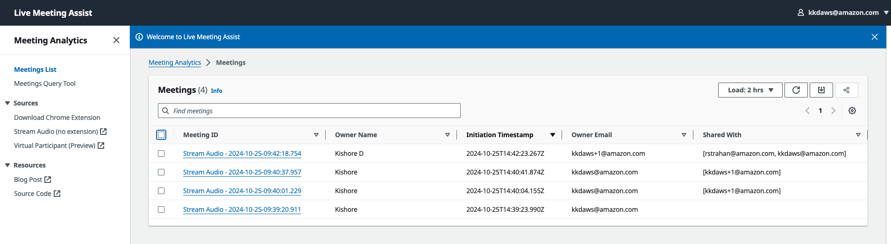
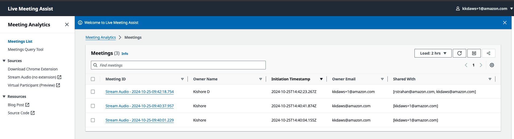
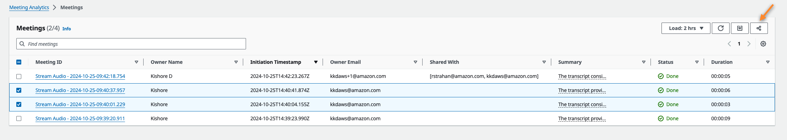
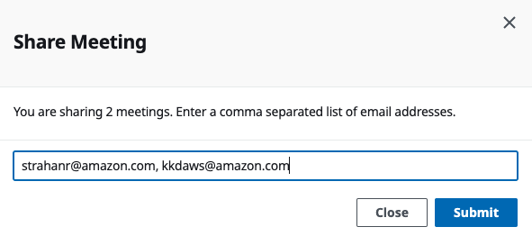
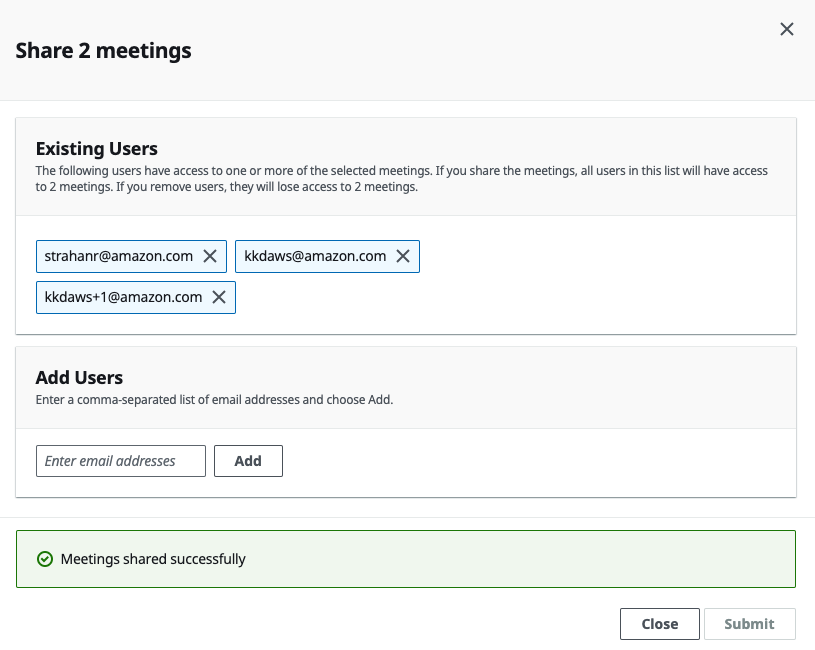
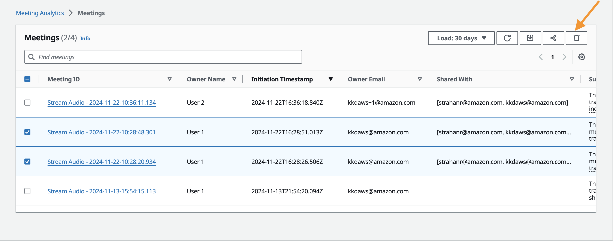
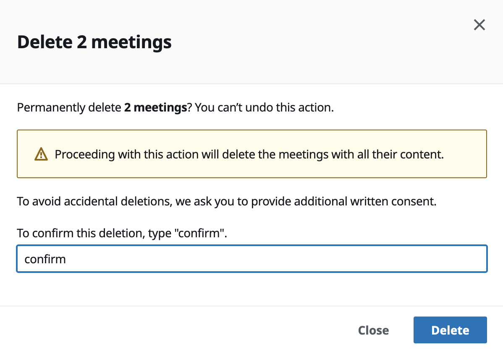
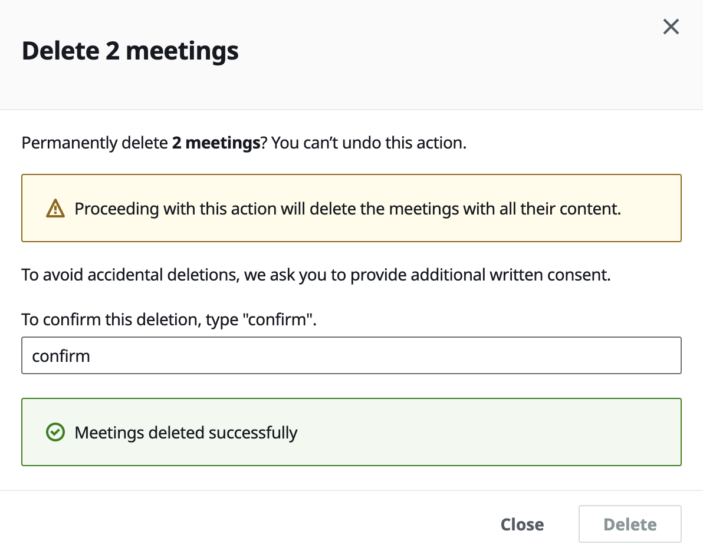

# User Based Access Control (Preview)

Starting with version 0.2.0, LMA has a new User-Based Access Control (UBAC, beta) feature. Previous versions of LMA supported multiple users (Authorized Account Email Domain(s)) by allowing any user in your organization to sign-up for access. 
However, it lacked fine-grained access controls in the UI. This meant that every user was able to see every other users' meetings. UBAC allows each user to only see their own meetings to ensure user privacy and reduce noise. With UBAC, meetings are personalized for each user, without any disruption in existing capabilities (see [Limitations](#limitations) for how this could change the experience for existing users during an upgrade). 

## Admin user
The user that created/updated the stack is automatically delegated as a Cognito "Admin" and is able to see all the calls. You may need this for any administrative or troubleshooting tasks. If this is not desired, you can either delete the Cognito User associated with the stack creation/update or remove the user from the "Admin" role. For information on managing users in your user pool see 
[Managing users in your user pool](https://docs.aws.amazon.com/cognito/latest/developerguide/managing-users.html)

## Non-Admin User
Any users that sign-up for access using the Web UI is a non-Admin user and is only able to see calls that they own.

## New LMA stack deployment

If you are deploying LMA for the first time, under "Admin Email Address", enter an email address that you would 
use only to log in occasionally to troubleshoot any issues users may be experiencing. If you need to use the same
email address for both administrative and personal use, we recommend that you enter your email address in the 
jdoe+admin@example.com format. Once the stack successfully deploys, you can sign-up using the Web UI link with your 
email address (jdoe@example.com format).

### Changing your Admin user password
You will receive an email to the address you entered under "Admin Email Address". This has the temporary password. Follow
these instructions to login to the LMA Web UI and changing your password:
1. Navigate to CloudFormation and ensure the LMA stack status shows CREATE_COMPLETE
2. Navigate to your Stack's Outputs section and copy the value associated with the ApplicationCloudfrontEndpoint key.
3. This is your LMA Web UI.
4. Log in to the Web UI with the temporary password and create a new password when prompted.

## Updating an existing LMA stack (from 0.1.9 or prior versions)

If you upgrade LMA from v0.1.9 or prior versions to v0.2.0 or later version, the existing Cognito user pool will be deleted. This means that you (the administrator)
and the other users will have to sign-up for a user again. You may have initially deployed the stack using the jdoe@example.com format. We recommend that you change the "Admin Email Address" value to the jdoe+admin@example.com format. See [New LMA stack deployment](#new-lma-stack-deployment) for more details.

### Existing non-Admin users
Existing users will have to re-create a new account by visiting the Web UI. Existing users will lose access to their previous meetings. 

### Existing Admin user 
You will receive an email to the address you entered under "Admin Email Address" with a temporary password. Log in to the Web UI with the temporary password and create a new password when prompted. If you do not have the Web UI link from your previous deployment, follow the instructions under
[Changing your Admin user password](#changing-your-admin-user-password)

As an administrator, you have access to all the previous meetings. There is no change in functionality for this user.

## Features of UBAC
- Fine-grained access control that restricts each user to their own meetings.
- In v0.2.5, LMA introduced a *Meeting Sharing* capability that allows users to share meetings they own with others. For more information on how this works, see [Sharing a Meeting](#Sharing-a-Meeting)
- In v0.2.7, LMA introduces a capability for users to delete meetings that they own. For more information on how this works, see [Deleting a Meeting](#Deleting-a-Meeting)

## Limitations of UBAC
- This is a beta feature and may have bugs. Use it with caution. If you encounter any issues, please open a GitHub issue.
- This feature upgrade (if upgrading from versions 0.1.9 or earlier) a breaking change. Existing users will not be able to see their previously recorded meetings. A future release will enable authorized administrators to share meetings other users/participants at which time you will be able to see your meetings created in previous versions (versions 0.1.9 or earlier) natively in the Web UI. In the interim, administrators can see your meetings and will be able to retrieve the transcripts, summaries and other information manually.
- Service limits apply. For example, Amazon Transcribe Streaming by default only allows you to stream up to 25 calls at a given time. You can request an increase to this through support. For Amazon Transcribe quotas and limits see [Amazon Transcribe endpoints and quotas](https://docs.aws.amazon.com/general/latest/gr/transcribe.html). Similar limits may apply to other services.

## Sharing a Meeting
Starting in version v0.2.5, LMA users can share meetings that they own with other users. On the Meeting List page of the LMA web UI, users can now see the meetings they own as well as meetings that have been shared with them.

In the following illustration, we see meeting List seen by User 1 (kkdaws@amazon.com):
1. The first meeting in the list is owned by a different user, but because it has been shared with User 1, it shows up in User1's meeting list. You can see the owner under Owner Email and the list of users the meeting has been shared with under Shared With.
2. The second and third meetings in the list are owned by User 1, and shared with User 2 (kkdaws+1@amazon.com)

Here we see the meeting List seen by User 2 (kkdaws+1@amazon.com):
1. The first meeting in the list is owned is the same as the first meeting in User1's list above - this is the meeting that is owned by User 2, and shared with User 1.
2. The second and third meetings in the list also the same as those seen by User 1; they are owned by User 1, but show up in User2's list because User 1 shared them.

### Sharing one or more meetings with others
To share a meeting, choose one or more meetings that you own and then choose the *share* icon on the meeting controls located on the upper right corner of the UI.

In the *Share Meeting* pop-up, provide a comma-separated list of email addresses for the recipients and choose Add. You can also remove access from one or more *Existing Users* if they no longer need access to this meeting. Once you have added and removed the recipients, click Submit.

Wait for confirmation that the meetings have been successfully shared before closing the pop-up. 

If you need to share the meeting with additional recipients or make additional changes to existing users list, you can do so immediately after the initial sharing or at a later time.

### Features (Sharing)
- Users can now share both previous and *live meeting* with other recipients. When sharing a live meeting, there is a possibility that some lines of the transcript might be missing (not the whole thing). See [Limitations](#limitations) section for more details.
- Meeting controls allow only the owner to share the meeting with recipients. That is, User 2 will not be able to share a meeting owned by User 1, even though they have access to view the meeting in the UI. Recipients of a shared meeting only have read-only access to the meeting.
- Meetings can be shared with new users (i.e., users who haven't signed up for an LMA application). Restrictions apply. See [Limitations](#limitations) section for more information.
- Sharing settings can be used to make modifications at any time to add or remove recipients.

### Limitations (Sharing)
- When users share a live meeting with other recipients, there is a small possibility that some of the transcript segments may not be shared due to a race condition. This does not impact the recipient's ability to view other meeting details. This limitation will be addressed in a future release.
- Recipients do not receive email notifications when meetings are shared with them. Existing users who are recipients of a new meeting can see it in the LMA web UI. For new users, the meeting owner should share the LMA URL, and encourage them to create an account in order to see their meeting..
- If a recipient who previously had access to the meeting but no longer does (because the owner removed them in the share settings), it is removed from their meetings list. However, the recipient will not be notified that the meeting is no longer shared with them.
- The sharing functionality currently does not validate if the recipient's email is part of the *Authorized Account Email Domain* configured during LMA deployment. Even if the meeting share is successful, recipients will not be able to create an account if their email is not in the authorized domain.

## Deleting a Meeting
Starting in version 0.2.7, LMA users can delete meetings that they own. Deleting a meeting will also delete it from the users it was shared with.

### Deleting one or more meetings
To delete one or more meetings that you own, choose the *delete* icon on the meeting controls located on the upper right corner of the UI.

Type confirm in the text box to give consent to delete the selected meetings and click on Delete.

Wait for confirmation that the meetings have been successfully deleted before closing the pop-up.

### Features (Deleting)
- Users can now delete previous and *live meetings*. 
- Only the meeting owners can delete their meetings. That is, User 2 will not be able to delete a meeting owned by User 1, even though they have access to view the meeting in the UI. 

### Limitations (Deleting)
- If a deleted meeting has been previously shared with additional recipients, it is automatically removed from their meetings list. There is no notification mechanism that lets the recipient know that a meeting that was once shared with them was deleted.

## Developer testing / troubleshooting notes

- To run LMA UI locally, see [How to run LMA UI Locally](./source/ui/README.md)
- To contribute to the solution, report bugs or issues, see [Contributing Guidelines](../CONTRIBUTING.md)