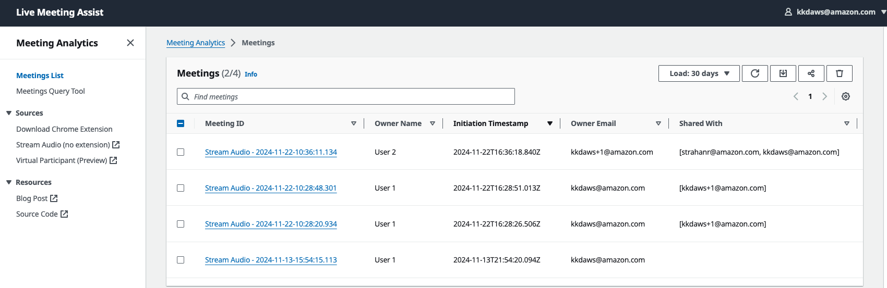
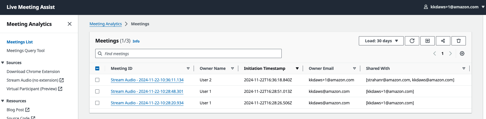
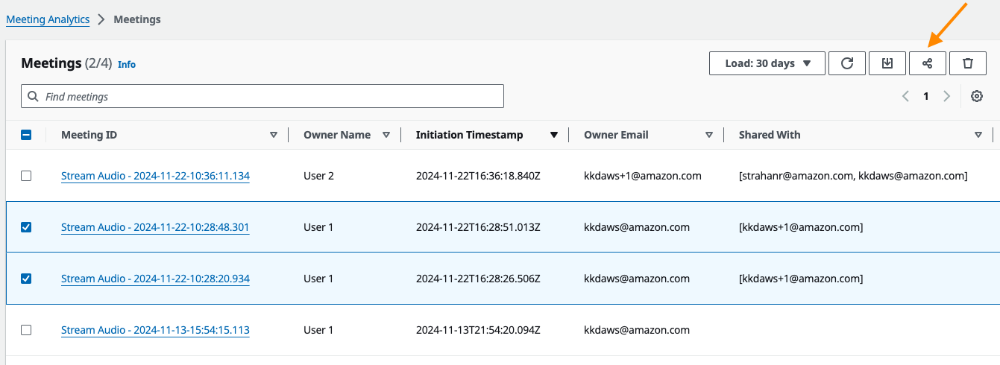
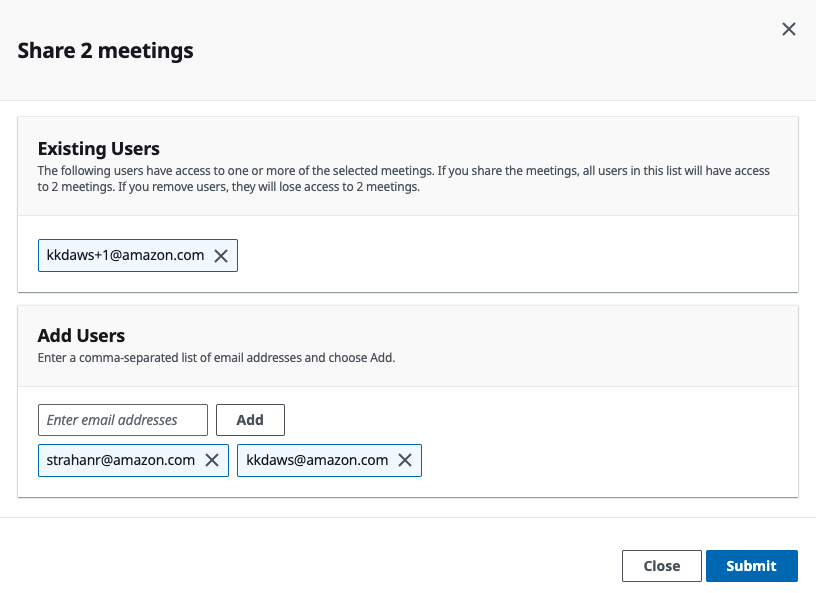
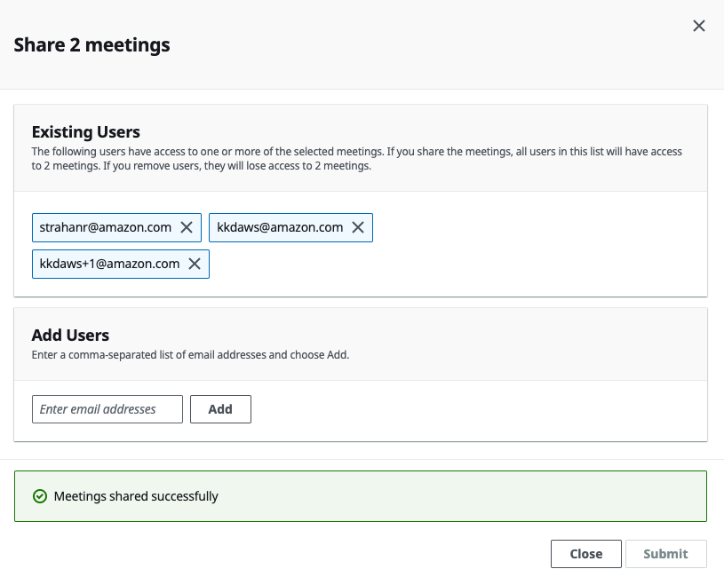

# User Based Access Control: Meeting Sharing Feature
Starting in version 0.2.5, LMA users can share meetings that they own with other users. On the Meeting List page of the LMA web UI, users can now see the meetings they own as well as meetings that have been shared with them.

In the following illustration, we see meeting List seen by User 1 (kkdaws@amazon.com):
1. The first meeting in the list is owned by a different user, but because it has been shared with User 1, it shows up in User1's meeting list. You can see the owner under Owner Email and the list of users the meeting has been shared with under Shared With.
2. The second and third meetings in the list are owned by User 1, and shared with User 2 (kkdaws+1@amazon.com)

Here we see the meeting List seen by User 2 (kkdaws+1@amazon.com):
1. The first meeting in the list is owned is the same as the first meeting in User1's list above - this is the meeting that is owned by User 2, and shared with User 1.
2. The second and third meetings in the list also the same as those seen by User 1; they are owned by User 1, but show up in User2's list because User 1 shared them.

## Sharing one or more meetings with others
To share a meeting, choose one or more meetings that you own and then choose the *share* icon on the meeting controls located on the upper right corner of the UI.

In the *Share Meeting* pop-up, provide a comma-separated list of email addresses for the recipients and choose Submit. 

Wait for confirmation that the meetings have been successfully shared before closing the pop-up. 

If you need to share the meeting with additional recipients, you can do so immediately after the initial sharing or at a later time. LMA will preserve the original list of recipients and incrementally adds permissions for the new set of recipients during subsequent sharing of the same meeting.

## Features
- Users can now share both previous and *live meeting* with other recipients. When sharing a live meeting, there is a possibility that some lines of the transcript might be missing (not the whole thing). See [Limitations](#limitations) section for more details.
- Meeting controls allow only the owner to share the meeting with recipients. That is, User 2 will not be able to share a meeting owned by User 1, even though they have access to view the meeting in the UI. Recipients of a shared meeting only have read-only access to the meeting.
- Meetings can be shared with new users (i.e., users who haven't signed up for an LMA application). Restrictions apply. See [Limitations](#limitations) section for more information.

## Limitations
- When users share a live meeting with other recipients, there is a small possibility that some of the transcript segments may not be shared due to a race condition. This does not impact the recipient's ability to view other meeting details. This limitation will be addressed in a future release.
- Users cannot edit their share settings. This means that once a meeting is shared with a recipient, the owner cannot remove them. However, the owner can add additional recipients. A future release will address this limitation.
- Recipients do not receive email notifications when meetings are shared with them. Existing users who are recipients of a new meeting can see it in the LMA web UI. For new users, the meeting owner should share the LMA URL, and encourage them to create an account in order to see their meeting..
- The sharing functionality currently does not validate if the recipient's email is part of the *Authorized Account Email Domain* configured during LMA deployment. Even if the meeting share is successful, recipients will not be able to create an account if their email is not in the authorized domain.

## Developer testing / troubleshooting notes

- To run LMA UI locally, see [How to run LMA UI Locally](./source/ui/README.md)
- To contribute to the solution, report bugs or issues, see [Contributing Guidelines](../CONTRIBUTING.md)