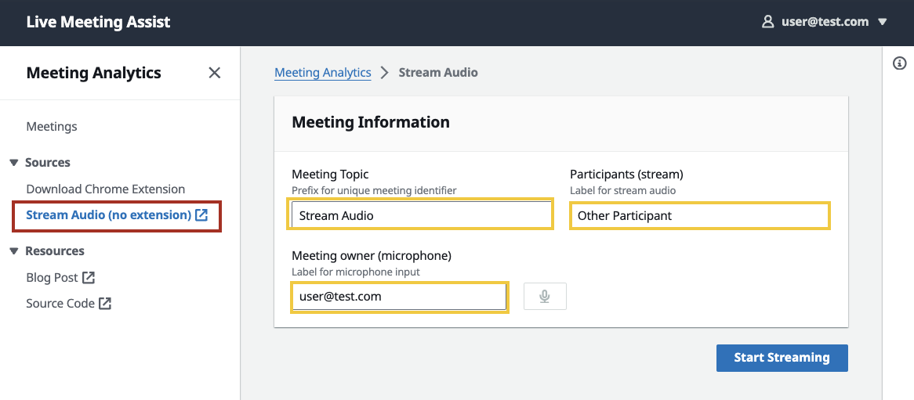
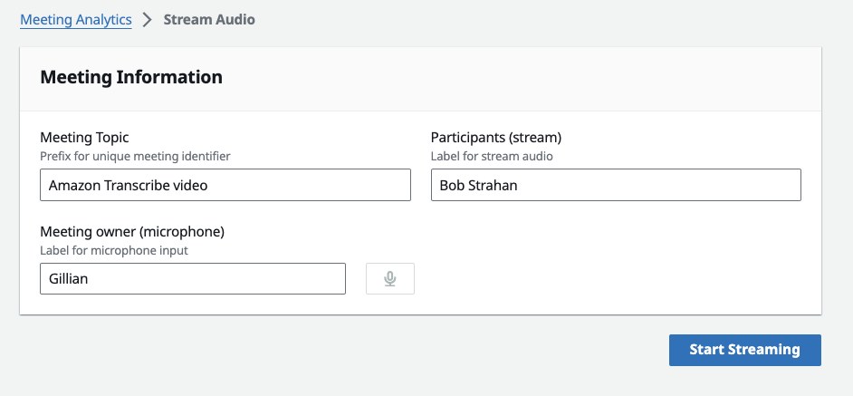
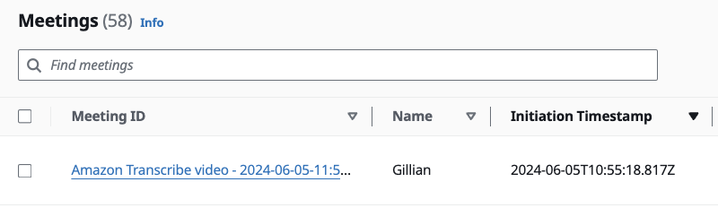
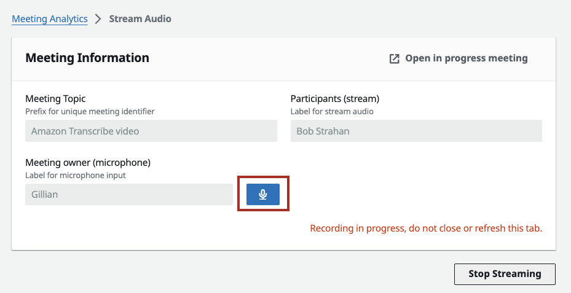

# Web UI Streaming Client

## Introduction
LMA UI offers an option to use LMA to stream from any browser based softphone, meeting app, or any other audio source playing in your Chrome browser, using the very convenient **Stream Audio** tab that is built into the LMA UI.

1. In the LMA App UI, choose **Stream Audio (no extension)** to open the Stream Audio tab.

   

1. For **Meeting Topic**, enter a name for your meeting. When the recording starts it will be appended to a timestamp to create a unique meeting identifier.
1. For **Meeting owner (microphone)**, enter a name for yourself (applied to audio from your microphone)
1. For **Participants (stream)**, enter the name(s) of the other participants (applied to the incoming audio source).

   

1. Choose **Start Streaming**
1. Choose the browser tab you opened earlier, and choose **Allow** to share
1. The audio from the chosen tab and  your microphone will be combined into a stereo (two channel) audio stream. The client sends the stream to the websocket server for downstream processing
1. To see your in-progress meeting use the "Open in progress meeting" link.
   NOTE: you may have a wait a few seconds for the meeting to start streaming before the meeting page is available.

    

1. You can also access the meeting from the LMA UI tab where you will see it "In Progress".

    

1. You can choose to mute or unmute your own microphone during the stream.

    

1. To stop the recording click on the "Stop Streaming" button.

1. Once you do that a link to the meeting that has just been recorded will appear at the bottom of the screen.

    

Use the **Stream Audio** feature to stream from any softphone app, meeting app, or any other streaming audio playing in the browser, along with your own audio captured from your selected microphone. Always obtain permission from others before recording them using LMA, or any other recording application.

