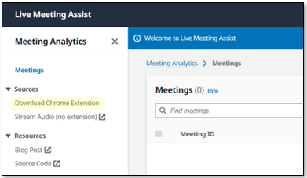
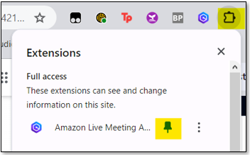
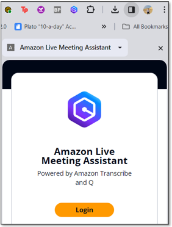
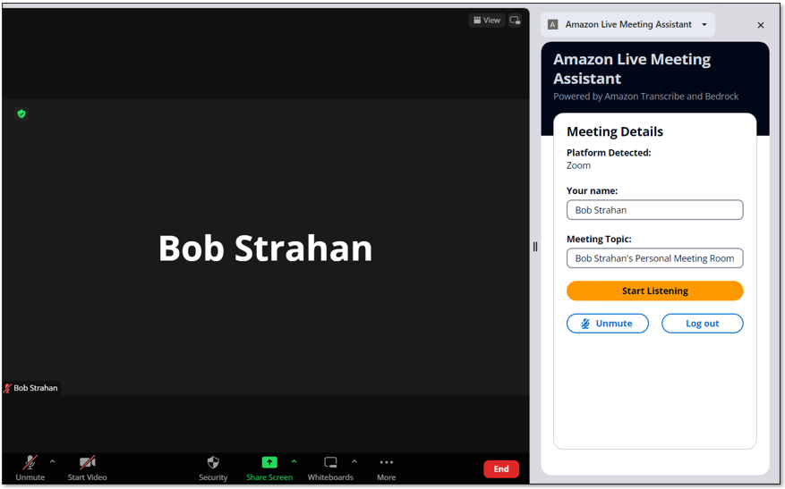
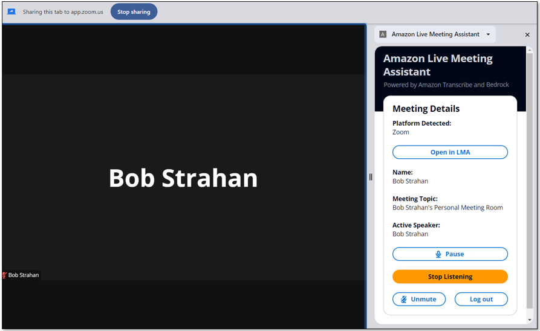

# Chrome Extension

### Download and unzip the extension

During the LMA stack deployment, the nested stack, BROWSEREXTENSIONSTACK, builds a pre-configured browser extension package which is ready to be downloaded and installed in your browser.

Currently only Chrome is supported, but we expect to add extension packages for other browsers later.

To download the Chrome browser extension zip file, either:
- Open the `Outputs` tab of the LMA stack, and choose the download URL labeled `ChromeExtensionDownloadUrl` to download the file `lma-chrome-extension.zip`

  

- OR Open the LMA web application and choose **Download Chrome Extension**

  

After downloading `lma-chrome-extension.zip`, right click and expand the zip file to create a local folder named `lma-chrome-extension`.

### Install the Chrome extension

From within Chrome, navigate to chrome://extensions.  On the left side, click the **Load unpacked**, navigate to the `lma-chrome-extension` folder (which you unzipped from the download), and click select.  This will load your extension.

Pin your new LMA extension to the browser tool bar - select the `extensions` icon and pin the extension `Amazon Live Meeting Assistant`.

   

## How to use

Once you have the extension installed, login with your LMA credentials.
  
   

  
Navigate to your meeting platform's page. If you already have it loaded, please reload the page. 

   

  
Select the `Start Listening` button.  
Choose `Allow` on the popup asking you to share the browser tab.
  
   

Choose `Open in LMA` to see your live transcript, select language, and to interact with the meeting assistant.

