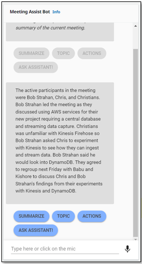
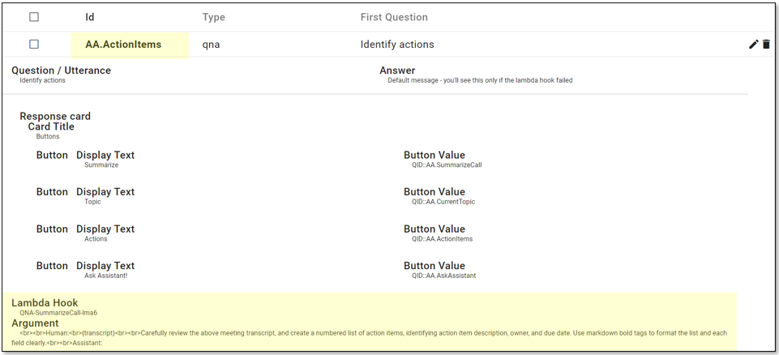
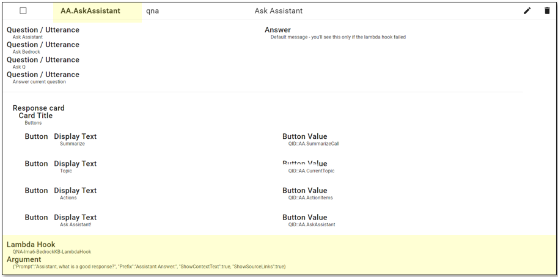
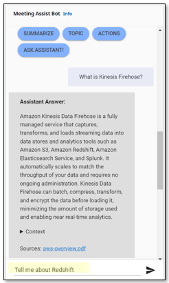
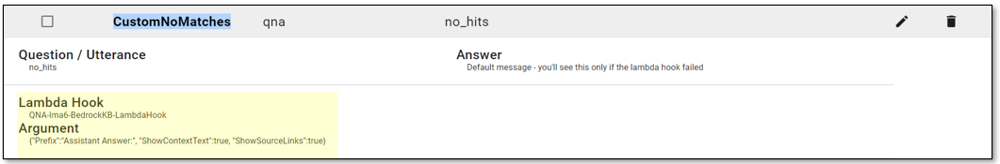

# LMA Meeting Assist

## Table of Contents

1. [Introduction to Meeting Assist](#introduction)  
  

## Introduction

Live Meeting Assist (LMA) is a solution which provides users with real-time multi-participant audio transcription, optionally translated into their preferred language, and an integrated AI meeting assistant that uses trusted enterprise data and meeting context to fact-check, look up relevant information, and propose responses. It creates succinct on-demand recaps, insights, and action item lists during and after meetings, securely maintaining an inventory of meeting records. Enterprises can use LMA with an existing Amazon Q Business application or Amazon Bedrock Agent/Knowledgebase. LMA integrates with popular meeting platforms and offers improved participant focus, understanding, accuracy, time-saving, and record-keeping efficiency, while supporting enterprise security, compliance, and availability. 

Before continuing, please read the blog post [Live Meeting Assistant (LMA) with Amazon Transcribe, Amazon Bedrock, and either Knowledge Bases for Bedrock or Amazon Q Business](https://amazon.com/live-meeting-assistant), deploy LMA, and follow the tutorial to experience the Meeting Assist demo. This is prerequisite context for the rest of this document.


In LMA, the meeting assistant is invoked in one of two ways:
1. A meeting participant says the wake phrase (defined by the **Meeting Assist Wake Phrase Regular Expression** parameter in the LMA Cloudformation stack). The wake phrase defaults to *OK Assistant!*. When using the *OK Assistant!* wake phrase, the meeting assistant response is inserted and persisted inline with the meeting transcript.
    <p align="left"></p>

2. The LMA user invokes the meeting assistant using the **Meeting Assist Bot** on the LMA User Interface, by typing a question, or by using one of the built-in 'easy button' options. When using the Meeting Assist Bot on the UI, the responses are shown in the bot panel, and are not persisted after the session.
    <p align="left"></p>

In either case, LMA sends a request to the [QnABot on AWS solution](https://aws.amazon.com/solutions/implementations/aws-qnabot/) which is used to handle intent configuration and orchestration of backend services. QnABot attempts to match the incoming request to a preconfigured item (or record) that is stores in its own Amazon Opensearch vectorstore. If the request contains the explicit ID of an item (QID) then the match is explicit, otherwise the content of the request is used to perform a vector search to find the most semantically similar match. You can dig deeper into this topic by reading the [LLM text embedding section](https://docs.aws.amazon.com/solutions/latest/qnabot-on-aws/semantic-question-matching.html) of the QnABot Implementation Guide.   

If QnABot finds a good match for the request (*for semantic matches, the `EMBEDDINGS_SCORE_THRESHOLD` setting threshold value defines 'good'*), the matched item determines how the request is fulfilled. If QnABot does not find a good match, it automatically uses a fallback item known as the `no_hits` item to determine how the request is fulfilled.

When you deploy LMA, a default set of items is loaded into QnABot, allowing it to handle all the default meeting assistant features illustrated in the blog. But you aren't limited to using the defaults! You can use QnAbot's Content Designer to inspect, and even to customize the set of items. Login to QnAbot Designer using the password you configured when you followed the instructions to deploy LMA.. or if you didn't set a password then, locate the email you received with the temporary password for QnABot, and do it now. When you log in, you see all the default items listed:
  
  <p align="left"></p>


## Generate Action Items

Choose the **ACTIONS** button to ask the meeting assistant to generate an action item list from the meeting transcript. You can do this for a meeting while it is in progress, or after it has ended.

  <p align="left"></p>

When you click **ACTIONS** the bot UI sends a request to QnABot (using Amazon Lex) that identified the ID of the item that deals with Action Items, `AA.ActionItems`.  

In QnAbot Designer, select the `AA.ActionItems` item to see its definition. Note that it has a **LambdaHook** function defined. You can read about [LambdaHooks in the QnAbot Implementation Guide](https://docs.aws.amazon.com/solutions/latest/qnabot-on-aws/specifying-lambda-hook-functions.html), but for now, just know that this configures QnABot to invoke the specified function everytime the user requests ActionItems. Here we use the 'SummarizeCall' function that was deployed with LMA, and we specify the LLM prompt it should use, in the **Argument** field. 

  <p align="left"></p>

The default prompt for generating actions items is:
```
<br><br>Human:<br>{transcript}<br><br>Carefully review the above meeting transcript, and create a numbered list of action items, identifying action item description, owner, and due date. Use markdown bold tags to format the list and each field clearly.<br><br>Assistant:
```
The `<br>` tags are replaced in the function by newlines, and the placeholder `{transcript}` is replaced by the actual transcript, so the LLM prompt is actually more like:
```


Human:
Bob Strahan: All right team, let's get started. 
Chris Lott: OK, I'm ready.
Bob Strahan: We've been assigned this new project, and it needs to be built using aws services.
Chris Lott: What does it need to do?
etc..

Carefully review the above meeting transcript, and create a numbered list of action items, identifying action item description, owner, and due date. Use markdown bold tags to format the list and each field clearly.

Assistant:
```

You may be able to improve on this default prompt to get better results. Please, have a go. First make a copy of the original prompt so you can easily restore it if needed, and then use QnAbot Designer to edit the `AA.ActionItems` item, open the 'advanced' pane, and find and edit the LambdaHook **Argument**.  Then choose **UPDATE** to save your changes, and try clicking the **ACTION ITEMS** button in the LMA Meeting Assist Bot pane again, and see how your new prompt works.

For extra 'behind the scenes' visibility, go to the QNA-SummarizeCall Lambda function in the AWS Lambda console, inspect the code, and and view its logs in CloudWatch. This will help you to understand how it works, and to troubleshoot any issues.

## Summarize, and Identify Topic

The **SUMMARIZE** and **TOPIC** buttons work the same way as **ACTIONS**. They also use the QNA-SummarizeCall LambdaHook function, but they use different prompts defined in the LambdaHook Argument field of items `AA.SummarizeCall` and `AA.CurrentTopic` respectively. You can customize these prompts too, as described above.

## Ask Assistant

The **ASK ASSISTANT!** button works similarly, but it uses a different LambdaHook function than the Summarize, Topic, and Actions items. 

n QnAbot Designer, select the `AA.AskAssistant` item to see its definition. Note that it has a different **LambdaHook** function. Here we use the 'BedrockKB-LambdaHook' function that was also deployed with LMA - this function interacts with Knowledge bases for Bedrock.  (If you configured LMA - during deployment - to use Amazon Q Business instead, you'd see a different Lambdahook function, 'QBusiness-LambdaHook', configured here instead.)

The LambaHook function retrieves the meeting transcript, and truncates it if needed to represent the last N turns, where N is the value of the QnABot Setting `LLM_CHAT_HISTORY_MAX_MESSAGES` (default is 20, but you can change it in QnABot designer Settings page). The transcript is used to provide context for the prompt.

A JSON object with several parameters is in the **Argument** field. 

  <p align="left"></p>

The default Argument value string is the following JSON:

```
{"Prompt":"Assistant, what is a good response?", "Prefix":"Assistant Answer:", "ShowContextText":true, "ShowSourceLinks":true}
```

The fields are:
- Key: "Prompt", Value: "Assistant, what is a good response?"
    - This is the default prompt for 'Ask Assistant'.. it is interpreted (by an LLM inference) in the context of the meeting transcript. The intention of this prompt is to simply advise the LMA user what might be a good thing to say next, given the topics being doiscussed and how the meeting is going. 
- Key: "Prefix", Value: "Assistant Answer:"
    - This is a message to prefix to the response returned by Knowledge base. 
- Key: "ShowContextText": Value: true
    - Include relevant passage snippets from your Knowledge Base, used to generate the response. 
- Key: "ShowSourceLinks": Value: true
    - include URLs to the relevant source documents from your Knowledge Base.

As before, you are empowered to tinker with the values to customize or improve on the responses you get from **ASK ASSISTANT!**. For extra 'behind the scenes' visibility, go to the  LambdaHook function in the AWS Lambda console, inspect the code, and and view its logs in CloudWatch. This will help you to understand how it works, and to troubleshoot any issues.

## Freeform questions in the bot UI, and 'OK Assistant!' voice questions

Instead of choosing one of the 'easy buttons' in the Meeting assist bot UI, you can type a freeform question..

  <p align="left"></p>

Not, when QnABot receives this message, it cannot immediatly locate a matching ID in it's list of items. It will attempt to perform a semantic search to see if there is an item with stored questions that is a "good match" - if so it will use that item to formulate a response - but if there is no good match, it reverts to matching the item with the question `no_hits` with the ID `CustomNoMatches`. Select it in Designer:

  <p align="left"></p>

TBC!


