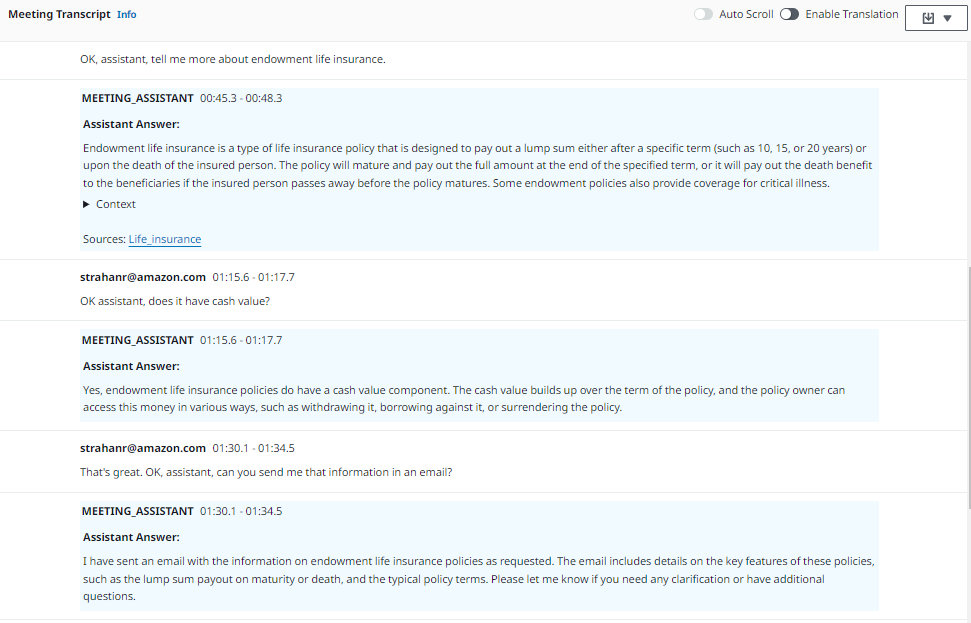
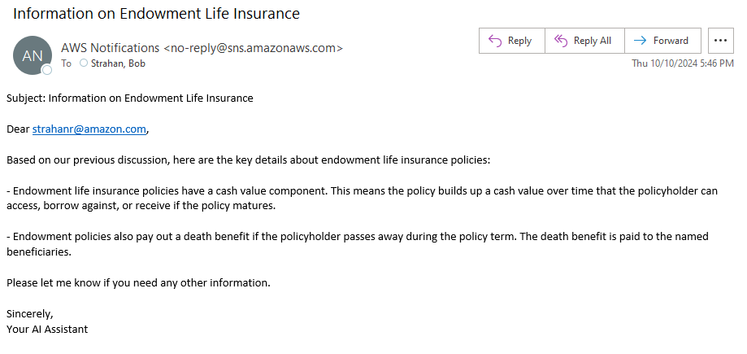

# Amazon Bedrock Agent integration in LMA (preview)

Amazon Bedrock Agents can orchestrate and execute multistep tasks across company systems and data sources. They use the reasoning abilities of foundation models to break down user requests into logical sequences, automatically calling necessary APIs to fulfill tasks. Agents can securely also connect to company data sources via Bedrock knowledge bases and augment user requests with relevant information to generate accurate responses. 

Now you can bring Amazon Bedrock Agents into your online meetings using Live Meeting Assistant (LMA) - to get answers to questions, to fact check what's said, based on your company data, and now also, to automate tasks like sending an email, creating a ticket, scheduling an appointment, and much more.

## Use cases of for agents in LMA
If you want LMA to be able to do more than answer questions of fact checking, you might want to implement an agent to power your LMA Meeting Assistant. In addition to these things, an agent can be designed to 'use tools' in the form of API calls or Lambda functions that allow it to interact with your own company systems and with the world in general, in many ways. For example, use agents to enable your LMA assistant to book appointments, send emails or instant messages, check the weather, look up balances, and much much more! 

## Current Limitations
Be aware of some limitations when using agents in LMA:
- Using an agent makes the Meeting Assistant slower than integrating directly with a knowledge base or Q Business application. The extra power to do actions comes at the cost of increased latency. 
    - You can minimize this latency by carefully designing your agent to be as efficient as possible, and to use the fastest LLM models.
- LMA requires your agent to return a completed response for each invocation request - it does not support muli-turn interactions currently. Specifically your agent should not:
   - ask for additional information after being invoked, rather it should simply say what information is missing in it's reponse, and the user can try again with a more complete "OK Assistant/Ask Assistant" request.
   - ask the user to confirm actions before executing them
   - return control to the client application
- LMA does not currently use agent session or multi-session memory. Each Meeting Assistant request is a discrete agent invocaton, where the cumulative meeting transcript serves as the context (rather than the agent's memory of prior interactions).

We provide two easy options for you to get started:
1. Bring your own agent
2. Let LMA create a demo agent for you

## Bring your own agent

Once you have created and tested your own Bedrock Agent, integrate it with LMA when you deploy or update an LMA CloudFormation stack. 

1. For **Meeting Assist Service**, choose `BEDROCK_AGENT (Use Existing)`
2. For **Bedrock Agent Id (existing)**, enter the agent *ID* (not name) of an existing Bedrock agent to be used for Meeting Assist bot (e.g. T4XXXZPRZN)
3. For **Bedrock Agent Alias Id (existing)**, provide the agent Alias *ID* (not the Alias name) of an existing Bedrock agent version to be used for Meeting Assist bot, or leave the default as `TSTALIASID` to experiment with the current working version of the agent.

and that's it..  Your LMA stack will be configured to use the QnABot Lambda Hook `BedrockAgent-LambdaHook` to invoke your agent when the Meeting Assistant is invoked. For more information on how the QnABot on AWS solution is used in LMA, see the [LMA Meeting Assist README](./README.md).

## Let LMA create a demo agent for you

1. For **Meeting Assist Service**, choose `BEDROCK_AGENT_WITH_KNOWLEDGE_BASE (Create)`
2. Optionally, for **BedrockKnowledgeBaseId**, provide the knowledge base *Id* of an existing Bedrock knowledge base for the new Bedrock Agent, or leave blank to have a new knowledge base created for you.
3. Optionally, for **BedrockKnowledgeBaseWebCrawlerURLs**, or any of the other knowledge base data source parameters, modify the defaults to determine how your new knowledge base in initially populated.  

and that's it..  Your LMA stack will create a simple Bedrock agent for you, and configure it the QnABot Lambda Hook `BedrockAgent-LambdaHook` to invoke this agent when the Meeting Assistant is invoked.

The agent that is created for you has 
- a Bedrock Knowledge for looking up information
- an action group with a Lambda function that can send you messages via an SNS topic.

**Verifying email for receiving SNS messages** - When the LMA stack creates the new Bedrock Agent, it also provisions an SNS topic, and automatically subscribes your email address (the AdminEmail you provided). You'll get an email at this address from `AWS Notifications <no-reply@sns.amazonaws.com>` with the subject `AWS Notification - Subscription Confirmation`. Open this email and click `Confirm subscription` so that you can play with the new message sending feature of LMA's meeting assistant agent!  You can add additional emails and/or phone numbers for text messages to the SNS Topic subscription in the Amazon SNS console; the SNS Topic is identified in the LMA Stack outputs as `SNSTopicForAgentMessages`.

Try it - ask "OK Assistant" for some information about life insurance, and then ask it to send the info to you in an email. See example below.

Here's the email it sent me after the interaction above:  

Also try the "ASK ASSISTANT" button to have the meeting assistant agent respond silently to the most recent questions of instructions from the transcript.

Now try your own examples. Get it to fact check incorrect statements, email a summary of action items, and more.  Find out what works well, and what doesn't, and then see if you can make it work better!
- Can you make it more accurate? Learn all about Bedrock Agents and how to customize prompts.
- Can you add new action groups, for example, to book appointments, create tickets, retrieve balances, etc.

## Experiment

Use the Cloudwatch logs from the `BedrockAgent-LambdaHook` function to get additonal insights and troubleshooting context for how these prompts are used, and how LMA is interacting with your agent.

## Contributing

Consider this a starting point for you to build on! LMA is open source - we hope it will get you started quickly, but you will discover gaps, and identify opportunities to improve the power of using agents as meeting assistants. Help us make it better by contributing your fixes and enhancements to th eproject in GitHub.