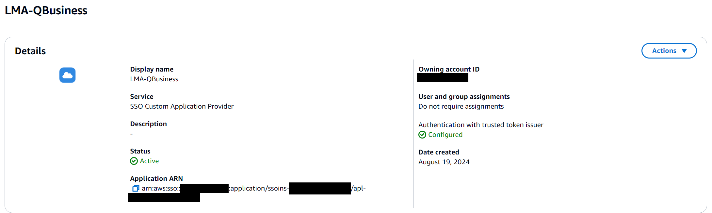

# Amazon Q Business integration in LMA

Amazon Q is a new generative AI-powered application that helps users get work done. Amazon Q can become your tailored business expert and let you discover content, brainstorm ideas, or create summaries using your company’s data safely and securely. For more information see: [Introducing Amazon Q, a new generative AI-powered assistant](https://aws.amazon.com/blogs/aws/introducing-amazon-q-a-new-generative-ai-powered-assistant-preview). This feature allows your users to converse with Amazon Q using Live Meeting Assistant to ask questions and get answers based on company data.

## Deploy Amazon Q (your business expert) as a fallback source of answers, using Lambda hooks with CustomNoMatches/no_hits

1. Before proceeding, you will need an existing deployment of a Q Business application. Please reference the AWS docs for creating a new [Q Business application](https://docs.aws.amazon.com/amazonq/latest/qbusiness-ug/create-application.html)
2. When launching or updating the LMA stack, make the following parameter changes:
    1. `Meeting Assist Service`: Located under `Meeting Assist Options` Select 'Q_Business (use existing)'
    2. `AmazonQAppId`: Located under `Meeting Assist Q Business Integration`. Existing Amazon Q Application ID
    3. `IDCApplicationARN`: ARN of the Identity Center customer managed application created for QBusiness. This will be blank on your first launch of LMA and you will need to update this after creating a custom application in Identity Center (see step 5 below). Once you have obtained that application, you will copy the ARN into this parameter below and update the stack. The process for a new deployment of LMA w/ Q Business follows these steps...
        1. Initial deployment (only filling in `AmazonQAppId`)
        2. Create IDC application (follow steps below)
        3. Update LMA stack providing `IDCApplicationARN` from step 5
3. Once the stack has completed, check the Outputs section of CloudFormation. You will need the following outputs.
    1. CognitoUserPoolClientId
    2. CognitoUserPoolTokenIssuerUrl
    3. QBusinessLambdaHookFunctionRoleArn
4. The Cognito user pool created by the Live Meeting Assistant will need to be added as **Trusted token issuer** to Identity Center by doing the following steps
    1. Go to Identity Center and click on `Settings`, then `Create trusted token issuer`
    2. The issuer URL will be the `CognitoUserPoolTokenIssuerUrl` obtained from deploying LMA and you will need to provide which attributes should map between the two (usually this is email).
        
5. A custom application will need to be created in Identity Center to handle the connection between your Q Business application and your Cognito pool. Follow these steps to create the application.
    1. Go to Identity Center and click on `Applications` then `Add application`
    2. Select `I have an application I want to set up` and `OAuth 2.0` on the next page for Selecting Application type, then hit `Next`
    3. For `Application URL`, provide the **Web experience URL** of your Q Business application (if you have a custom domain for your Q Business application, you would use the URL of that domain). You can either opt to assign specific users/groups to this application or allow any Identity Center users/groups to access the application. Your Q Business subscriptions will still apply however so only users with a subscription can successfully chat with the application. Then hit `Next`
    4. Select the Trusted token issuer that was created in the previous section of these instructions, you will now need an aud claim so that the token issuer can identify the application. This is the `CognitoUserPoolClientId` obtained from deploying LMA.
    5. On application credentials, you will provide the IAM role of the Lambda function that is used to make calls to Q Business. This is the `QBusinessLambdaHookFunctionRoleArn` from deploying the LMA application.
    6. Once completed, your application will be visible in the `Customer managed` tab of Identity Center Applications. You will need to copy the `Application ARN` found in the Details section and update the LMA stack, providing this value as the `IDCApplicationARN` parameter
        

## After your Amazon Q Plugin stack is deployed
After setup, Live Meeting Assistant will use Q Business as a fallback for answering questions asked by the Meeting Assist Bot and the 'Okay Assistant' queries asked during meetings. 