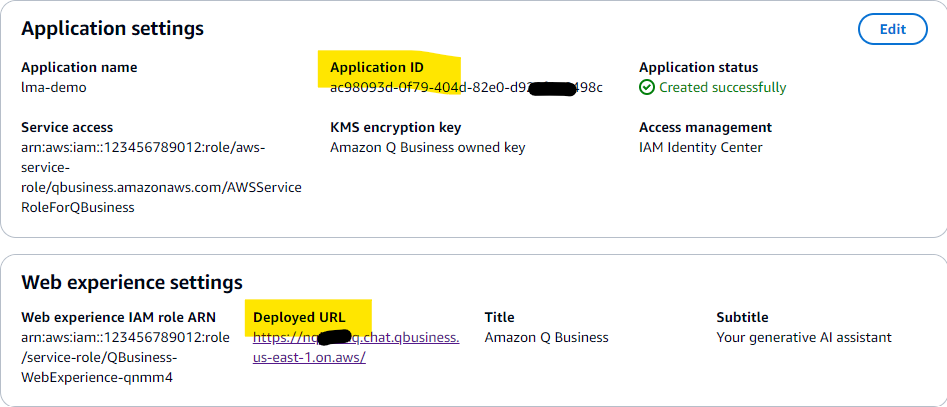
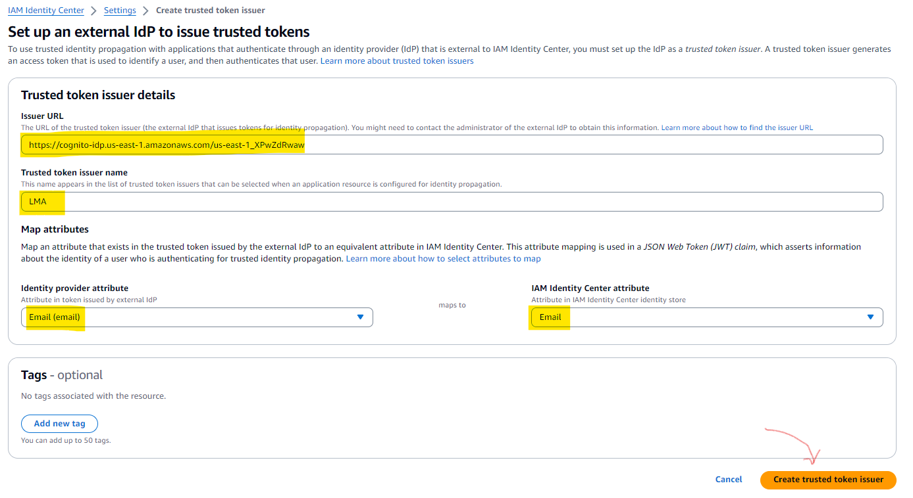
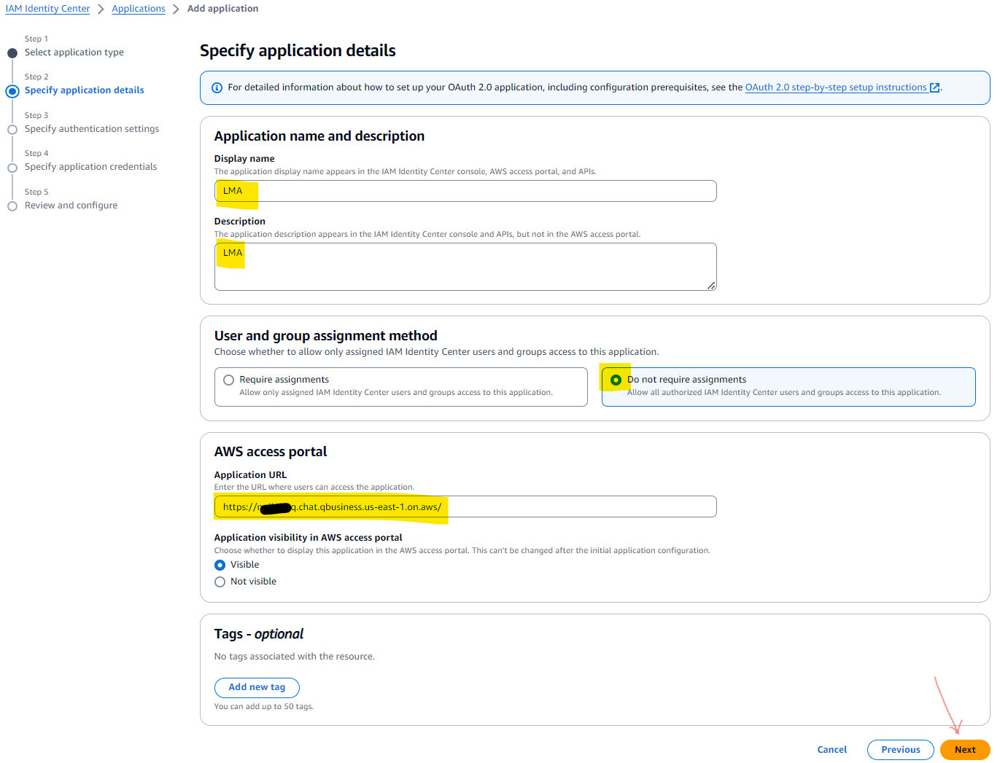
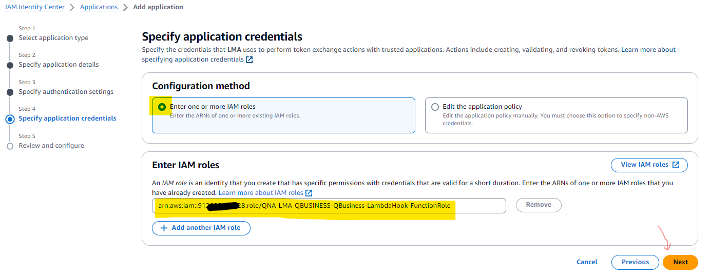
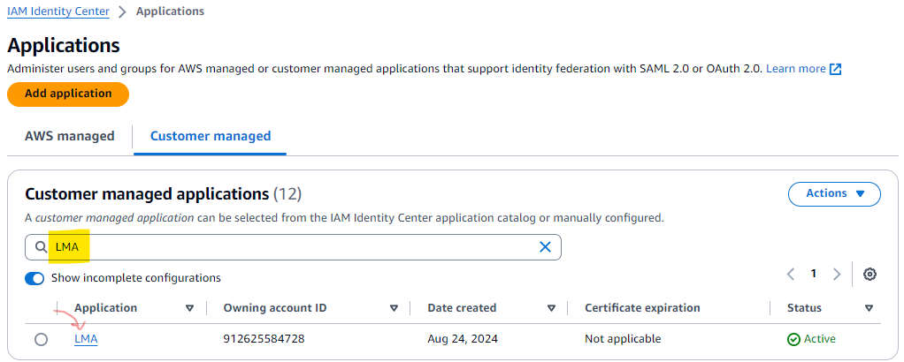
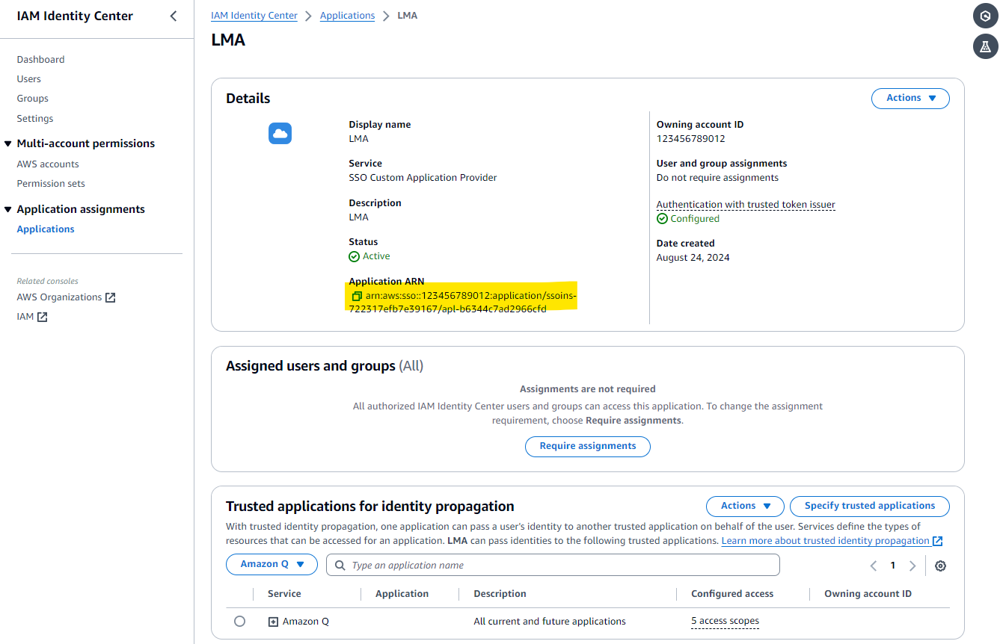

# Amazon Q Business integration in LMA

Amazon Q is a generative AI-powered application that helps users get work done. Amazon Q Business can become your tailored business expert and let you discover content, brainstorm ideas, or create summaries using your company’s data safely and securely. For more information see: [Introducing Amazon Q, a new generative AI-powered assistant](https://aws.amazon.com/blogs/aws/introducing-amazon-q-a-new-generative-ai-powered-assistant-preview). 

Now you can bring Amazon Q Business into your online meetings using Live Meeting Assistant (LMA) - to get answers to questions or to fact check what's said, based on your company data.

## Overall Flow of integrating with Q Business in LMA

1. Start with an existing working Q Business application with active subscriptions for LMA user(s)
1. Deploy LMA or update LMA, choosing "Q_BUSINESS" as the Meeting Assist Service, and providing the Id of your Q Business application.
1. Create IAM Identity Center Trusted Token Issuer to allow LMA to exchange Cognito user tokens for Identity Center tokens.
1. Create an IAM Identity Center application to allow LMA users to access their Q_BUSINESS subscriptions.
1. Finally, update the LMA stack with the ARN of your new IAM Identity Center application

These steps are described in detail below

## Detailed steps to configure Amazon Q Business as the LMA Meeting Assistant service

### 1. Start with an existing working Q Business application with active subscriptions for LMA user(s)

Use an existing Q Business application, or set up a new one, using IAM Identity Center - see [Configuring an Amazon Q Business application using AWS IAM Identity Center](https://docs.aws.amazon.com/amazonq/latest/qbusiness-ug/create-application.html).

*Be sure to add users with subscriptions to your Q Business application. It is essential that the Q Business user email addresses match the email addresses of you LMA users - it is by matching user email addresses that IAM can swap your user's LMA credentials (issued by Cognito) for secure IAM Identity Center tokens (used by Q Business) and enable the LMA user to invoke Q Business as the Meeting Assistant.*

**Note these values from your Q Business application:**
- `Application ID` (a UUID that looks like ac12345d-0f79-404d-82e0-d920f1a1234c)
- `Web Experience URL`

   

### 2. Deploy LMA or update LMA, choosing "Q_BUSINESS" as the Meeting Assist Service

Deploy LMA, following the directions in the [How to deploy LMA](../README.md#deploy-the-cloudformation-stack).  
Alternatively, update an existing LMA stack to use Q Business - see [How to update LMA](../README.md#update-an-existing-lma-stack) 

1. For **Meeting Assist Service** Select 'Q_Business (use existing)'
1. For **AmazonQAppId** enter the Amazon Q `Application ID` that you noted in the previous step.
1. For **IDC Application ARN** just leave it empty for now - later, in step 4, after you create the IDC Application, you will update the stack with its ARN.

Wait for your deployment or update to complete. The status of your LMA stack should not be CREATE_COMPLETE or UPDATE_COMPLETE.

**Note these values from the `Outputs` tab of the LMA CloudFormation stack:**
- `CognitoUserPoolTokenIssuerUrl`
- `CognitoUserPoolClientId`
- `QBusinessLambdaHookFunctionRoleArn`

### 3. Create IAM Identity Center Trusted Token Issuer

1. Open the IAM Identity Center console
2. Choose **Settings** from the left navigation menu
3. Select the **Authentication** tab
4. Choose **Create trusted token issuer**  

   

5. For **Issuer URL** enter the `CognitoUserPoolTokenIssuerUrl` stack output value that you noted earlier.
6. For **Trusted token issuer name** enter *LMA*
7. For **Mapping Attributes**, select `email` on both sides.
8. Choose **Create Trusted Token Issuer**

   

### 4. Create an IAM Identity Center application to allow LMA users to access their Q_BUSINESS subscriptions

1. Open the IAM Identity Center console
1. Choose **Applications** from the left navigation menu
1. Choose **Add application** (top right)
1. For **Setup preference** select **I have an application I want to set up**
1. For **Application type** select **OAuth 2.0**
1. Choose **Next**

    

1. For **Display name** enter *LMA*
1. For **Description** enter *LMA*
1. For **Application URL**, provide the `Web experience URL` for the Q Business application that you noted earlier. If you have a custom domain for your Q Business application, use the URL of that domain.
1. Select **Do not require assignments**
1. Choose **Next**

    

1. For **Trusted token issuers**, find and select the issuer named *LMA* that you created in step 3 earlier.
1. For **Aud claim** enter the `CognitoUserPoolClientId` obtained from the LMA Cloudformation stack outputs above.
1. Choose **Next**

    

1. For **Enter IAM roles** enter the `QBusinessLambdaHookFunctionRoleArn` obtained from the LMA Cloudformation stack outputs that you noted above.
1. Choose **Next**  

    

1. Choose **Submit** to create the application.

1. Back in the IAM Identity Center Applications page, open the **Customer managed** tab.
1. Enter *LMA* in the search bar to find the new LMA application.

    

1. In the section **Trusted applications for identity propagation** choose **Specify trusted applications**
1. For **Setup type** select **All applications for service with same access**
1. Choose **Next**
1. Under **Services** select the entry for **Amazon Q**
1. Choose **Next**

    

1. Choose **Trust applications** to save the configuration.

1. Note the **Application ARN** - you need it to update the LMA Cloudformation stack in the next section.

    

### 5. Update the LMA stack with the ARN of your new IAM Identity Center application

1. Open the CloudFormation console
1. Select the LMA stack
1. Choose **Update**
1. Choose **Use existing template**
1. Choose **Next**
1. For **IDC Application ARN** enter IDC `Application ARN` value noted in the previous section. 

Congratulations. You have now created a trust relationship between LMA and IAM Identity Center, allowing your LMA users to access their Q Business subscriptions when using the LMA meeting assistant.

**It is necessary that LMA users have an active subscription for the Amazon Q Business application, and that their LMA email address matches their registered Amazon Q Business user (Identity Center) user email address. LMA users that do not have matching Amazon Q Business subscriptions will see a error messages when attempting to use LMA meeting assistant features.**

## Use the Q Business powered meeting assistant

Try using the "OK Assistant" wake phrase in a call, or use the Meeting assist bot panel, to answer a question during a meeting using Amazon Q Business.

Note that answers have associated context citations, and links to the source documents used to generate the answer.

## Troubleshooting

If you get an error message instead of a response, you can search for clues by inspecting the CloudWatch Logs for the QnABot QBusiness LambdaHook Lambda function, which you find in the Lambda console by searching for `QBusiness-LambdaHook`. Common causes for problems include:
- Configuration error when setting up the IAM Identity Center Trusted Token Issuer and/or the Application. Retrace, or repeat the steps carefully.
- The LMA user does not have an active QBusiness subscription
- The LMA user email address does not match the configured QBusiness user email address

