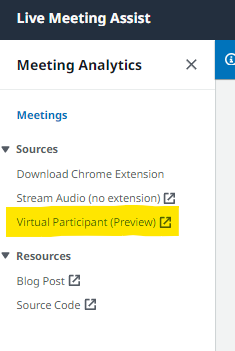
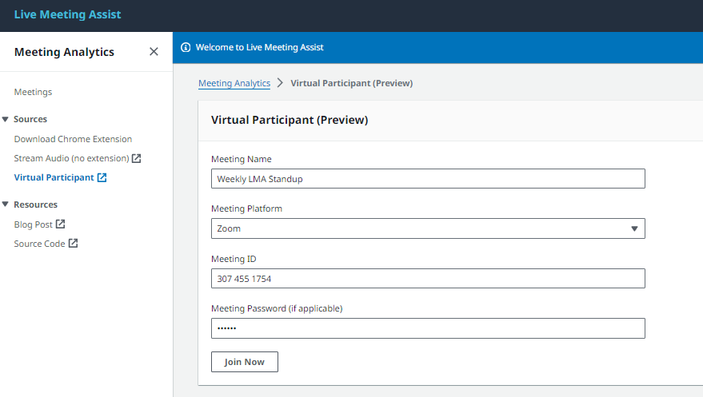
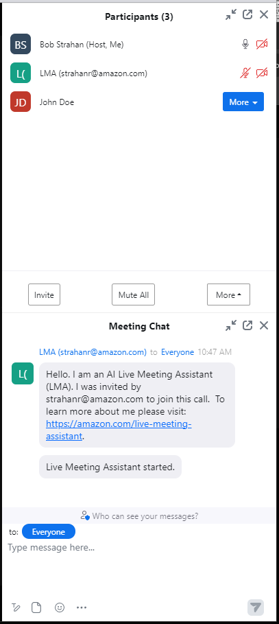

# Virtual Participant (Preview)

This stack deploys an ECS Fargate Task and Step Function state machine architecture that will join meeting via 'Virtual Participant', or VP for short. The VP is launched via a Fargate Task that runs via [Playwright](https://playwright.dev/python/), a headless Chrome browser. The audio and meeting metadata are ingested and sent to the LMA Kinesis Data Stream for further processing.

This feature is currently a work in progress - not feature complete. It currently works for Chime and Zoom calls only, and while it can join and stream a call, it has known issues, listed below.

Using the Virtual Participant is an alternative to using the LMA browser extension to capture your meeting.

Advantages:

- By using the Virtual Participant instead of the browser extension, you are free to use the native Chime, or Zoom app on your desktop rather than being compelled to running the meeting in your browser.
- You can also have the Virtual Participant join the meeting before you do (it joins as a separate participant) or stay on the call after you drop. In fact it could even join calls you've been invited to even if you don't join at all. Of course, while this is possible, you'll need to explain the presence of your LMA participant to others on the meeting, and get their permission.

Use the new "Virtual Participant (Preview)" tab to have LMA join your Chime or Zoom call.



Add your meeting details to the fields, and click "Join Now"



Your virtual participant will join your meeting in about 1 minute (after the Fargate task has started running). When it joins, it posts a message in the meeting chat to introduce itself.



## Known issues with the beta, will be addressed in later releases.

- The "Virtual Participant (Preview)" UI currently lacks error handling, user feedback, status visibility, and controls (pause/resume, leave meeting, etc.). If it fails to join your meeting after about 1m, you will need to troubleshoot using the logs from StepFunctions and/or the Fargate tasks.
- Limited currently to just Chime and Zoom meetings.

## Developer testing / troubleshooting notes

If you have it deployed via the LMA stack, you can manually execute the step function state machine. The payload is as follows:

```
{
  "apiInfo": {
    "httpMethod": "POST"
  },
  "data": {
    "meetingPlatform": "Zoom",
    "meetingID": "12345678",
    "meetingPassword": "a1b2c3",
    "meetingName": "A meeting title",
    "meetingTime": ""
  }
}
```

The `httpMethod` supports POST, GET, and DELETE. If POST, if you provide a meeting time in the future, it will schedule a meeting in the future. If GET, it will fetch a list of scheduled meetings, and DELETE will delete the upcoming meeting.

To execute this in the CLI, assuming you have AWS credentials, use this:

```
aws stepfunctions start-execution \
    --state-machine-arn arn:aws:states:us-east-1:123456789012:stateMachine:SchedulerStateMachine-09X1KR2ZL54I \
    --input '{"apiInfo": {"httpMethod": "POST"}, "data": {"meetingPlatform": "Zoom", "meetingID": "12345678", "meetingPassword": "a1b2c3", "meetingName": "A meeting title", "meetingTime": "", "userName": "Bob"}}'
```

You can also run it locally via docker

Use the following commands to test it locally. Note it is required to pass not only the meeting id and passcode, but also the LMA settings such as the Transcribe settings, Kinesis Data Stream name, etc.

`docker build -t lma-vp . `
_Copy image id_

```
MEETING_ID=123456789
MEETING_PASSWORD=
KINESIS_STREAM_NAME=<Outputs.CallDataStreamName>
RECORDINGS_BUCKET_NAME=<Outputs.RecordingsS3Bucket>
MEETING_PLATFORM=<Chime|Zoom>
IMAGE_ID=<image_id from docker build>
USER_NAME=TestUser
MEETING_NAME=TestMeeting

docker run --env MEETING_ID=$MEETING_ID --env MEETING_PASSWORD=$MEETING_PASSWORD  --env MEETING_NAME=$MEETING_NAME --env AWS_DEFAULT_REGION=us-east-1 --env KINESIS_STREAM_NAME=$KINESIS_STREAM_NAME --env CONTENT_REDACTION_TYPE=PII --env RECORDINGS_BUCKET_NAME=RECORDINGS_BUCKET_NAME --env RECORDINGS_KEY_PREFIX=lca-audio-recordings/ --env MEETING_PLATFORM=$MEETING_PLATFORM --env USER_NAME=$USER_NAME --env INTRO_MESSAGE="Test Intro Message" --env START_RECORDING_MESSAGE="Test Start Recording Message"  --env STOP_RECORDING_MESSAGE="Test Stop Recording Message" --env EXIT_MESSAGE="Test Exit Message" --env LMA_IDENTITY="LMA ({LMA_USER})" --env DEBUG=DEBUG lma-vp $IMAGE_ID
```
