# Data Flows

## Document Information

| Field | Value |
|-------|-------|
| **Document Version** | 1.0 |
| **Last Updated** | 2025-05-18 |
| **Classification** | Internal |

## 1. Overview

This document describes the primary data flows through the Live Meeting Assistant, identifying where data crosses trust boundaries, undergoes transformation, and is persisted. Each flow is analyzed for security-relevant characteristics.

## 2. Audio Capture & Transcription Flow (Core Pipeline)

### 2.1 WebSocket Audio Streaming

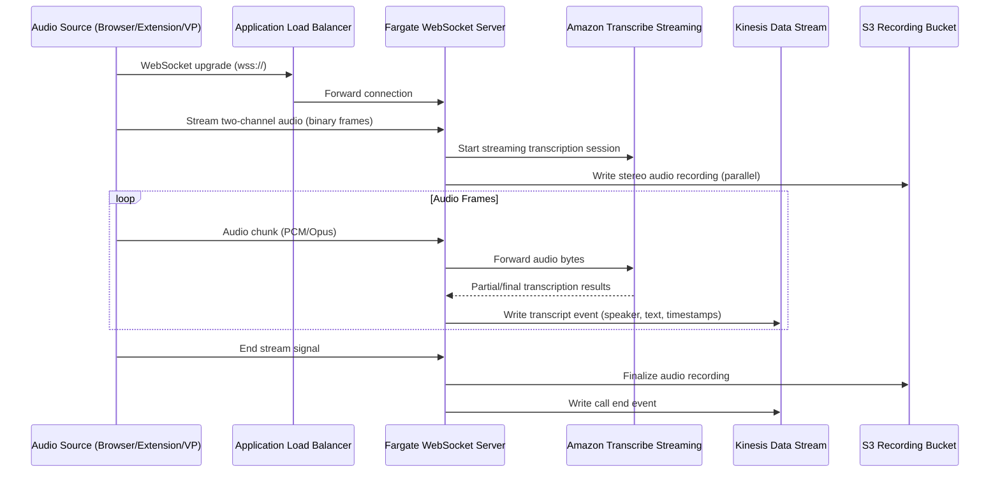

**Data in transit**: Raw audio bytes (PCM/Opus), transcription results (text + speaker labels + timestamps), audio recording (stereo WAV/Opus).

**Trust boundary crossings**:
- TB1→TB2: Audio client connects via HTTPS/WSS through ALB
- TB3→TB4: Fargate sends audio to Transcribe Streaming API
- TB3 internal: Fargate writes to Kinesis and S3

**Security controls**:
- ALB security groups restrict inbound connections
- WebSocket connection requires valid meeting token
- TLS 1.2+ encryption for all connections
- Fargate tasks in private subnets (egress via NAT)
- S3 bucket encrypted with customer-managed KMS key
- Kinesis stream encrypted with KMS

### 2.2 Virtual Participant Audio Capture

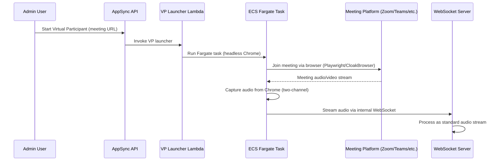

**Data in transit**: Meeting platform credentials, meeting URL, captured audio from Chrome browser, platform audio/video streams.

**Trust boundary crossings**:
- TB3→TB8: Fargate task connects to external meeting platform
- TB3 internal: VP task streams to WebSocket server

**Security controls**:
- VP tasks run in private subnets
- Meeting credentials stored as ECS task parameters (encrypted)
- No persistent storage on VP container (ephemeral)
- Platform-specific auth (OAuth, meeting passwords)

## 3. Event Processing Flow

### 3.1 Transcript Processing (Call Event Processor)

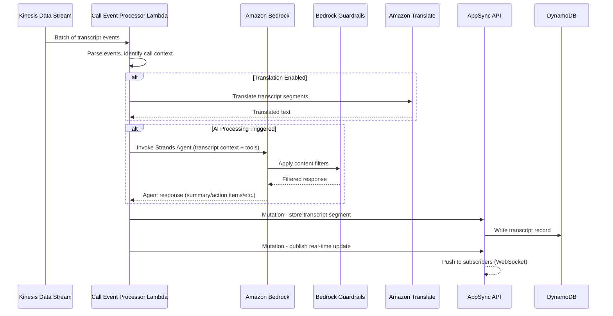

**Data transformation**: Raw Kinesis events → parsed transcript segments → translated text → AI-processed summaries/insights → DynamoDB records + real-time subscriptions.

**Sensitive data exposure**: Full meeting transcript text sent to Bedrock for AI processing. Translation sends text to Amazon Translate. Both contain potentially sensitive meeting content.

**Trust boundary crossings**:
- TB3→TB4: Lambda sends transcript text to Bedrock, Translate, Guardrails
- TB3 internal: Lambda writes to AppSync/DynamoDB

### 3.2 Meeting Assistant Agent Flow

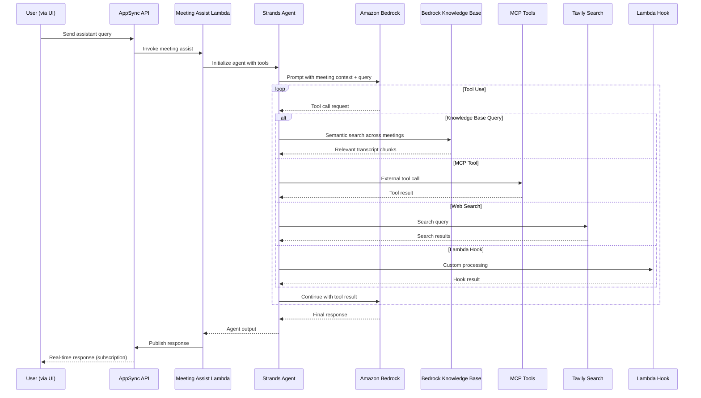

**Trust boundary crossings**:
- TB1→TB3: User query via AppSync
- TB3→TB4: Meeting context to Bedrock, KB queries
- TB3→TB5: Tavily web search
- TB3→TB6: MCP tool calls to external servers
- TB3→TB7: Lambda hook invocations

## 4. Voice Assistant Flow

### 4.1 Nova Sonic Voice Interaction

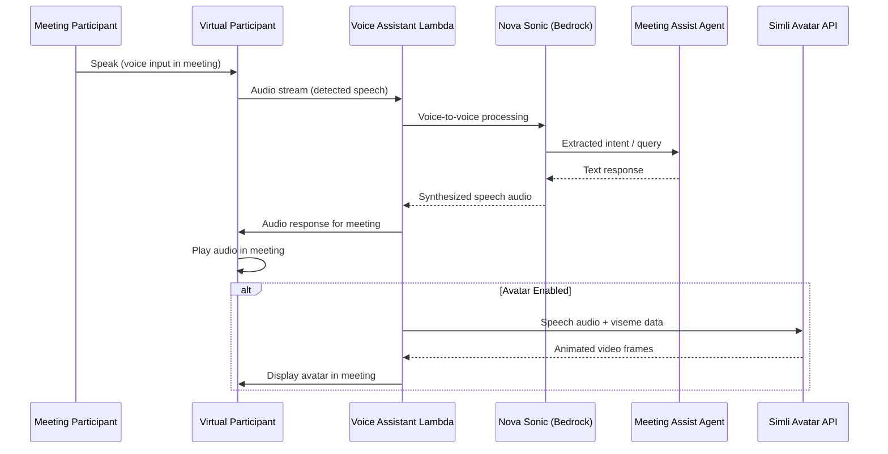

**Trust boundary crossings**:
- TB3→TB4: Voice audio to Nova Sonic
- TB3→TB6: Avatar requests to Simli API
- TB3→TB8: Audio output played into meeting platform

**Security note**: Voice assistant processes live audio which may contain sensitive meeting content. Third-party services (Simli) receive audio/viseme data.

## 5. Web UI & Authentication Flows

### 5.1 Authentication Flow

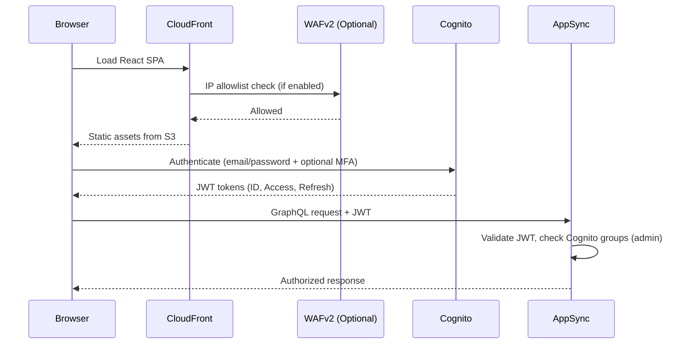

**Trust boundary crossings**: TB1→TB2 (browser to CloudFront/WAF/Cognito), TB2→TB3 (JWT to AppSync).

### 5.2 Real-Time Meeting UI Flow

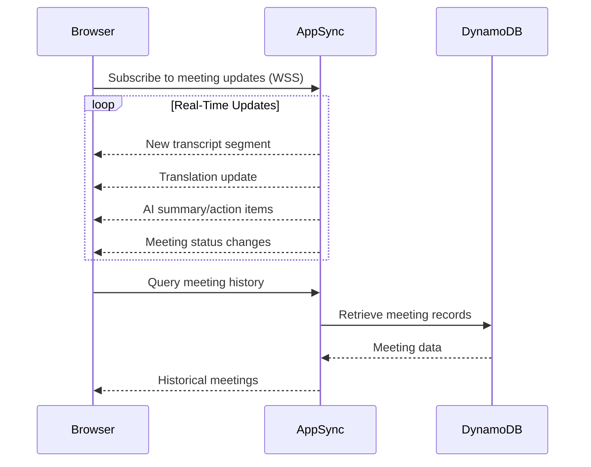

## 6. MCP API Gateway Flow

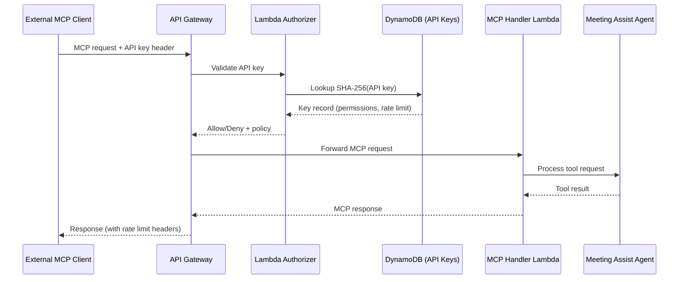

**Trust boundary crossings**: TB1→TB2→TB3. External clients authenticate via API key, validated against SHA-256 hash in DynamoDB.

**Security controls**:
- Custom Lambda Authorizer validates API keys
- SHA-256 hashing (keys not stored in plaintext)
- Rate limiting (100 req/sec default)
- Request validation at API Gateway level
- Access logging enabled
- Throttling per API key

## 7. Knowledge Base & Search Flow

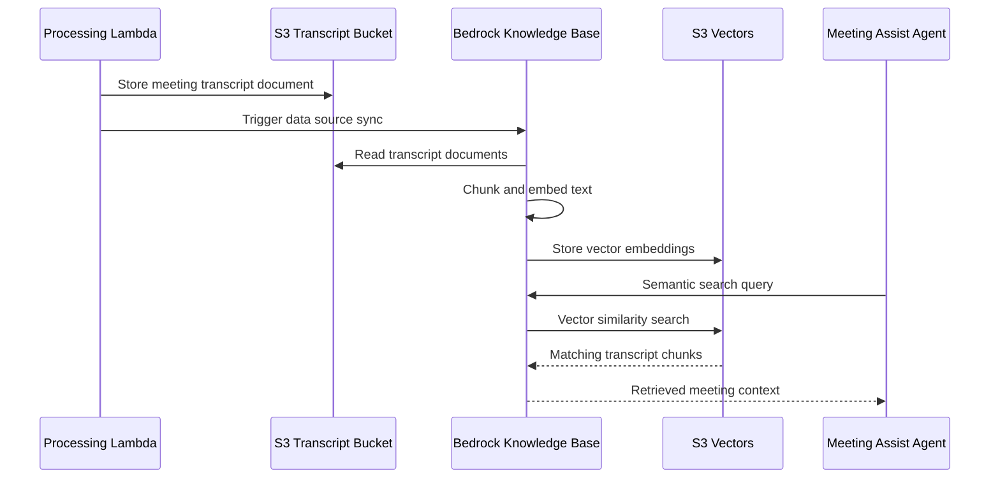

**Security note**: Knowledge Base contains transcripts from ALL meetings indexed into a single vector store. Cross-meeting access control is not natively enforced at the KB layer — any authenticated user querying the assistant can potentially retrieve content from any indexed meeting.

## 8. Browser Extension Flow

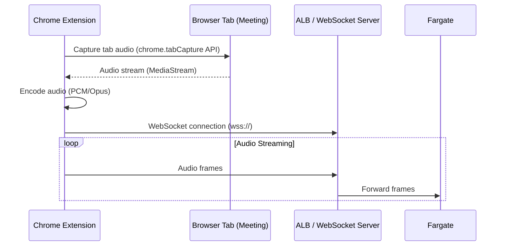

**Trust boundary crossings**: TB1→TB2. Browser extension captures audio from the active tab and transmits to the LMA backend.

**Security note**: Extension has broad audio capture permissions. Extension code runs in the user's browser with access to tab audio content.

## 9. Lambda Hook Flow

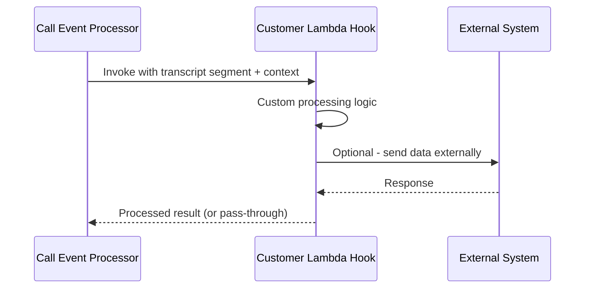

**Trust boundary crossings**: TB3→TB7. Customer-managed Lambda hooks receive transcript data and can send it to external systems.

## 10. Summary of Cross-Boundary Data Flows

| Flow | From | To | Data Sensitivity | Controls |
|------|------|----|-----------------|----------|
| Audio streaming | TB1 | TB2→TB3 | High (live speech) | WSS/TLS, meeting token, ALB security groups |
| Audio to Transcribe | TB3 | TB4 | High (raw audio) | TLS, IAM roles |
| Transcripts to Bedrock | TB3 | TB4 | High (meeting content) | TLS, IAM roles, Guardrails |
| VP joining meetings | TB3 | TB8 | Medium (meeting credentials) | OAuth, encrypted parameters |
| Voice to Nova Sonic | TB3 | TB4 | High (voice audio) | TLS, IAM roles |
| Avatar to Simli | TB3 | TB6 | Medium (speech/viseme data) | TLS, API key auth |
| Audio to ElevenLabs | TB3 | TB6 | Medium (text for TTS) | TLS, API key auth |
| MCP tool calls | TB3 | TB6 | Variable (meeting context) | API key auth, TLS |
| Tavily web search | TB3 | TB5 | Low (search queries) | API key auth, TLS |
| KB vector search | TB3 | TB4→TB5 | High (all meeting transcripts) | IAM, encryption |
| Lambda hooks | TB3 | TB7 | High (transcript data) | IAM, invocation-only |
| Browser extension audio | TB1 | TB2 | High (tab audio) | WSS/TLS, extension permissions |
| Real-time subscriptions | TB3 | TB1 | High (live transcripts) | JWT auth, WSS |
| MCP API inbound | TB1 | TB3 | Variable | API key, Lambda authorizer, rate limiting |
