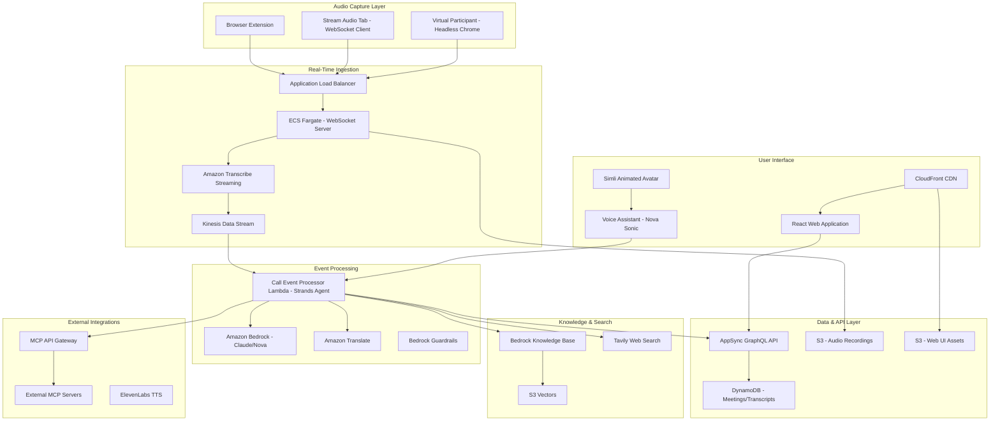
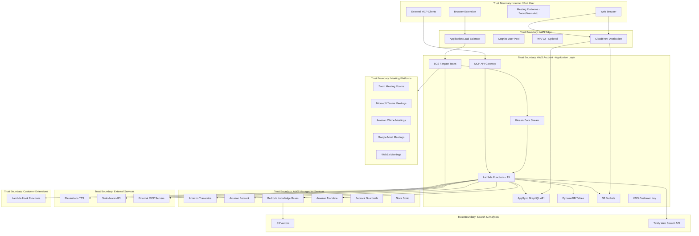

# System Overview

## Document Information

| Field | Value |
|-------|-------|
| **Document Version** | 1.0 |
| **Last Updated** | 2025-05-18 |
| **Classification** | Internal |
| **System Name** | Live Meeting Assistant (LMA) |

## 1. System Purpose

The Live Meeting Assistant (LMA) is an AWS-deployed solution for real-time meeting transcription, AI-powered meeting assistance, and virtual meeting participation. It captures live audio from meetings (via browser extension, WebSocket streaming, or virtual participant bots), transcribes speech in real-time using Amazon Transcribe, processes transcripts with AI agents (Strands Agents SDK + Amazon Bedrock), and provides interactive meeting assistance including summaries, Q&A, voice interaction, and semantic search across meeting history.

## 2. Architecture Overview

The system uses **11 nested CloudFormation stacks** orchestrated by `lma-main.yaml`, deployed across a VPC with public/private subnets in 2 availability zones.

## 3. Key Components

### 3.1 Infrastructure Layer

| Component | Service | Purpose |
|-----------|---------|---------|
| **VPC Networking** | VPC, Public/Private Subnets, NAT Gateway | Network isolation for Fargate tasks |
| **WebSocket Server** | ECS Fargate + ALB | Receives real-time audio streams via secure WebSocket |
| **Audio Transcription** | Amazon Transcribe Streaming | Real-time speech-to-text with speaker diarization |
| **Event Stream** | Amazon Kinesis Data Streams | Buffers transcription events for processing |
| **Event Processing** | AWS Lambda (19 functions) | Strands agent processing, transcript handling |
| **API Layer** | AWS AppSync (39 resolvers) | GraphQL API with real-time subscriptions |
| **Data Store** | Amazon DynamoDB | Meeting metadata, transcripts, LLM templates, API keys |
| **Audio Storage** | Amazon S3 | Stereo audio recordings, UI static assets |
| **CDN** | Amazon CloudFront | Web UI delivery with geo restrictions |
| **Authentication** | Amazon Cognito | User Pool + Identity Pool, JWT-based auth |
| **Encryption** | AWS KMS (Customer-managed) | Encrypts DynamoDB, S3, CloudWatch Logs |
| **Monitoring** | CloudWatch, X-Ray | Logging, tracing, configurable retention |

### 3.2 AI/ML Services

| Service | Usage |
|---------|-------|
| **Amazon Bedrock** | Foundation models (Claude 4.x, Nova) for meeting assistance, summaries, Q&A |
| **Strands Agents SDK** | Agent orchestration with tool use for meeting processing |
| **Amazon Transcribe** | Real-time streaming transcription with speaker attribution |
| **Amazon Translate** | Live translation (75+ languages) |
| **Amazon Bedrock Knowledge Bases** | Semantic search across meeting transcripts via S3 Vectors |
| **Bedrock Guardrails** | Content filtering and safety controls for agent responses |
| **Nova Sonic** | Voice-to-voice AI assistant for meeting interaction |

### 3.3 Application Features

| Feature | Description | Key Services |
|---------|-------------|--------------|
| **Live Transcription** | Real-time speech-to-text with speaker labels | Transcribe, Kinesis, AppSync subscriptions |
| **Live Translation** | 75+ language translation of transcripts | Amazon Translate |
| **AI Meeting Assistant** | On-demand/automatic summaries, Q&A, action items | Strands Agents, Bedrock |
| **Virtual Participant** | Headless Chrome bot joins Zoom/Teams/Chime/Meet/WebEx | ECS Fargate, Puppeteer |
| **Voice Assistant** | Natural voice interaction during meetings | Nova Sonic, ElevenLabs TTS |
| **Animated Avatar** | Visual avatar for voice assistant | Simli API |
| **Meeting Search** | Semantic search across all meeting transcripts | Bedrock KB, S3 Vectors |
| **MCP Integration** | Extend assistant with external tools (Salesforce, etc.) | API Gateway, Lambda Authorizer |
| **Audio Recording** | Stereo recording stored in S3 | Fargate, S3 |
| **Meeting Inventory** | Browse, share, manage meetings with access control | AppSync, DynamoDB |
| **Browser Extension** | Captures audio from any browser tab | Chrome Extension, WebSocket |
| **Embeddable Components** | Iframe-embeddable meeting UI components | React, CloudFront |
| **Lambda Hooks** | Customer extensibility for transcript processing | Lambda, customer-managed code |
| **Web Search** | AI assistant can search the web | Tavily API |

### 3.4 CloudFormation Stacks

| Stack | Purpose |
|-------|---------|
| **lma-main** | Orchestrator for all nested stacks |
| **lma-ai-stack** | Core Lambda functions, AppSync, DynamoDB, CloudFront, React UI |
| **lma-websocket-transcriber-stack** | Fargate WebSocket server, ALB, Transcribe, Kinesis |
| **lma-virtual-participant-stack** | Headless Chrome bots, ECS tasks, voice assistant |
| **lma-vpc-stack** | VPC, subnets, NAT gateway, security groups |
| **lma-cognito-stack** | Cognito User Pool, Identity Pool, admin group |
| **lma-meetingassist-setup-stack** | Strands agent configuration and tools |
| **lma-bedrockkb-stack** | Bedrock Knowledge Base, S3 Vectors |
| **lma-llm-template-setup-stack** | LLM prompt templates in DynamoDB |
| **lma-chat-button-config-stack** | Chat button UI configuration |
| **lma-nova-sonic-config-stack** | Nova Sonic voice assistant configuration |
| **lma-browser-extension-stack** | Browser extension distribution |

## 4. Trust Boundaries

### Trust Boundary Descriptions

| Boundary | Description | Controls |
|----------|-------------|----------|
| **TB1: Internet/End User** | Untrusted external users, browser extensions, meeting participants | TLS, Cognito authentication required |
| **TB2: AWS Edge** | CDN, identity, load balancing services | CloudFront OAC, Cognito JWT, WAF IP allowlist, ALB security groups |
| **TB3: Application Layer** | Core application infrastructure in VPC | IAM roles, security groups, KMS encryption, least-privilege |
| **TB4: Managed AI Services** | AWS-managed transcription, LLM, translation | Service-linked roles, TLS, data encryption |
| **TB5: Search & Analytics** | Semantic search and web search | S3 Vectors encryption + IAM, Tavily API key auth |
| **TB6: External Services** | Third-party APIs (ElevenLabs, Simli, MCP) | API key authentication, TLS, egress controls |
| **TB7: Customer Extensions** | Customer-provided Lambda hooks | Separate IAM roles, invocation-only permissions |
| **TB8: Meeting Platforms** | Third-party meeting services | OAuth/API credentials, platform-specific auth |

## 5. Data Classification

| Data Type | Classification | Storage | Encryption |
|-----------|---------------|---------|------------|
| Live audio streams | Customer Confidential | In-transit (WebSocket → Transcribe) | TLS 1.2+ |
| Audio recordings | Customer Confidential | S3 (stereo WAV) | SSE-KMS (customer key) |
| Meeting transcripts | Customer Confidential | DynamoDB | KMS encryption at rest |
| Meeting summaries/notes | Customer Confidential | DynamoDB | KMS encryption at rest |
| Meeting metadata | Internal | DynamoDB | KMS encryption at rest |
| User credentials | Restricted | Cognito | AWS-managed encryption |
| MCP API keys | Restricted | DynamoDB (SHA-256 hashed) | KMS encryption at rest |
| Third-party API keys | Restricted | CloudFormation Parameters / Secrets | Encrypted parameters |
| LLM prompt templates | Internal | DynamoDB | KMS encryption at rest |
| Knowledge Base vectors | Customer Confidential | S3 Vectors | Encryption at rest |
| CloudWatch Logs | Internal | CloudWatch | KMS encryption |
| Virtual Participant credentials | Restricted | ECS Task Environment | Task-level encryption |

## 6. Deployment Model

- **Deployment method**: AWS CloudFormation (11 nested stacks via `lma-main.yaml`)
- **Runtime**: Python 3.12+ (Lambda), Node.js (Fargate WebSocket), React (UI)
- **Container images**: ECS Fargate (WebSocket server, Virtual Participant with Puppeteer)
- **Regions**: Commercial AWS regions with Transcribe Streaming, Bedrock, and ECS support
- **Multi-tenancy**: Single-tenant per deployment (one stack = one environment)
- **Authentication**: Cognito User Pool with optional MFA, self-registration with email domain restrictions, admin group
- **Network**: VPC with public/private subnets, NAT gateway, optional WAF
- **Data retention**: Configurable DynamoDB TTL (default 90 days)
