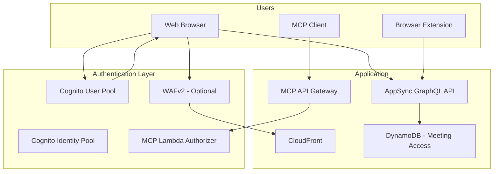

# Authentication & Access Control — Threat Analysis

## Document Information

| Field | Value |
|-------|-------|
| **Document Version** | 1.0 |
| **Last Updated** | 2025-05-18 |
| **Feature** | Amazon Cognito, JWT, RBAC, Meeting Access Control |
| **Classification** | Internal |

## 1. Feature Overview

Authentication and access control in LMA includes:
- **Amazon Cognito User Pool**: User registration, authentication, MFA support
- **Cognito Identity Pool**: Federated identities for AWS resource access
- **Admin Group**: Cognito group for administrative access (VP launch, config management)
- **Self-Registration**: Optional with email domain restrictions
- **JWT Token Validation**: AppSync validates Cognito JWTs for all API requests
- **Meeting-Level Access**: Meeting owners can share access with specific users
- **MCP API Key Auth**: Separate API key authentication for MCP API Gateway
- **Optional WAFv2**: IP-based access control for CloudFront/ALB

## 2. Architecture

## 3. Threat Analysis

### AUTH.T01: Self-Registration Abuse

| Attribute | Value |
|-----------|-------|
| **Threat ID** | AUTH.T01 |
| **Category** | STRIDE: Spoofing |
| **Description** | LMA supports self-registration with email domain restrictions. If domain restrictions are misconfigured or bypassed, unauthorized users could register accounts and access meeting data. Additionally, email domain spoofing could bypass the restriction. |
| **Attack Vector** | Attacker registers with a spoofed email address matching the allowed domain, or exploits misconfigured domain restrictions to create an account. Once authenticated, they access shared meeting content and can use the meeting assistant. |
| **Impact** | Unauthorized access to meeting transcripts, ability to launch meeting recordings, access to organizational meeting history via KB |
| **Likelihood** | Medium (2) |
| **Severity** | High (3) |
| **Risk Score** | **6 (High)** |
| **Affected Components** | Cognito User Pool, self-registration configuration, email verification |
| **Existing Mitigations** | Email domain restriction (AllowedSignUpEmailDomain parameter), email verification required, Cognito pre-signup Lambda trigger (optional), admin group separately managed |
| **Status** | Mitigated |
| **Recommendations** | Implement pre-signup Lambda trigger for strict domain validation, consider disabling self-registration in production, add CAPTCHA to registration, enable Cognito advanced security for anomaly detection |

### AUTH.T02: JWT Token Theft / Session Hijacking

| Attribute | Value |
|-----------|-------|
| **Threat ID** | AUTH.T02 |
| **Category** | STRIDE: Spoofing, Information Disclosure |
| **Description** | JWT tokens stored in the browser (localStorage/sessionStorage) could be stolen via XSS attacks, browser extensions, or client-side vulnerabilities, enabling session hijacking and unauthorized access to meeting data. |
| **Attack Vector** | XSS vulnerability in the React UI allows attacker's JavaScript to read JWT tokens from browser storage. Attacker uses stolen tokens to make authenticated AppSync requests, accessing live transcriptions and meeting history. |
| **Impact** | Full session hijacking, access to all meetings the victim can access, ability to use meeting assistant as the victim, real-time eavesdropping on active meetings |
| **Likelihood** | Medium (2) |
| **Severity** | High (3) |
| **Risk Score** | **6 (High)** |
| **Affected Components** | React UI, browser storage, AppSync API, Cognito tokens |
| **Existing Mitigations** | Short-lived access tokens (1 hour), React framework XSS protection, HTTPS-only, Cognito token revocation capabilities |
| **Status** | Mitigated |
| **Recommendations** | Implement CSP headers via CloudFront, use httpOnly cookies where possible, add token binding to client fingerprint, enable Cognito advanced security for compromised credential detection |

### AUTH.T03: Meeting Access Control Bypass

| Attribute | Value |
|-----------|-------|
| **Threat ID** | AUTH.T03 |
| **Category** | STRIDE: Elevation of Privilege |
| **Description** | Meeting-level access control (owner + shared users) is enforced at the application layer (AppSync resolvers, Lambda). If authorization checks are incomplete or bypassable, users could access meetings they weren't invited to. |
| **Attack Vector** | Attacker discovers meeting IDs (predictable patterns, API enumeration) and directly queries AppSync for meeting transcripts, bypassing UI-level access checks if resolver authorization is incomplete |
| **Impact** | Unauthorized access to specific meetings, transcript eavesdropping, privacy violation for meeting participants |
| **Likelihood** | Medium (2) |
| **Severity** | High (3) |
| **Risk Score** | **6 (High)** |
| **Affected Components** | AppSync resolvers, DynamoDB meeting access table, Lambda authorization logic |
| **Existing Mitigations** | AppSync resolver-level authorization checks, meeting access validation in Lambda, user-scoped DynamoDB queries, UUID meeting IDs (non-predictable) |
| **Status** | Mitigated |
| **Recommendations** | Comprehensive authorization audit of all 39 AppSync resolvers, add meeting access middleware to all data access paths, implement meeting ID opacity (no sequential patterns), add authorization unit tests |

### AUTH.T04: Admin Group Privilege Escalation

| Attribute | Value |
|-----------|-------|
| **Threat ID** | AUTH.T04 |
| **Category** | STRIDE: Elevation of Privilege |
| **Description** | The admin Cognito group grants extensive privileges including VP launch, MCP configuration, LLM template management, and user management. If a regular user can add themselves to the admin group, they gain full system control. |
| **Attack Vector** | Exploit misconfigured Cognito IAM policies that allow `cognito-idp:AdminAddUserToGroup` from non-admin contexts, or compromise the Cognito admin API to self-promote to admin group |
| **Impact** | Full system compromise — access to all meetings, ability to modify LLM templates, launch VPs, configure MCP servers, manage users |
| **Likelihood** | Low (1) |
| **Severity** | Critical (4) |
| **Risk Score** | **4 (Medium)** |
| **Affected Components** | Cognito User Pool, IAM policies, admin group |
| **Existing Mitigations** | IAM policies restrict Cognito admin operations to specific admin roles, CloudTrail logging of all Cognito admin API calls, admin group membership managed only through CloudFormation or direct console |
| **Status** | Mitigated |
| **Recommendations** | Regular audit of IAM policies with Cognito admin permissions, enable CloudTrail alerts for group membership changes, implement MFA requirement for admin operations, add detective control for unexpected admin group additions |

### AUTH.T05: WebSocket Authentication Weakness

| Attribute | Value |
|-----------|-------|
| **Threat ID** | AUTH.T05 |
| **Category** | STRIDE: Spoofing |
| **Description** | The WebSocket connection to the Fargate transcription server requires authentication. If the WebSocket authentication mechanism is weaker than the AppSync JWT validation (e.g., single-use tokens without expiration, or session-based auth without rotation), it creates an alternative attack surface. |
| **Attack Vector** | Attacker captures a WebSocket connection token and replays it to establish an unauthorized connection, or exploits long-lived WebSocket sessions that outlive the original JWT token lifetime |
| **Impact** | Unauthorized audio streaming (injecting fake transcripts), eavesdropping on active meeting audio via unauthorized connections |
| **Likelihood** | Low (1) |
| **Severity** | High (3) |
| **Risk Score** | **3 (Medium)** |
| **Affected Components** | ALB, Fargate WebSocket Server, WebSocket authentication tokens |
| **Existing Mitigations** | Meeting-specific connection tokens, TLS enforcement (WSS), ALB security groups, optional WAF |
| **Status** | Mitigated |
| **Recommendations** | Implement token expiration for WebSocket connections, add periodic re-authentication on long-running sessions, bind tokens to client IP/fingerprint, add connection duration limits |

### AUTH.T06: WAF Bypass / IP Restriction Evasion

| Attribute | Value |
|-----------|-------|
| **Threat ID** | AUTH.T06 |
| **Category** | STRIDE: Spoofing |
| **Description** | Optional WAFv2 provides IP-based access control. If WAF is the primary access restriction (without strong auth), attackers could bypass it through IP spoofing, proxy services, or accessing the ALB/AppSync directly without going through CloudFront/WAF. |
| **Attack Vector** | Attacker accesses the ALB or AppSync endpoint directly (bypassing CloudFront with WAF), or uses VPN/proxy from an allowed IP range to bypass IP restrictions |
| **Impact** | Bypass of network-level access controls, unauthorized access to LMA services |
| **Likelihood** | Low (1) |
| **Severity** | Medium (2) |
| **Risk Score** | **2 (Low)** |
| **Affected Components** | WAFv2, CloudFront, ALB, AppSync |
| **Existing Mitigations** | WAF is supplementary (not sole auth mechanism), Cognito authentication still required, ALB security groups restrict direct access, CloudFront geo restrictions |
| **Status** | Mitigated |
| **Recommendations** | Ensure WAF is defense-in-depth (not sole control), restrict ALB to CloudFront-only access, implement AppSync endpoint restrictions, document WAF as supplementary control |

## 4. Security Controls Summary

| Control | Implementation | Threats Mitigated |
|---------|---------------|-------------------|
| **Email domain restriction** | Cognito AllowedSignUpEmailDomain parameter | AUTH.T01 |
| **Email verification** | Required for account activation | AUTH.T01 |
| **Short-lived tokens** | 1-hour access token lifetime | AUTH.T02 |
| **React XSS protection** | Framework-level protection + CSP | AUTH.T02 |
| **Resolver authorization** | All 39 AppSync resolvers check auth | AUTH.T03 |
| **UUID meeting IDs** | Non-predictable meeting identifiers | AUTH.T03 |
| **IAM-protected admin ops** | Cognito admin APIs restricted by IAM | AUTH.T04 |
| **CloudTrail logging** | Audit trail for auth operations | AUTH.T01, AUTH.T04 |
| **WSS/TLS** | Encrypted WebSocket connections | AUTH.T05 |
| **Defense-in-depth** | WAF + Cognito + resolver auth layered | AUTH.T06 |
| **Optional MFA** | Multi-factor authentication available | AUTH.T01, AUTH.T02 |
