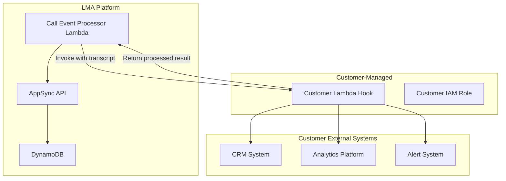

# Lambda Hooks — Threat Analysis

## Document Information

| Field | Value |
|-------|-------|
| **Document Version** | 1.0 |
| **Last Updated** | 2025-05-18 |
| **Feature** | Transcript Lambda Hook (Customer Extensibility) |
| **Classification** | Internal |

## 1. Feature Overview

Lambda Hooks provide customer extensibility for transcript processing:
- **Transcript Lambda Hook**: Customer-provided Lambda function invoked during transcript processing
- **Hook invocation**: Called by the Call Event Processor with transcript segments and context
- **Custom processing**: Customers can implement custom NLP, integration, alerting, or transformation
- **Pass-through or override**: Hook can modify transcript data or pass it through unchanged
- **Customer-managed code**: Hook Lambda is owned and managed by the customer

This extensibility point allows customers to integrate LMA with their internal systems, add custom AI processing, or implement organization-specific logic.

## 2. Architecture

## 3. Threat Analysis

### HOOK.T01: Data Exfiltration via Hook Lambda

| Attribute | Value |
|-----------|-------|
| **Threat ID** | HOOK.T01 |
| **Category** | STRIDE: Information Disclosure |
| **Description** | The Transcript Lambda Hook receives full transcript segments including speaker attribution, timestamps, and meeting context. A malicious or compromised hook Lambda could exfiltrate this data to unauthorized external endpoints. |
| **Attack Vector** | Customer-deployed hook Lambda contains code that forwards transcript data to an external endpoint controlled by an insider threat or attacker who compromised the hook's source code/deployment pipeline |
| **Impact** | Complete transcript exfiltration for all meetings processed through the hook, including sensitive meeting content, PII, and confidential discussions |
| **Likelihood** | Medium (2) |
| **Severity** | Critical (4) |
| **Risk Score** | **8 (Critical)** |
| **Affected Components** | Customer Lambda Hook, transcript data, network egress |
| **Existing Mitigations** | Hook is customer-managed (customer responsibility), hook Lambda uses customer's IAM role (not platform role), documentation recommends VPC with egress controls |
| **Status** | Accepted (customer responsibility) |
| **Recommendations** | Document secure hook deployment patterns (VPC, egress restrictions), provide reference architecture for hook security, recommend code review process for hooks, add hook data access audit logging on platform side |

### HOOK.T02: Hook Result Tampering

| Attribute | Value |
|-----------|-------|
| **Threat ID** | HOOK.T02 |
| **Category** | STRIDE: Tampering |
| **Description** | The hook can return modified transcript data that the platform processes as authoritative. A malicious hook could alter transcript content (changing words, removing sensitive content, adding false statements) before it reaches DynamoDB and the UI. |
| **Attack Vector** | Compromised hook Lambda modifies transcript text (e.g., removes evidence of misconduct, alters quoted figures, changes speaker attribution) before returning to the Call Event Processor |
| **Impact** | Meeting record integrity compromise, false official records, removed evidence, manipulated meeting history |
| **Likelihood** | Low (1) |
| **Severity** | High (3) |
| **Risk Score** | **3 (Medium)** |
| **Affected Components** | Customer Lambda Hook, Call Event Processor, DynamoDB records |
| **Existing Mitigations** | Original transcript from Transcribe available independently (Kinesis records), hook modification logged, output schema validation |
| **Status** | Mitigated |
| **Recommendations** | Store original (pre-hook) transcript alongside modified version, implement diff logging for hook modifications, add integrity hash on original transcripts, provide audit trail comparing pre/post hook content |

### HOOK.T03: Hook Lambda Failure Cascade

| Attribute | Value |
|-----------|-------|
| **Threat ID** | HOOK.T03 |
| **Category** | STRIDE: Denial of Service |
| **Description** | If the hook Lambda fails, times out, or throws errors, it could block the transcript processing pipeline, causing real-time transcription updates to stop flowing to the UI and DynamoDB. |
| **Attack Vector** | Hook Lambda has a bug causing exceptions, exhausts memory/timeout limits, or external dependency of the hook is unavailable, causing cascading failures in the real-time transcript pipeline |
| **Impact** | Real-time transcription stops, meeting data loss during hook failure period, degraded user experience |
| **Likelihood** | Medium (2) |
| **Severity** | Medium (2) |
| **Risk Score** | **4 (Medium)** |
| **Affected Components** | Customer Lambda Hook, Call Event Processor, real-time pipeline |
| **Existing Mitigations** | Hook invocation timeout limits, error handling in Call Event Processor (continue on hook failure), CloudWatch alarms on hook errors |
| **Status** | Mitigated |
| **Recommendations** | Implement circuit breaker pattern (skip hook after N failures), add configurable hook bypass mode, monitor hook latency and error rates, implement DLQ for failed hook invocations, add graceful degradation (process without hook on timeout) |

### HOOK.T04: Hook IAM Over-Privilege Accessing Platform Resources

| Attribute | Value |
|-----------|-------|
| **Threat ID** | HOOK.T04 |
| **Category** | STRIDE: Elevation of Privilege |
| **Description** | If the customer's hook Lambda IAM role is overly permissive, or if there's a misconfigured resource policy on LMA platform resources, the hook could access platform DynamoDB tables, S3 buckets, or other resources beyond the transcript data it's intended to receive. |
| **Attack Vector** | Hook Lambda's IAM role includes permissions to read from LMA's DynamoDB tables directly, or the DynamoDB table resource policy allows the hook's role. Hook code exploits this to read any meeting's data. |
| **Impact** | Hook access to all platform data (all meetings, all users), privilege escalation beyond intended hook scope |
| **Likelihood** | Low (1) |
| **Severity** | High (3) |
| **Risk Score** | **3 (Medium)** |
| **Affected Components** | Customer IAM role, LMA DynamoDB tables, S3 buckets, platform resource policies |
| **Existing Mitigations** | Hook uses customer-managed IAM role (separate from platform roles), platform resources have resource-based policies, invocation-only permission from platform to hook |
| **Status** | Mitigated |
| **Recommendations** | Document IAM role requirements for hooks (minimum permissions), add platform resource policies explicitly denying hook role, provide IAM role template for hook development, audit resource policies for unintended cross-role access |

### HOOK.T05: Supply Chain Attack via Hook Dependencies

| Attribute | Value |
|-----------|-------|
| **Threat ID** | HOOK.T05 |
| **Category** | STRIDE: Tampering |
| **Description** | Customer hook Lambda may include third-party dependencies (npm packages, Python libraries) that could be compromised via supply chain attacks, injecting malicious code into the hook that processes all transcript data. |
| **Attack Vector** | A dependency used by the hook Lambda is compromised (typosquatting, maintainer account hijack), injecting code that exfiltrates transcript data or modifies processing results |
| **Impact** | Stealthy data exfiltration through compromised dependency, hook behavior modification without customer awareness |
| **Likelihood** | Low (1) |
| **Severity** | High (3) |
| **Risk Score** | **3 (Medium)** |
| **Affected Components** | Customer Lambda Hook, third-party dependencies |
| **Existing Mitigations** | Customer responsibility for dependency management, Lambda execution isolation |
| **Status** | Accepted (customer responsibility) |
| **Recommendations** | Document dependency security best practices for hook development, recommend pinned versions and dependency scanning, provide minimal hook templates with no external dependencies, recommend container image scanning for hook Lambdas |

## 4. Security Controls Summary

| Control | Implementation | Threats Mitigated |
|---------|---------------|-------------------|
| **Invocation-only permissions** | Platform only has lambda:InvokeFunction on hook ARN | HOOK.T04 |
| **Separate IAM roles** | Hook uses customer-managed role (not platform role) | HOOK.T01, HOOK.T04 |
| **Error handling** | Continue processing on hook failure | HOOK.T03 |
| **Timeout limits** | Hook invocation timeout configured | HOOK.T03 |
| **Output validation** | Schema validation on hook return values | HOOK.T02 |
| **CloudWatch logging** | Hook invocation and results logged | HOOK.T01, HOOK.T02, HOOK.T03 |
| **Documentation** | Secure hook development guide | HOOK.T01, HOOK.T04, HOOK.T05 |
| **Original preservation** | Original transcript available independent of hook | HOOK.T02 |
