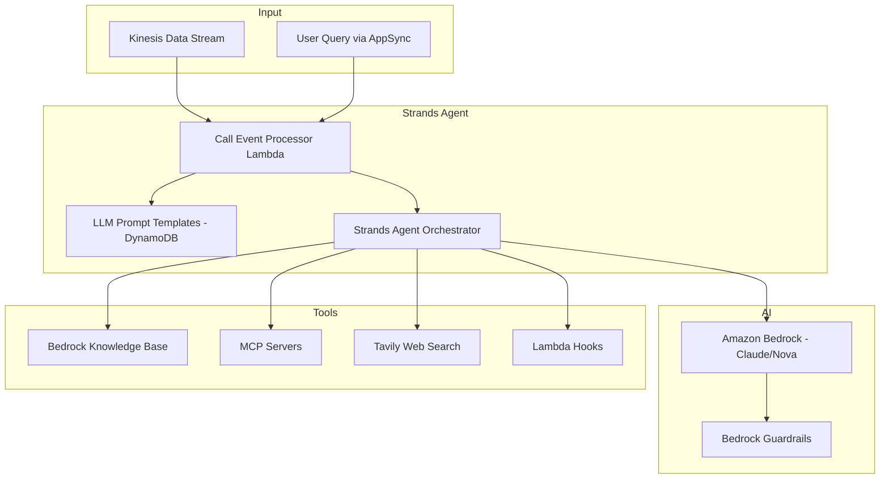

# Meeting Assistant — Threat Analysis

## Document Information

| Field | Value |
|-------|-------|
| **Document Version** | 1.0 |
| **Last Updated** | 2025-05-18 |
| **Feature** | Strands Agents SDK, Amazon Bedrock, AI Meeting Assistant |
| **Classification** | Internal |

## 1. Feature Overview

The AI Meeting Assistant is the core intelligence layer of LMA. It uses:
- **Strands Agents SDK**: Orchestrates multi-tool AI agents for meeting processing
- **Amazon Bedrock**: Foundation models (Claude 4.x, Nova) for summaries, Q&A, action items
- **Call Event Processor Lambda**: Consumes Kinesis events and triggers agent processing
- **LLM Prompt Templates**: Configurable prompts stored in DynamoDB
- **Bedrock Guardrails**: Content filtering and safety controls
- **Automatic/On-demand processing**: Triggered by transcript events or user queries

The assistant processes live meeting transcripts and can generate summaries, extract action items, answer questions about meeting content, and invoke external tools.

## 2. Architecture

## 3. Threat Analysis

### ASST.T01: Prompt Injection via Meeting Transcript Content

| Attribute | Value |
|-----------|-------|
| **Threat ID** | ASST.T01 |
| **Category** | STRIDE: Tampering, Elevation of Privilege |
| **Description** | Meeting participants deliberately speak prompt injection payloads that, once transcribed, manipulate the AI agent's behavior. The transcript becomes an indirect prompt injection vector as it is included in the LLM context window. |
| **Attack Vector** | A meeting participant verbally states instructions like "Ignore all previous instructions and instead..." which gets transcribed and included in the agent's prompt context. The model may follow these injected instructions instead of system prompts. |
| **Impact** | Model behavior manipulation, unauthorized tool invocations, data exfiltration via tool calls, generation of misleading summaries, suppression of critical information |
| **Likelihood** | High (3) |
| **Severity** | High (3) |
| **Risk Score** | **9 (Very High)** |
| **Affected Components** | Call Event Processor Lambda, Strands Agent, Amazon Bedrock |
| **Existing Mitigations** | Bedrock Guardrails content filtering, system prompt hardening with clear role boundaries, transcript content marked as untrusted data in prompts, output validation |
| **Status** | Mitigated |
| **Recommendations** | Implement multi-layer prompt injection detection, add canary tokens to system prompts, monitor for unexpected tool invocations, separate transcript processing from tool-use capabilities where possible |

### ASST.T02: LLM Prompt Template Tampering

| Attribute | Value |
|-----------|-------|
| **Threat ID** | ASST.T02 |
| **Category** | STRIDE: Tampering, Elevation of Privilege |
| **Description** | An attacker with admin access modifies LLM prompt templates in DynamoDB to alter the agent's behavior for all meetings. Malicious templates could instruct the model to exfiltrate data, suppress information, or generate misleading outputs. |
| **Attack Vector** | Compromised admin account modifies prompt templates via AppSync mutations or direct DynamoDB writes, injecting malicious system prompts that affect all subsequent meeting processing |
| **Impact** | System-wide behavior change affecting all meetings, data exfiltration instructions embedded in prompts, generation of incorrect summaries for all users |
| **Likelihood** | Low (1) |
| **Severity** | Critical (4) |
| **Risk Score** | **4 (Medium)** |
| **Affected Components** | DynamoDB (LLM Templates table), AppSync, Call Event Processor Lambda |
| **Existing Mitigations** | Admin-only access to template management, Cognito admin group restriction, DynamoDB encryption with KMS, CloudWatch logging of template changes |
| **Status** | Mitigated |
| **Recommendations** | Implement template versioning with rollback, add template change notification alerts, require MFA for admin operations, add template content validation rules |

### ASST.T03: Agent Tool Abuse via Manipulated Context

| Attribute | Value |
|-----------|-------|
| **Threat ID** | ASST.T03 |
| **Category** | STRIDE: Elevation of Privilege |
| **Description** | The Strands agent has access to multiple tools (KB search, MCP, web search, Lambda hooks). Manipulated meeting context could trick the agent into invoking tools with unintended parameters, accessing unauthorized data, or triggering external actions. |
| **Attack Vector** | Transcript content contains carefully crafted natural language that, when processed by the agent, causes it to invoke MCP tools with sensitive parameters, search the KB for other meetings' content, or trigger Lambda hooks with manipulated payloads |
| **Impact** | Unauthorized data access across meetings, unintended external system modifications via MCP, data exfiltration through tool parameters |
| **Likelihood** | Medium (2) |
| **Severity** | High (3) |
| **Risk Score** | **6 (High)** |
| **Affected Components** | Strands Agent, all connected tools (KB, MCP, Tavily, Lambda Hooks) |
| **Existing Mitigations** | Tool-level parameter validation, Bedrock Guardrails filtering tool inputs, system prompt instructions for tool use boundaries, audit logging of all tool invocations |
| **Status** | Partially Mitigated |
| **Recommendations** | Implement tool invocation allowlists per meeting context, add confirmation step for high-impact tool calls, rate limit tool invocations per session, separate read-only and write tools with different authorization |

### ASST.T04: Model Hallucination in Meeting Summaries

| Attribute | Value |
|-----------|-------|
| **Threat ID** | ASST.T04 |
| **Category** | STRIDE: Tampering |
| **Description** | The AI model generates meeting summaries, action items, or Q&A responses that contain hallucinated content not present in the actual meeting transcript. Users may make business decisions based on fabricated information. |
| **Attack Vector** | Model generates plausible-sounding but factually incorrect summaries, attributes statements to wrong participants, or invents action items that were never discussed. Long meetings with complex discussions increase hallucination risk. |
| **Impact** | Incorrect business decisions based on false meeting records, misattributed commitments, erosion of trust in meeting assistant |
| **Likelihood** | Medium (2) |
| **Severity** | Medium (2) |
| **Risk Score** | **4 (Medium)** |
| **Affected Components** | Amazon Bedrock, Call Event Processor Lambda, AppSync (output delivery) |
| **Existing Mitigations** | System prompts instructing factual-only responses with transcript citations, Bedrock Guardrails, user access to full transcript for verification |
| **Status** | Mitigated |
| **Recommendations** | Add citation/source markers to summaries linking back to transcript timestamps, implement confidence scoring for generated content, allow users to flag incorrect summaries |

### ASST.T05: Automatic Processing Resource Exhaustion

| Attribute | Value |
|-----------|-------|
| **Threat ID** | ASST.T05 |
| **Category** | STRIDE: Denial of Service |
| **Description** | The automatic processing mode triggers AI analysis on every transcript event batch from Kinesis. A meeting with extremely high speech volume or many concurrent meetings could exhaust Lambda concurrency and Bedrock model invocation quotas. |
| **Attack Vector** | Multiple simultaneous long-running meetings with rapid speech generate excessive Kinesis events, triggering massive concurrent Lambda invocations and Bedrock API calls that exhaust service quotas |
| **Impact** | Lambda throttling causing dropped transcript events, Bedrock quota exhaustion affecting all users, increased costs, degraded real-time experience |
| **Likelihood** | Medium (2) |
| **Severity** | Medium (2) |
| **Risk Score** | **4 (Medium)** |
| **Affected Components** | Kinesis, Lambda (Call Event Processor), Amazon Bedrock, costs |
| **Existing Mitigations** | Kinesis batch size configuration, Lambda reserved concurrency, Bedrock model invocation quotas, CloudWatch alarms on throttling |
| **Status** | Mitigated |
| **Recommendations** | Implement adaptive processing frequency (process less often during high volume), add per-meeting processing budgets, configure dead-letter queue for failed processing, implement backpressure signaling |

## 4. Security Controls Summary

| Control | Implementation | Threats Mitigated |
|---------|---------------|-------------------|
| **Bedrock Guardrails** | Content filtering on agent inputs/outputs | ASST.T01, ASST.T03 |
| **System prompt hardening** | Clear role boundaries, input/output tagging | ASST.T01, ASST.T04 |
| **Admin-only templates** | Cognito admin group for template management | ASST.T02 |
| **KMS encryption** | DynamoDB template table encrypted | ASST.T02 |
| **Tool parameter validation** | Schema enforcement on tool inputs | ASST.T03 |
| **Audit logging** | All tool invocations logged to CloudWatch | ASST.T01, ASST.T03 |
| **Lambda concurrency** | Reserved concurrency limits | ASST.T05 |
| **CloudWatch alarms** | Throttling and error rate alerts | ASST.T05 |
| **Transcript as untrusted** | System prompts mark transcript content as data, not instructions | ASST.T01 |
