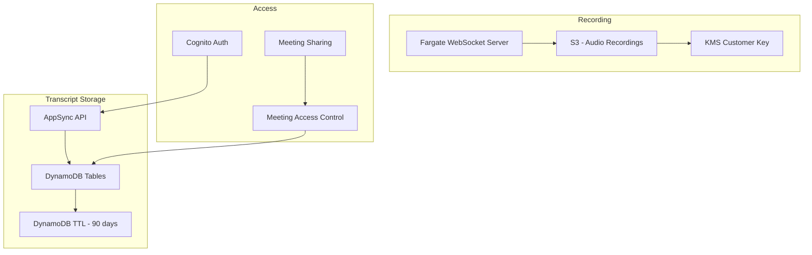

# Recording & Storage — Threat Analysis

## Document Information

| Field | Value |
|-------|-------|
| **Document Version** | 1.0 |
| **Last Updated** | 2025-05-18 |
| **Feature** | S3 Audio Recording, Meeting Data Storage, DynamoDB |
| **Classification** | Internal |

## 1. Feature Overview

Recording and storage covers the persistence layer for meeting data:
- **Audio recordings**: Stereo audio files stored in S3 (encrypted with KMS)
- **Meeting transcripts**: Full transcript text in DynamoDB with TTL
- **Meeting metadata**: Participant info, timestamps, settings in DynamoDB
- **AI outputs**: Summaries, action items, Q&A responses in DynamoDB
- **Data retention**: Configurable DynamoDB TTL (default 90 days)
- **Meeting sharing**: Access control for sharing meetings between users

## 2. Architecture

## 3. Threat Analysis

### REC.T01: Unauthorized Audio Recording Access

| Attribute | Value |
|-----------|-------|
| **Threat ID** | REC.T01 |
| **Category** | STRIDE: Information Disclosure |
| **Description** | Audio recordings in S3 contain full meeting conversations. Unauthorized access to these recordings (via misconfigured S3 policies, compromised IAM roles, or leaked presigned URLs) exposes highly sensitive meeting content including verbal agreements, personal information, and confidential discussions. |
| **Attack Vector** | Overly permissive S3 bucket policy, IAM role with s3:GetObject on recording bucket used by multiple services, or presigned URL for audio playback intercepted/shared beyond intended recipient |
| **Impact** | Complete disclosure of meeting audio, corporate espionage, privacy violation, potential regulatory penalties |
| **Likelihood** | Low (1) |
| **Severity** | Critical (4) |
| **Risk Score** | **4 (Medium)** |
| **Affected Components** | S3 recording bucket, KMS key policy, IAM roles, presigned URLs |
| **Existing Mitigations** | Customer-managed KMS key encryption, S3 block public access, IAM least-privilege, presigned URLs with short expiration, CloudTrail data events |
| **Status** | Mitigated |
| **Recommendations** | Enable S3 access logging, implement S3 Object Lock for compliance, add VPC endpoint policy restricting bucket access, audit KMS key policy grants regularly, implement presigned URL generation with IP restrictions |

### REC.T02: Meeting Data Retention Compliance Violation

| Attribute | Value |
|-----------|-------|
| **Threat ID** | REC.T02 |
| **Category** | STRIDE: Information Disclosure, Repudiation |
| **Description** | DynamoDB TTL (default 90 days) handles automatic data deletion, but audio recordings in S3 may not have lifecycle policies aligned with retention requirements. Regulatory requirements (GDPR right to erasure, data minimization) may require earlier deletion. |
| **Attack Vector** | Compliance audit reveals meeting data retained beyond policy limits. Or, user requests data deletion (GDPR Article 17) but S3 recordings, DynamoDB records, and KB vectors are not all consistently deleted. |
| **Impact** | Regulatory non-compliance (GDPR, CCPA fines), legal liability from retained data, reputation damage |
| **Likelihood** | Medium (2) |
| **Severity** | High (3) |
| **Risk Score** | **6 (High)** |
| **Affected Components** | S3 recording bucket, DynamoDB (multiple tables), OpenSearch Serverless (KB vectors), Bedrock KB |
| **Existing Mitigations** | DynamoDB TTL (configurable, default 90 days), S3 lifecycle policies (configurable) |
| **Status** | Partially Mitigated |
| **Recommendations** | Implement unified data deletion across all stores (S3 + DynamoDB + KB vectors), add meeting deletion API that purges from all locations, document data retention architecture, align TTL across all data stores, add retention compliance reporting |

### REC.T03: Recording Without Consent

| Attribute | Value |
|-----------|-------|
| **Threat ID** | REC.T03 |
| **Category** | STRIDE: Information Disclosure, Repudiation |
| **Description** | LMA records meeting audio by default when a connection is established. Meeting participants may not be aware they are being recorded, violating consent laws in two-party consent jurisdictions (e.g., California, EU, many countries). |
| **Attack Vector** | User starts LMA transcription for a meeting without informing other participants. Audio is recorded and stored without consent. Participants later discover recording and pursue legal action. |
| **Impact** | Legal liability (wiretapping/eavesdropping laws), regulatory fines (GDPR), civil lawsuits, reputation damage, invalidation of recorded content as evidence |
| **Likelihood** | High (3) |
| **Severity** | High (3) |
| **Risk Score** | **9 (Very High)** |
| **Affected Components** | Audio recording pipeline, S3 storage, meeting transcription initiation |
| **Existing Mitigations** | VP identifies itself in meeting participant list, documentation recommends consent notification, configurable recording enable/disable |
| **Status** | Partially Mitigated |
| **Recommendations** | Implement mandatory consent notification mechanism (audio announcement, chat message), add configurable consent workflow (require acknowledgment before recording), provide recording indicator visible to all participants, document legal requirements in deployment guide, add consent audit trail |

### REC.T04: Meeting Sharing Over-Permission

| Attribute | Value |
|-----------|-------|
| **Threat ID** | REC.T04 |
| **Category** | STRIDE: Information Disclosure |
| **Description** | Meeting owners can share meeting access with other users. If sharing controls are coarse-grained (all-or-nothing) or if shared links don't expire, meetings containing sensitive content may be accessible to unintended recipients indefinitely. |
| **Attack Vector** | User shares a meeting containing sensitive discussion with a broad group. Shared access persists even after the person leaves the organization (if their account isn't deprovisioned). Or, sharing link is forwarded to unauthorized parties. |
| **Impact** | Sensitive meeting content accessible to unauthorized users, data leakage through over-sharing, persistent access beyond intended time |
| **Likelihood** | Medium (2) |
| **Severity** | Medium (2) |
| **Risk Score** | **4 (Medium)** |
| **Affected Components** | Meeting sharing mechanism, DynamoDB access control records, AppSync API |
| **Existing Mitigations** | User-level sharing (specific Cognito users), meeting owner can revoke access, access requires valid Cognito session |
| **Status** | Mitigated |
| **Recommendations** | Implement share expiration with configurable duration, add sharing audit trail, provide admin view of all shared meetings, implement automatic access revocation for deprovisioned users |

### REC.T05: DynamoDB Data Exposure via IAM

| Attribute | Value |
|-----------|-------|
| **Threat ID** | REC.T05 |
| **Category** | STRIDE: Information Disclosure |
| **Description** | DynamoDB tables contain meeting transcripts, summaries, and metadata. If Lambda execution roles have overly broad DynamoDB permissions, a compromised Lambda could read data from any meeting across all tables. |
| **Attack Vector** | Lambda function with broad DynamoDB read permissions (e.g., `dynamodb:GetItem` on `*`) is exploited via prompt injection or code vulnerability, allowing the attacker to read arbitrary meeting records |
| **Impact** | Bulk access to all meeting transcripts and metadata, cross-user data access |
| **Likelihood** | Low (1) |
| **Severity** | High (3) |
| **Risk Score** | **3 (Medium)** |
| **Affected Components** | DynamoDB tables, Lambda execution roles, IAM policies |
| **Existing Mitigations** | KMS encryption on all DynamoDB tables, IAM roles scoped to specific tables, least-privilege Lambda execution roles |
| **Status** | Mitigated |
| **Recommendations** | Audit Lambda IAM roles for DynamoDB scope, implement per-table IAM policies, add DynamoDB fine-grained access control where feasible, enable DynamoDB Streams monitoring for unusual access patterns |

## 4. Security Controls Summary

| Control | Implementation | Threats Mitigated |
|---------|---------------|-------------------|
| **KMS encryption** | Customer-managed key for S3 and DynamoDB | REC.T01, REC.T05 |
| **S3 block public access** | All public access blocked on recording bucket | REC.T01 |
| **IAM least-privilege** | Scoped bucket/table access per Lambda | REC.T01, REC.T05 |
| **DynamoDB TTL** | Configurable retention (default 90 days) | REC.T02 |
| **S3 lifecycle policies** | Configurable object expiration | REC.T02 |
| **Recording configuration** | Enable/disable recording per deployment | REC.T03 |
| **VP bot identification** | VP appears as identified bot in meetings | REC.T03 |
| **User-level sharing** | Share to specific Cognito users | REC.T04 |
| **Access revocation** | Meeting owner can revoke shared access | REC.T04 |
| **CloudTrail logging** | Data event logging for S3 and DynamoDB | REC.T01, REC.T05 |
