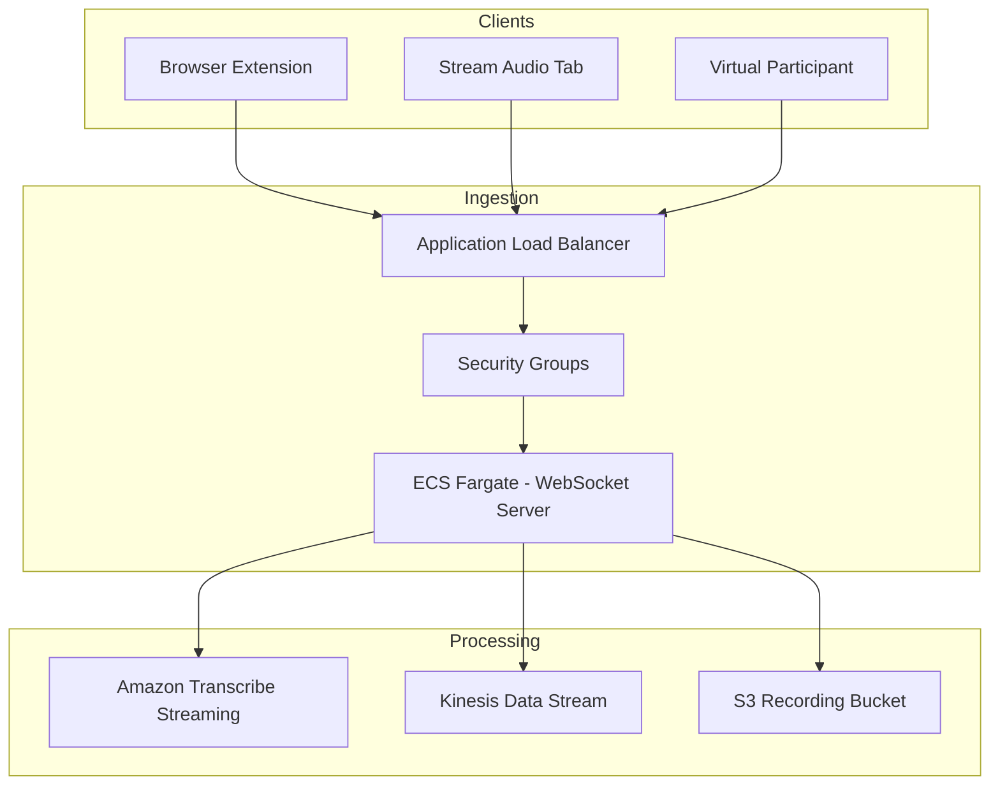

# Transcription & Audio Streaming — Threat Analysis

## Document Information

| Field | Value |
|-------|-------|
| **Document Version** | 1.0 |
| **Last Updated** | 2025-05-18 |
| **Feature** | Audio Streaming, Amazon Transcribe, Kinesis Data Streams |
| **Classification** | Internal |

## 1. Feature Overview

The audio streaming and transcription subsystem is the core real-time pipeline of LMA. It handles:
- **WebSocket audio ingestion**: ECS Fargate-based WebSocket server receiving two-channel audio streams
- **Real-time transcription**: Amazon Transcribe Streaming with speaker diarization
- **Event streaming**: Kinesis Data Streams buffering transcription events for downstream processing
- **Audio recording**: Stereo audio written to S3 for replay and archival
- **ALB load balancing**: Application Load Balancer routing WebSocket connections to Fargate tasks

## 2. Architecture

## 3. Threat Analysis

### AUDIO.T01: WebSocket Connection Hijacking

| Attribute | Value |
|-----------|-------|
| **Threat ID** | AUDIO.T01 |
| **Category** | STRIDE: Spoofing |
| **Description** | An attacker intercepts or establishes unauthorized WebSocket connections to the ALB, injecting audio streams that appear to be from legitimate meeting participants. This could result in fabricated transcript content being attributed to meetings. |
| **Attack Vector** | Attacker obtains meeting connection token (via XSS, network sniffing, or social engineering) and establishes a WebSocket connection to stream malicious audio content into an active meeting transcription session |
| **Impact** | Fabricated transcript content, meeting integrity compromise, potential for disinformation injection into meeting records |
| **Likelihood** | Medium (2) |
| **Severity** | High (3) |
| **Risk Score** | **6 (High)** |
| **Affected Components** | ALB, Fargate WebSocket Server, Kinesis |
| **Existing Mitigations** | TLS/WSS encryption, ALB security groups restricting inbound access, meeting-specific connection tokens, optional WAF with IP allowlists |
| **Status** | Mitigated |
| **Recommendations** | Implement per-session token rotation, add connection rate limiting per source IP, validate audio format/encoding strictly |

### AUDIO.T02: Audio Stream Interception (Eavesdropping)

| Attribute | Value |
|-----------|-------|
| **Threat ID** | AUDIO.T02 |
| **Category** | STRIDE: Information Disclosure |
| **Description** | An attacker intercepts live audio streams between the client and the WebSocket server, gaining access to sensitive meeting conversations in real-time |
| **Attack Vector** | Man-in-the-middle attack on the WebSocket connection, DNS spoofing to redirect ALB connections, or compromise of network path between client and ALB |
| **Impact** | Exposure of confidential meeting content, corporate secrets, personal information discussed in meetings |
| **Likelihood** | Low (1) |
| **Severity** | Critical (4) |
| **Risk Score** | **4 (Medium)** |
| **Affected Components** | Network path between client and ALB, ALB, Fargate |
| **Existing Mitigations** | TLS 1.2+ mandatory (WSS), ALB certificate validation, HTTPS-only connections enforced, CloudFront with custom SSL certificate |
| **Status** | Mitigated |
| **Recommendations** | Enable ALB access logging, implement certificate pinning in browser extension, monitor for certificate anomalies |

### AUDIO.T03: Kinesis Stream Injection/Tampering

| Attribute | Value |
|-----------|-------|
| **Threat ID** | AUDIO.T03 |
| **Category** | STRIDE: Tampering |
| **Description** | An attacker with compromised IAM credentials writes malicious records to the Kinesis Data Stream, injecting fabricated transcript events that bypass the normal audio→transcription pipeline |
| **Attack Vector** | Compromised IAM role with `kinesis:PutRecord` permissions writes crafted transcript events with manipulated speaker attribution, timestamps, or content |
| **Impact** | Transcript manipulation, false attribution of statements to meeting participants, insertion of malicious content that triggers downstream agent actions |
| **Likelihood** | Low (1) |
| **Severity** | High (3) |
| **Risk Score** | **3 (Medium)** |
| **Affected Components** | Kinesis Data Stream, Call Event Processor Lambda |
| **Existing Mitigations** | IAM least-privilege (only Fargate WebSocket server has PutRecord), KMS encryption on Kinesis stream, CloudTrail logging of Kinesis API calls |
| **Status** | Mitigated |
| **Recommendations** | Add event source validation in Call Event Processor, implement record integrity checks (HMAC), monitor for unexpected PutRecord sources via CloudTrail |

### AUDIO.T04: Transcribe Service Abuse / Cost Escalation

| Attribute | Value |
|-----------|-------|
| **Threat ID** | AUDIO.T04 |
| **Category** | STRIDE: Denial of Service |
| **Description** | An attacker establishes numerous concurrent WebSocket connections streaming audio, exhausting Amazon Transcribe concurrent session limits and ECS Fargate capacity, causing service degradation for legitimate users |
| **Attack Vector** | Automated client opens many WebSocket connections simultaneously, streaming synthetic audio to consume Transcribe sessions and ECS resources, leading to throttling or task failures |
| **Impact** | Service unavailability for legitimate meetings, cost escalation from excessive Transcribe usage, Fargate task exhaustion |
| **Likelihood** | Medium (2) |
| **Severity** | Medium (2) |
| **Risk Score** | **4 (Medium)** |
| **Affected Components** | ALB, Fargate tasks, Amazon Transcribe, AWS costs |
| **Existing Mitigations** | ALB security groups, optional WAF rate limiting, ECS service auto-scaling limits, Transcribe service quotas, CloudWatch alarms |
| **Status** | Mitigated |
| **Recommendations** | Implement per-user concurrent session limits, add WAF rate limiting rules, set ECS service maximum task count, configure Transcribe quota alarms |

### AUDIO.T05: Audio Recording Unauthorized Access

| Attribute | Value |
|-----------|-------|
| **Threat ID** | AUDIO.T05 |
| **Category** | STRIDE: Information Disclosure |
| **Description** | Stored audio recordings in S3 are accessed by unauthorized parties through misconfigured bucket policies, leaked presigned URLs, or compromised IAM credentials |
| **Attack Vector** | S3 bucket policy misconfiguration exposing recordings publicly, overly-permissive IAM roles allowing cross-function S3 access, or presigned URL leakage enabling time-limited unauthorized access |
| **Impact** | Exposure of recorded meeting audio containing sensitive business discussions, PII, and confidential information |
| **Likelihood** | Low (1) |
| **Severity** | Critical (4) |
| **Risk Score** | **4 (Medium)** |
| **Affected Components** | S3 recording bucket, IAM roles, presigned URLs |
| **Existing Mitigations** | S3 bucket encryption with customer-managed KMS key, block public access enabled, IAM least-privilege scoped to specific buckets, CloudTrail data events logging |
| **Status** | Mitigated |
| **Recommendations** | Enable S3 access logging, implement S3 Object Lock for compliance retention, add VPC endpoint policy restricting S3 access to VPC, regular IAM access review |

### AUDIO.T06: Speaker Attribution Manipulation

| Attribute | Value |
|-----------|-------|
| **Threat ID** | AUDIO.T06 |
| **Category** | STRIDE: Tampering, Repudiation |
| **Description** | Transcribe speaker diarization is manipulated by injecting audio that confuses speaker identification, causing statements to be attributed to wrong participants. This enables repudiation ("I never said that") |
| **Attack Vector** | Inject audio on one channel that mimics another speaker's voice characteristics, or manipulate the two-channel audio routing to swap speaker attribution |
| **Impact** | Incorrect speaker attribution in transcripts, enables repudiation of statements, erodes trust in meeting records |
| **Likelihood** | Low (1) |
| **Severity** | Medium (2) |
| **Risk Score** | **2 (Low)** |
| **Affected Components** | Audio streaming client, Fargate WebSocket server, Amazon Transcribe |
| **Existing Mitigations** | Two-channel audio separation (each speaker on dedicated channel), Transcribe speaker diarization confidence scores, meeting participant list validation |
| **Status** | Accepted |
| **Recommendations** | Display confidence scores in UI, allow manual speaker correction in transcripts, log channel-to-speaker mapping decisions |

## 4. Security Controls Summary

| Control | Implementation | Threats Mitigated |
|---------|---------------|-------------------|
| **TLS/WSS encryption** | Mandatory TLS 1.2+ on all WebSocket connections | AUDIO.T01, AUDIO.T02 |
| **ALB security groups** | Restrict inbound to required CIDR ranges | AUDIO.T01, AUDIO.T04 |
| **Meeting connection tokens** | Per-session authentication tokens for WebSocket | AUDIO.T01 |
| **KMS encryption** | Customer-managed key for Kinesis and S3 | AUDIO.T03, AUDIO.T05 |
| **IAM least-privilege** | Only Fargate tasks can write to Kinesis/S3 | AUDIO.T03, AUDIO.T05 |
| **Optional WAF** | IP allowlists and rate limiting | AUDIO.T01, AUDIO.T04 |
| **S3 block public access** | All public access blocked | AUDIO.T05 |
| **CloudTrail logging** | API-level audit for Kinesis and S3 | AUDIO.T03, AUDIO.T05 |
| **Two-channel audio** | Speaker separation at capture level | AUDIO.T06 |
