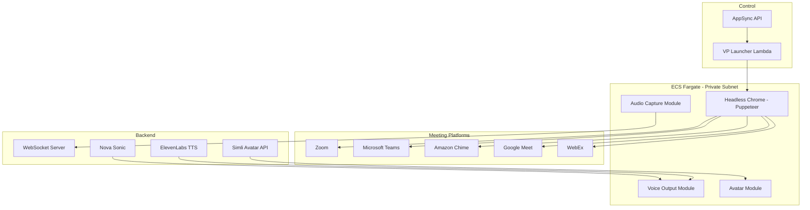

# Virtual Participant — Threat Analysis

## Document Information

| Field | Value |
|-------|-------|
| **Document Version** | 1.0 |
| **Last Updated** | 2025-05-18 |
| **Feature** | Virtual Participant (Headless Chrome on ECS Fargate) |
| **Classification** | Internal |

## 1. Feature Overview

The Virtual Participant enables LMA to join meetings autonomously by running a headless Chrome browser (Puppeteer) in an ECS Fargate container. It supports:
- **Platform support**: Zoom, Microsoft Teams, Amazon Chime, Google Meet, WebEx
- **Meeting join**: Navigates to meeting URLs and joins as a participant
- **Audio capture**: Captures two-channel audio from the browser
- **Voice assistant**: Optional — speaks responses into the meeting via Nova Sonic or ElevenLabs
- **Avatar display**: Optional — shows animated avatar via Simli in the meeting

The VP runs as a Fargate task in private subnets with access to meeting platforms over the internet via NAT gateway.

## 2. Architecture

## 3. Threat Analysis

### VP.T01: Meeting Credential Exposure

| Attribute | Value |
|-----------|-------|
| **Threat ID** | VP.T01 |
| **Category** | STRIDE: Information Disclosure |
| **Description** | The Virtual Participant requires credentials or meeting URLs (potentially with embedded passwords) to join meetings. These credentials could be exposed through ECS task definitions, environment variables, CloudWatch logs, or memory dumps. |
| **Attack Vector** | Meeting URLs with embedded passwords stored in ECS task parameters, logged to CloudWatch during Puppeteer navigation, or accessible via ECS DescribeTask API calls by over-privileged IAM roles |
| **Impact** | Unauthorized access to meetings, replay attacks to join future recurring meetings, exposure of meeting passwords |
| **Likelihood** | Medium (2) |
| **Severity** | High (3) |
| **Risk Score** | **6 (High)** |
| **Affected Components** | ECS Fargate task definitions, CloudWatch Logs, IAM roles |
| **Existing Mitigations** | Fargate tasks in private subnets, ECS task role least-privilege, CloudWatch Logs encryption with KMS, ephemeral container (no persistent storage) |
| **Status** | Partially Mitigated |
| **Recommendations** | Use AWS Secrets Manager for meeting credentials, implement credential scrubbing in CloudWatch Logs, add TTL on stored meeting URLs, disable ECS Exec in production, restrict DescribeTask permissions |

### VP.T02: Headless Chrome Sandbox Escape

| Attribute | Value |
|-----------|-------|
| **Threat ID** | VP.T02 |
| **Category** | STRIDE: Elevation of Privilege |
| **Description** | Headless Chrome/Puppeteer running in the Fargate container processes untrusted web content from meeting platforms. A vulnerability in Chrome could allow sandbox escape, providing access to the container's network, IAM credentials, or other ECS resources. |
| **Attack Vector** | Meeting platform serves malicious JavaScript or WebRTC content that exploits a Chrome vulnerability, escaping the browser sandbox and gaining code execution in the Fargate container with access to its IAM role |
| **Impact** | Container-level compromise, access to IAM task role credentials, lateral movement to internal services, data exfiltration |
| **Likelihood** | Low (1) |
| **Severity** | Critical (4) |
| **Risk Score** | **4 (Medium)** |
| **Affected Components** | Headless Chrome, Fargate container, IAM task role, VPC network |
| **Existing Mitigations** | Fargate isolation (no shared host), private subnet (limited egress via NAT), IAM task role least-privilege, container image regularly updated, Chrome `--no-sandbox` flag NOT used (sandbox enabled) |
| **Status** | Mitigated |
| **Recommendations** | Implement regular Chrome/Puppeteer image updates, use minimal IAM task role, add VPC security group egress restrictions, enable GuardDuty for ECS, implement container health monitoring |

### VP.T03: Meeting Platform API Abuse

| Attribute | Value |
|-----------|-------|
| **Threat ID** | VP.T03 |
| **Category** | STRIDE: Denial of Service, Spoofing |
| **Description** | The VP bot's automated behavior may violate meeting platform terms of service, leading to account bans, IP blocks, or legal action. Additionally, rapid/automated meeting joins could be detected as bot activity and blocked. |
| **Attack Vector** | Excessive VP launches overwhelm meeting platform APIs, trigger anti-bot detection mechanisms, or violate platform ToS. Platform may block the NAT gateway IP, affecting all VP operations. |
| **Impact** | VP service disruption, platform account suspension, IP-level blocking affecting all outbound connections, potential legal/compliance issues |
| **Likelihood** | Medium (2) |
| **Severity** | Medium (2) |
| **Risk Score** | **4 (Medium)** |
| **Affected Components** | ECS Fargate, NAT Gateway, meeting platform accounts |
| **Existing Mitigations** | Rate limiting on VP launches, single NAT gateway (risk of single IP block), meeting-specific join logic per platform |
| **Status** | Partially Mitigated |
| **Recommendations** | Implement per-platform rate limits, add multiple NAT gateways or Elastic IPs for rotation, monitor platform ban signals, document ToS compliance per platform, add circuit breaker for failed joins |

### VP.T04: Unauthorized Meeting Recording via VP

| Attribute | Value |
|-----------|-------|
| **Threat ID** | VP.T04 |
| **Category** | STRIDE: Information Disclosure, Repudiation |
| **Description** | The VP joins meetings and captures audio without explicit consent from all participants. In jurisdictions with two-party consent laws, this could violate privacy regulations. Additionally, users could deploy VP to record meetings they weren't invited to. |
| **Attack Vector** | Authorized LMA user provides a meeting URL to the VP, joining a meeting where other participants are unaware they are being recorded/transcribed. Or, an attacker obtains meeting URLs and uses VP to surveil meetings they shouldn't access. |
| **Impact** | Privacy law violations, unauthorized surveillance, trust breach with meeting participants, regulatory fines (GDPR, CCPA, wiretapping laws) |
| **Likelihood** | High (3) |
| **Severity** | High (3) |
| **Risk Score** | **9 (Very High)** |
| **Affected Components** | Virtual Participant, meeting platforms, audio recording pipeline |
| **Existing Mitigations** | VP announces itself as a bot participant (visible in meeting participant list), recording notification in most meeting platforms, admin-only VP launch capability |
| **Status** | Partially Mitigated |
| **Recommendations** | Implement mandatory consent notification mechanism, add VP display name clearly indicating recording, provide meeting host with ability to kick VP, add audit trail for VP launches with justification, document consent requirements in deployment guide |

### VP.T05: Voice Assistant Impersonation

| Attribute | Value |
|-----------|-------|
| **Threat ID** | VP.T05 |
| **Category** | STRIDE: Spoofing, Tampering |
| **Description** | The VP's voice assistant capability (Nova Sonic/ElevenLabs) can synthesize speech and play it into meetings. An attacker could abuse this to impersonate meeting participants, spread disinformation, or manipulate meeting outcomes. |
| **Attack Vector** | Compromised admin account configures voice assistant to use a custom voice that mimics a specific person, then uses it to make statements in meetings attributed to that person. Or, manipulates assistant prompts to generate misleading responses. |
| **Impact** | Meeting participant impersonation, manipulation of meeting outcomes, trust destruction, potential legal liability for synthesized impersonation |
| **Likelihood** | Low (1) |
| **Severity** | High (3) |
| **Risk Score** | **3 (Medium)** |
| **Affected Components** | Nova Sonic, ElevenLabs TTS, Virtual Participant voice output |
| **Existing Mitigations** | Admin-only voice assistant configuration, VP clearly identified as bot in meeting, voice assistant uses distinct non-human voice by default, audit logging of voice configuration changes |
| **Status** | Mitigated |
| **Recommendations** | Restrict voice model selection to approved voices, add watermarking to synthesized speech, log all voice output events, implement rate limiting on voice responses |

### VP.T06: Container Resource Exhaustion

| Attribute | Value |
|-----------|-------|
| **Threat ID** | VP.T06 |
| **Category** | STRIDE: Denial of Service |
| **Description** | Headless Chrome is resource-intensive. A meeting with complex UI elements, screen sharing, or many participants could exhaust the Fargate task's CPU/memory, causing the VP to crash or degrade, losing meeting audio. |
| **Attack Vector** | Legitimate long-running meeting with heavy screen sharing, or deliberate attempt to overwhelm the VP by sharing resource-intensive content (video, complex animations) in the meeting |
| **Impact** | VP crash causing lost audio/transcription, meeting coverage gaps, degraded user experience |
| **Likelihood** | Medium (2) |
| **Severity** | Low (1) |
| **Risk Score** | **2 (Low)** |
| **Affected Components** | ECS Fargate task, Headless Chrome |
| **Existing Mitigations** | Fargate task CPU/memory sizing, Chrome headless optimizations (disable video rendering where possible), health checks with auto-restart |
| **Status** | Accepted |
| **Recommendations** | Implement Chrome memory limit monitoring, add graceful degradation (reduce features under load), configure ECS task auto-recovery, alert on task OOM kills |

## 4. Security Controls Summary

| Control | Implementation | Threats Mitigated |
|---------|---------------|-------------------|
| **Private subnet** | VP tasks run in private subnets (NAT egress only) | VP.T02, VP.T03 |
| **Ephemeral containers** | No persistent storage, fresh container per meeting | VP.T01, VP.T02 |
| **IAM least-privilege** | Minimal task role (write to WebSocket, read config) | VP.T01, VP.T02 |
| **KMS log encryption** | CloudWatch Logs encrypted with customer key | VP.T01 |
| **Admin-only launch** | Only admin group can start VP sessions | VP.T04, VP.T05 |
| **Bot identification** | VP identified as bot in meeting participant list | VP.T04, VP.T05 |
| **Chrome sandbox** | Browser sandbox enabled (not --no-sandbox) | VP.T02 |
| **Audit logging** | All VP launch/stop events logged | VP.T04, VP.T05 |
| **Health checks** | ECS health monitoring with task restart | VP.T06 |
