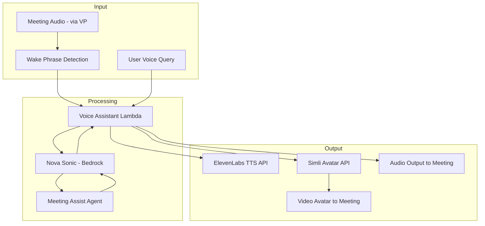

# Voice Assistant — Threat Analysis

## Document Information

| Field | Value |
|-------|-------|
| **Document Version** | 1.0 |
| **Last Updated** | 2025-05-18 |
| **Feature** | Voice Assistant (Nova Sonic, ElevenLabs TTS, Simli Avatar) |
| **Classification** | Internal |

## 1. Feature Overview

The Voice Assistant enables natural voice interaction during meetings. It includes:
- **Nova Sonic**: Amazon's voice-to-voice AI model for real-time speech understanding and generation
- **ElevenLabs TTS**: Alternative text-to-speech with high-quality voice synthesis
- **Simli Avatar**: Animated visual avatar that lip-syncs with voice output
- **Wake phrase detection**: Activates voice assistant during meetings
- **Voice configuration**: Customizable voice profiles and behavior settings

The voice assistant processes live meeting audio, understands spoken queries, and responds with synthesized speech through the Virtual Participant or meeting interface.

## 2. Architecture

## 3. Threat Analysis

### VOICE.T01: Wake Phrase Spoofing / False Activation

| Attribute | Value |
|-----------|-------|
| **Threat ID** | VOICE.T01 |
| **Category** | STRIDE: Spoofing |
| **Description** | An attacker triggers the voice assistant by speaking the wake phrase in a meeting, causing the assistant to activate and process subsequent speech as commands. This could lead to unauthorized information retrieval or assistant actions during a meeting. |
| **Attack Vector** | Meeting participant (or audio playback) speaks the wake phrase followed by queries like "summarize the last meeting with [person]" or "search for [sensitive topic]", causing the assistant to retrieve and potentially vocalize sensitive information to all meeting participants |
| **Impact** | Unintended information disclosure in meetings, unauthorized assistant actions, disruption of meeting flow |
| **Likelihood** | Medium (2) |
| **Severity** | High (3) |
| **Risk Score** | **6 (High)** |
| **Affected Components** | Wake phrase detection, Voice Assistant Lambda, Meeting Assist Agent |
| **Existing Mitigations** | Configurable wake phrase, admin-controlled voice assistant activation, assistant responses scoped to current meeting context by default |
| **Status** | Partially Mitigated |
| **Recommendations** | Implement speaker verification (only respond to authorized speakers), add confirmation prompts for sensitive queries, restrict assistant capabilities in voice mode, add "mute assistant" meeting control |

### VOICE.T02: Voice Synthesis Deepfake Abuse

| Attribute | Value |
|-----------|-------|
| **Threat ID** | VOICE.T02 |
| **Category** | STRIDE: Spoofing, Tampering |
| **Description** | ElevenLabs TTS enables high-quality voice synthesis. If custom voice models are supported, an attacker could clone a specific person's voice and use it through the meeting assistant to impersonate them, creating convincing audio deepfakes within meetings. |
| **Attack Vector** | Attacker with admin access uploads a voice clone model to ElevenLabs, configures the voice assistant to use it, then uses the VP to inject synthesized speech in meetings that sounds like a specific person |
| **Impact** | Executive/participant impersonation in meetings, social engineering, manipulation of meeting decisions, potential for fraud |
| **Likelihood** | Low (1) |
| **Severity** | Critical (4) |
| **Risk Score** | **4 (Medium)** |
| **Affected Components** | ElevenLabs TTS API, Voice Assistant configuration, Virtual Participant |
| **Existing Mitigations** | Admin-only voice configuration, ElevenLabs voice model restrictions, voice assistant clearly identified as bot, audit logging of configuration changes |
| **Status** | Mitigated |
| **Recommendations** | Restrict voice model IDs to pre-approved list, add audio watermarking for all synthesized speech, implement voice activity logging with model ID, block custom voice upload in production |

### VOICE.T03: Third-Party API Key Exposure (ElevenLabs/Simli)

| Attribute | Value |
|-----------|-------|
| **Threat ID** | VOICE.T03 |
| **Category** | STRIDE: Information Disclosure |
| **Description** | API keys for ElevenLabs and Simli are stored as CloudFormation parameters or environment variables. Exposure of these keys allows attackers to use the services at the victim's expense or access service-level data. |
| **Attack Vector** | API keys leaked through CloudFormation stack outputs, Lambda environment variables visible in console, CloudWatch log entries, or source code repositories. Attacker uses stolen keys for unauthorized TTS/avatar generation. |
| **Impact** | Financial abuse (TTS/avatar API usage costs), potential access to voice models or service data, service rate limit exhaustion affecting legitimate use |
| **Likelihood** | Medium (2) |
| **Severity** | Medium (2) |
| **Risk Score** | **4 (Medium)** |
| **Affected Components** | ElevenLabs API, Simli API, Lambda environment variables, CloudFormation parameters |
| **Existing Mitigations** | CloudFormation NoEcho parameter for API keys, Lambda environment variable encryption, IAM restrictions on DescribeFunction |
| **Status** | Partially Mitigated |
| **Recommendations** | Migrate API keys to AWS Secrets Manager with rotation, implement key usage monitoring/alerts at provider level, use scoped/restricted API keys where possible, add CloudTrail alerts for Lambda:GetFunction calls |

### VOICE.T04: Avatar Video Stream Manipulation

| Attribute | Value |
|-----------|-------|
| **Threat ID** | VOICE.T04 |
| **Category** | STRIDE: Tampering, Spoofing |
| **Description** | The Simli avatar generates animated video that is displayed in meetings. If the avatar API is compromised or the video stream is tampered with, inappropriate or misleading visual content could be displayed to meeting participants. |
| **Attack Vector** | Man-in-the-middle attack on Simli API responses replacing avatar video with malicious content, or Simli service compromise leading to inappropriate avatar generation |
| **Impact** | Inappropriate content displayed in meetings, brand/reputation damage, meeting disruption |
| **Likelihood** | Low (1) |
| **Severity** | Medium (2) |
| **Risk Score** | **2 (Low)** |
| **Affected Components** | Simli Avatar API, Virtual Participant video output |
| **Existing Mitigations** | TLS encryption for Simli API calls, admin-only avatar configuration, avatar is optional feature |
| **Status** | Accepted |
| **Recommendations** | Implement content validation on avatar video frames, add avatar enable/disable per-meeting control, monitor Simli API response patterns |

### VOICE.T05: Sensitive Information Vocalized in Meetings

| Attribute | Value |
|-----------|-------|
| **Threat ID** | VOICE.T05 |
| **Category** | STRIDE: Information Disclosure |
| **Description** | The voice assistant responds audibly in meetings, meaning its responses are heard by ALL meeting participants. If the assistant retrieves sensitive information (from KB search, MCP tools, or previous meetings) and vocalizes it, this information is disclosed to everyone present. |
| **Attack Vector** | User asks voice assistant a question that triggers KB search or MCP tool returning confidential data. The assistant vocalizes the response in the meeting where unauthorized participants are present. |
| **Impact** | Uncontrolled information disclosure to all meeting participants, data leakage from other meetings/systems via voice output |
| **Likelihood** | Medium (2) |
| **Severity** | High (3) |
| **Risk Score** | **6 (High)** |
| **Affected Components** | Voice Assistant, Meeting Assist Agent, Knowledge Base, MCP tools |
| **Existing Mitigations** | Bedrock Guardrails on output content, assistant scope defaults to current meeting context, admin configuration of voice response behavior |
| **Status** | Partially Mitigated |
| **Recommendations** | Implement data sensitivity classification for voice responses, restrict voice assistant to current-meeting-only queries by default, add "text-only response" option for sensitive queries, classify and filter KB/MCP results before vocalization |

## 4. Security Controls Summary

| Control | Implementation | Threats Mitigated |
|---------|---------------|-------------------|
| **Admin-only configuration** | Voice settings restricted to admin group | VOICE.T01, VOICE.T02, VOICE.T03 |
| **Bot identification** | Assistant clearly identified as bot in meetings | VOICE.T02, VOICE.T04 |
| **TLS encryption** | All API calls to ElevenLabs/Simli over HTTPS | VOICE.T03, VOICE.T04 |
| **NoEcho parameters** | API keys not visible in CloudFormation outputs | VOICE.T03 |
| **Bedrock Guardrails** | Content filtering on voice assistant responses | VOICE.T01, VOICE.T05 |
| **Audit logging** | Voice configuration changes and activation events logged | VOICE.T01, VOICE.T02 |
| **Configurable wake phrase** | Non-default wake phrase reduces false activation | VOICE.T01 |
| **Scoped context** | Default to current meeting context only | VOICE.T05 |
