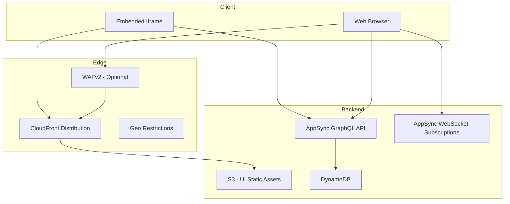

# Web UI — Threat Analysis

## Document Information

| Field | Value |
|-------|-------|
| **Document Version** | 1.0 |
| **Last Updated** | 2025-05-18 |
| **Feature** | React UI, CloudFront, AppSync GraphQL, Embeddable Iframes |
| **Classification** | Internal |

## 1. Feature Overview

The Web UI is the primary user interface for LMA:
- **React SPA**: Single-page application for meeting management and real-time viewing
- **CloudFront CDN**: Serves static assets with geo restrictions and optional WAF
- **AppSync GraphQL**: Real-time API with subscriptions for live meeting updates
- **Embeddable iframes**: Meeting components embeddable in external applications
- **Real-time subscriptions**: WebSocket-based subscriptions for live transcript streaming
- **Meeting inventory**: Browse, search, share, and manage meeting recordings

## 2. Architecture

## 3. Threat Analysis

### UI.T01: Cross-Site Scripting (XSS) via Transcript Content

| Attribute | Value |
|-----------|-------|
| **Threat ID** | UI.T01 |
| **Category** | STRIDE: Tampering, Information Disclosure |
| **Description** | Meeting transcripts may contain content that, when rendered in the React UI, could execute as JavaScript. Since transcripts come from spoken content (via Transcribe), special characters or script-like content could be transcribed and rendered unsafely. |
| **Attack Vector** | Meeting participant speaks content that gets transcribed as HTML/JavaScript (e.g., spelling out "<script>..." or exploiting ASR patterns). If the transcript is rendered with dangerouslySetInnerHTML or similar, XSS occurs. |
| **Impact** | JWT token theft, session hijacking, data exfiltration from the UI, defacement of meeting content |
| **Likelihood** | Low (1) |
| **Severity** | High (3) |
| **Risk Score** | **3 (Medium)** |
| **Affected Components** | React UI, AppSync (data delivery), transcript rendering components |
| **Existing Mitigations** | React's default XSS protection (auto-escaping JSX), transcript content treated as text (not HTML), CSP headers via CloudFront response headers |
| **Status** | Mitigated |
| **Recommendations** | Audit all transcript rendering for dangerouslySetInnerHTML usage, implement strict CSP with nonce-based scripts, add DOMPurify sanitization for any HTML rendering, regular security scanning of React components |

### UI.T02: AppSync Subscription Eavesdropping

| Attribute | Value |
|-----------|-------|
| **Threat ID** | UI.T02 |
| **Category** | STRIDE: Information Disclosure |
| **Description** | AppSync real-time subscriptions deliver live transcript segments and meeting updates over WebSocket. If subscription authorization is insufficient, an authenticated user could subscribe to other users' meeting updates. |
| **Attack Vector** | Authenticated user manipulates GraphQL subscription parameters to subscribe to a meeting they don't own/have access to, receiving real-time transcript updates from that meeting |
| **Impact** | Real-time eavesdropping on active meetings, access to live transcripts and AI summaries as they are generated |
| **Likelihood** | Medium (2) |
| **Severity** | High (3) |
| **Risk Score** | **6 (High)** |
| **Affected Components** | AppSync subscriptions, subscription authorization resolvers, meeting access control |
| **Existing Mitigations** | Subscription authorization in AppSync resolvers, user-scoped subscription filters, meeting ID validation against user access |
| **Status** | Mitigated |
| **Recommendations** | Audit all subscription resolvers for proper authorization, implement server-side subscription filtering (not client-side), add integration tests for subscription access control, log subscription registration events |

### UI.T03: Iframe Embedding Security

| Attribute | Value |
|-----------|-------|
| **Threat ID** | UI.T03 |
| **Category** | STRIDE: Information Disclosure, Tampering |
| **Description** | LMA supports embeddable iframe components for integrating meeting views into external applications. If iframe security controls are insufficient, the embedded component could be exploited via clickjacking, token leakage to parent frames, or cross-origin data access. |
| **Attack Vector** | Attacker embeds LMA iframe on a malicious page, using clickjacking to trick users into performing actions. Or, misconfigured postMessage handlers leak meeting data to the parent frame's origin. |
| **Impact** | Clickjacking attacks on meeting controls, token/data leakage to embedding application, unauthorized actions performed via UI manipulation |
| **Likelihood** | Medium (2) |
| **Severity** | Medium (2) |
| **Risk Score** | **4 (Medium)** |
| **Affected Components** | Embeddable iframe components, CloudFront response headers, React UI |
| **Existing Mitigations** | X-Frame-Options / Content-Security-Policy frame-ancestors configuration, origin validation for postMessage communication |
| **Status** | Partially Mitigated |
| **Recommendations** | Implement strict frame-ancestors CSP directive with allowlisted domains, validate all postMessage origins, minimize data exposed through iframe API, add iframe sandbox attributes |

### UI.T04: GraphQL API Abuse / Introspection

| Attribute | Value |
|-----------|-------|
| **Threat ID** | UI.T04 |
| **Category** | STRIDE: Information Disclosure, Denial of Service |
| **Description** | AppSync GraphQL API with 39 resolvers exposes a rich query surface. Attackers could use introspection to discover the full schema, craft expensive queries to cause DoS, or exploit overly permissive queries to extract more data than intended. |
| **Attack Vector** | Attacker uses GraphQL introspection to map the full API schema, then crafts deeply nested or batched queries that consume excessive Lambda/DynamoDB resources, or discovers undocumented queries that expose additional data |
| **Impact** | API schema disclosure aiding further attacks, DDoS via expensive queries, unauthorized data access via discovered queries |
| **Likelihood** | Medium (2) |
| **Severity** | Medium (2) |
| **Risk Score** | **4 (Medium)** |
| **Affected Components** | AppSync API, DynamoDB, Lambda resolvers |
| **Existing Mitigations** | Cognito authentication required for all queries, AppSync built-in rate limiting, resolver-level authorization, query depth limits |
| **Status** | Mitigated |
| **Recommendations** | Disable GraphQL introspection in production, implement query complexity analysis, add per-user rate limiting, monitor for unusual query patterns |

### UI.T05: CloudFront Configuration Exposure

| Attribute | Value |
|-----------|-------|
| **Threat ID** | UI.T05 |
| **Category** | STRIDE: Information Disclosure |
| **Description** | The CloudFront distribution serves the React SPA which contains configuration endpoints (AppSync URL, Cognito Pool ID, region). While these require authentication to use, they provide reconnaissance information. Misconfigured CloudFront could also expose the S3 origin directly. |
| **Attack Vector** | Attacker inspects the React application's JavaScript bundles to extract configuration (AppSync endpoint, Cognito User Pool ID), then targets those services directly for further attacks |
| **Impact** | Reconnaissance information aiding targeted attacks, potential direct S3 access if OAC misconfigured |
| **Likelihood** | Medium (2) |
| **Severity** | Low (1) |
| **Risk Score** | **2 (Low)** |
| **Affected Components** | CloudFront, S3 UI bucket, React application bundles |
| **Existing Mitigations** | All exposed endpoints require Cognito authentication, CloudFront Origin Access Control (OAC) restricts direct S3 access, endpoints are not secret (security through access control, not obscurity) |
| **Status** | Accepted |
| **Recommendations** | Verify OAC is properly configured, ensure no sensitive data in client-side config, add response headers (X-Content-Type-Options, Strict-Transport-Security) |

## 4. Security Controls Summary

| Control | Implementation | Threats Mitigated |
|---------|---------------|-------------------|
| **React auto-escaping** | JSX default XSS protection | UI.T01 |
| **CSP headers** | Content-Security-Policy via CloudFront response headers | UI.T01, UI.T03 |
| **Subscription authorization** | AppSync resolver auth on subscriptions | UI.T02 |
| **Cognito authentication** | Required for all API operations | UI.T02, UI.T04, UI.T05 |
| **X-Frame-Options** | Framing restrictions via response headers | UI.T03 |
| **Rate limiting** | AppSync built-in throttling | UI.T04 |
| **CloudFront OAC** | Origin Access Control for S3 | UI.T05 |
| **Geo restrictions** | CloudFront geographic access control | UI.T01, UI.T04 |
| **Optional WAF** | IP allowlisting and rate limiting | UI.T04 |
| **HTTPS only** | TLS 1.2+ enforced on all connections | All |
