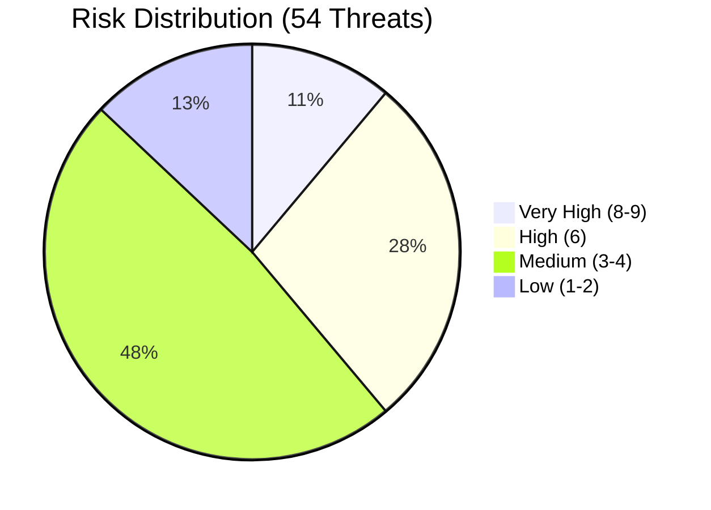

# Risk Assessment Matrix

## Document Information

| Field | Value |
|-------|-------|
| **Document Version** | 1.0 |
| **Last Updated** | 2025-05-18 |
| **Classification** | Internal |
| **Total Threats Identified** | 54 |

## 1. Risk Scoring Methodology

### Likelihood Scale

| Rating | Score | Description |
|--------|-------|-------------|
| **Low** | 1 | Requires specialized skills, insider access, or unlikely conditions |
| **Medium** | 2 | Feasible with moderate effort by authenticated users or sophisticated attackers |
| **High** | 3 | Readily exploitable with common tools or by any authenticated user |

### Severity Scale

| Rating | Score | Description |
|--------|-------|-------------|
| **Low** | 1 | Minimal impact, cosmetic or informational |
| **Medium** | 2 | Moderate impact on confidentiality, integrity, or availability for limited scope |
| **High** | 3 | Significant impact on confidentiality, integrity, or availability |
| **Critical** | 4 | Severe impact: complete data breach, system compromise, or total service loss |

### Risk Score

**Risk = Likelihood × Severity**

| Risk Score | Risk Level | Action Required |
|------------|-----------|-----------------|
| 1-2 | **Low** | Accept or monitor |
| 3-4 | **Medium** | Mitigate with standard controls |
| 6 | **High** | Prioritize mitigation |
| 8-9 | **Very High** | Immediate mitigation required |
| 12 | **Critical** | Block deployment until mitigated |

## 2. Complete Risk Register

### Very High Risk (Score 8-9)

| Threat ID | Threat | L | S | Risk | Component | Status |
|-----------|--------|---|---|------|-----------|--------|
| ASST.T01 | Prompt injection via meeting transcript content | 3 | 3 | **9** | Meeting Assistant | Mitigated |
| KB.T01 | Cross-meeting data leakage via Knowledge Base | 3 | 3 | **9** | Knowledge Base | Partially Mitigated |
| REC.T03 | Recording without consent (legal/privacy) | 3 | 3 | **9** | Recording/Storage | Partially Mitigated |
| VP.T04 | Unauthorized meeting recording via VP | 3 | 3 | **9** | Virtual Participant | Partially Mitigated |
| MCP.T01 | Data exfiltration via MCP tools | 2 | 4 | **8** | MCP Integration | Partially Mitigated |
| HOOK.T01 | Data exfiltration via hook Lambda | 2 | 4 | **8** | Lambda Hooks | Accepted |

### High Risk (Score 6)

| Threat ID | Threat | L | S | Risk | Component | Status |
|-----------|--------|---|---|------|-----------|--------|
| AUDIO.T01 | WebSocket connection hijacking | 2 | 3 | **6** | Audio Streaming | Mitigated |
| ASST.T03 | Agent tool abuse via manipulated context | 2 | 3 | **6** | Meeting Assistant | Partially Mitigated |
| KB.T02 | Knowledge Base poisoning via transcript | 2 | 3 | **6** | Knowledge Base | Partially Mitigated |
| KB.T03 | RAG context injection (indirect prompt injection) | 2 | 3 | **6** | Knowledge Base | Mitigated |
| VP.T01 | Meeting credential exposure | 2 | 3 | **6** | Virtual Participant | Partially Mitigated |
| VOICE.T01 | Wake phrase spoofing / false activation | 2 | 3 | **6** | Voice Assistant | Partially Mitigated |
| VOICE.T05 | Sensitive information vocalized in meetings | 2 | 3 | **6** | Voice Assistant | Partially Mitigated |
| MCP.T02 | MCP API key compromise (inbound) | 2 | 3 | **6** | MCP Integration | Mitigated |
| MCP.T03 | MCP response injection (prompt injection via tool) | 2 | 3 | **6** | MCP Integration | Mitigated |
| MCP.T06 | Cross-meeting data access via MCP tools | 2 | 3 | **6** | MCP Integration | Partially Mitigated |
| AUTH.T01 | Self-registration abuse | 2 | 3 | **6** | Authentication | Mitigated |
| AUTH.T02 | JWT token theft / session hijacking | 2 | 3 | **6** | Authentication | Mitigated |
| AUTH.T03 | Meeting access control bypass | 2 | 3 | **6** | Authentication | Mitigated |
| UI.T02 | AppSync subscription eavesdropping | 2 | 3 | **6** | Web UI | Mitigated |
| REC.T02 | Meeting data retention compliance violation | 2 | 3 | **6** | Recording/Storage | Partially Mitigated |

### Medium Risk (Score 3-4)

| Threat ID | Threat | L | S | Risk | Component | Status |
|-----------|--------|---|---|------|-----------|--------|
| AUDIO.T02 | Audio stream interception (eavesdropping) | 1 | 4 | **4** | Audio Streaming | Mitigated |
| AUDIO.T04 | Transcribe service abuse / cost escalation | 2 | 2 | **4** | Audio Streaming | Mitigated |
| AUDIO.T05 | Audio recording unauthorized access | 1 | 4 | **4** | Audio Streaming | Mitigated |
| AUDIO.T03 | Kinesis stream injection/tampering | 1 | 3 | **3** | Audio Streaming | Mitigated |
| ASST.T02 | LLM prompt template tampering | 1 | 4 | **4** | Meeting Assistant | Mitigated |
| ASST.T04 | Model hallucination in meeting summaries | 2 | 2 | **4** | Meeting Assistant | Mitigated |
| ASST.T05 | Automatic processing resource exhaustion | 2 | 2 | **4** | Meeting Assistant | Mitigated |
| VP.T02 | Headless Chrome sandbox escape | 1 | 4 | **4** | Virtual Participant | Mitigated |
| VP.T03 | Meeting platform API abuse | 2 | 2 | **4** | Virtual Participant | Partially Mitigated |
| VP.T05 | Voice assistant impersonation | 1 | 3 | **3** | Virtual Participant | Mitigated |
| VOICE.T02 | Voice synthesis deepfake abuse | 1 | 4 | **4** | Voice Assistant | Mitigated |
| VOICE.T03 | Third-party API key exposure (ElevenLabs/Simli) | 2 | 2 | **4** | Voice Assistant | Partially Mitigated |
| MCP.T05 | Unauthorized MCP tool registration | 1 | 3 | **3** | MCP Integration | Mitigated |
| KB.T04 | OpenSearch Serverless data exposure | 1 | 3 | **3** | Knowledge Base | Mitigated |
| AUTH.T04 | Admin group privilege escalation | 1 | 4 | **4** | Authentication | Mitigated |
| AUTH.T05 | WebSocket authentication weakness | 1 | 3 | **3** | Authentication | Mitigated |
| UI.T01 | XSS via transcript content | 1 | 3 | **3** | Web UI | Mitigated |
| UI.T03 | Iframe embedding security | 2 | 2 | **4** | Web UI | Partially Mitigated |
| UI.T04 | GraphQL API abuse / introspection | 2 | 2 | **4** | Web UI | Mitigated |
| REC.T01 | Unauthorized audio recording access | 1 | 4 | **4** | Recording/Storage | Mitigated |
| REC.T04 | Meeting sharing over-permission | 2 | 2 | **4** | Recording/Storage | Mitigated |
| REC.T05 | DynamoDB data exposure via IAM | 1 | 3 | **3** | Recording/Storage | Mitigated |
| HOOK.T02 | Hook result tampering | 1 | 3 | **3** | Lambda Hooks | Mitigated |
| HOOK.T03 | Hook Lambda failure cascade | 2 | 2 | **4** | Lambda Hooks | Mitigated |
| HOOK.T04 | Hook IAM over-privilege | 1 | 3 | **3** | Lambda Hooks | Mitigated |
| HOOK.T05 | Supply chain attack via hook dependencies | 1 | 3 | **3** | Lambda Hooks | Accepted |

### Low Risk (Score 1-2)

| Threat ID | Threat | L | S | Risk | Component | Status |
|-----------|--------|---|---|------|-----------|--------|
| AUDIO.T06 | Speaker attribution manipulation | 1 | 2 | **2** | Audio Streaming | Accepted |
| VP.T06 | Container resource exhaustion | 2 | 1 | **2** | Virtual Participant | Accepted |
| VOICE.T04 | Avatar video stream manipulation | 1 | 2 | **2** | Voice Assistant | Accepted |
| MCP.T04 | Rate limit bypass / DDoS via MCP API | 1 | 2 | **2** | MCP Integration | Mitigated |
| KB.T05 | Knowledge Base denial of service | 1 | 1 | **1** | Knowledge Base | Accepted |
| AUTH.T06 | WAF bypass / IP restriction evasion | 1 | 2 | **2** | Authentication | Mitigated |
| UI.T05 | CloudFront configuration exposure | 2 | 1 | **2** | Web UI | Accepted |

## 3. Risk Distribution Summary

### By Component

| Component | Very High | High | Medium | Low | Total |
|-----------|-----------|------|--------|-----|-------|
| Audio Streaming | 0 | 1 | 4 | 1 | 6 |
| Meeting Assistant | 1 | 1 | 3 | 0 | 5 |
| Virtual Participant | 1 | 1 | 3 | 1 | 6 |
| Voice Assistant | 0 | 2 | 2 | 1 | 5 |
| MCP Integration | 1 | 3 | 1 | 1 | 6 |
| Knowledge Base | 1 | 2 | 1 | 1 | 5 |
| Authentication | 0 | 3 | 2 | 1 | 6 |
| Web UI | 0 | 1 | 3 | 1 | 5 |
| Recording/Storage | 1 | 1 | 3 | 0 | 5 |
| Lambda Hooks | 1 | 0 | 4 | 0 | 5 |

### By STRIDE Category

| STRIDE Category | Threats | Highest Risk |
|----------------|---------|--------------|
| **Spoofing** | 9 | High (6) |
| **Tampering** | 16 | Very High (9) |
| **Repudiation** | 5 | Very High (9) |
| **Information Disclosure** | 19 | Very High (9) |
| **Denial of Service** | 8 | Medium (4) |
| **Elevation of Privilege** | 9 | Very High (9) |

### Mitigation Status

| Status | Count | Description |
|--------|-------|-------------|
| **Mitigated** | 33 | Controls implemented and verified |
| **Partially Mitigated** | 14 | Some controls in place, additional measures recommended |
| **Accepted** | 7 | Risk accepted with documented rationale |

## 4. Top 10 Priority Threats

These threats require the most attention based on risk score and business impact:

| Priority | Threat ID | Description | Risk Score | Status |
|----------|-----------|-------------|------------|--------|
| 1 | ASST.T01 | Prompt injection via meeting transcript content | 9 | Mitigated |
| 2 | KB.T01 | Cross-meeting data leakage via Knowledge Base | 9 | Partially Mitigated |
| 3 | REC.T03 | Recording without consent (legal/privacy) | 9 | Partially Mitigated |
| 4 | VP.T04 | Unauthorized meeting recording via VP | 9 | Partially Mitigated |
| 5 | MCP.T01 | Data exfiltration via MCP tools | 8 | Partially Mitigated |
| 6 | HOOK.T01 | Data exfiltration via hook Lambda | 8 | Accepted |
| 7 | ASST.T03 | Agent tool abuse via manipulated context | 6 | Partially Mitigated |
| 8 | VP.T01 | Meeting credential exposure | 6 | Partially Mitigated |
| 9 | VOICE.T05 | Sensitive information vocalized in meetings | 6 | Partially Mitigated |
| 10 | REC.T02 | Data retention compliance violation | 6 | Partially Mitigated |

## 5. Recommendations

### Immediate Actions (Very High/Critical Risk, Partially Mitigated)

1. **Cross-Meeting KB Access Control (KB.T01)**: Implement metadata-based filtering in KB queries restricting results to meetings the user has access to; add meeting access metadata to indexed documents
2. **Consent Workflow (REC.T03, VP.T04)**: Implement mandatory consent notification before recording begins; add configurable consent acknowledgment workflow
3. **MCP Data Classification (MCP.T01)**: Implement data sensitivity classification on MCP tool parameters; add VPC egress controls with endpoint allowlists
4. **Agent Tool Scoping (ASST.T03)**: Implement per-meeting tool authorization; add confirmation step for high-impact tool calls

### Short-Term Actions (High Risk, Partially Mitigated)

5. **VP Credential Security (VP.T01)**: Migrate meeting credentials to AWS Secrets Manager; implement log scrubbing
6. **Voice Response Filtering (VOICE.T05)**: Implement sensitivity classification for voice responses; restrict voice-mode to current meeting queries
7. **Wake Phrase Security (VOICE.T01)**: Add speaker verification; implement confirmation prompts for sensitive queries
8. **MCP Cross-Meeting Scoping (MCP.T06)**: Enforce user identity and meeting context in all MCP tool calls
9. **Data Retention Alignment (REC.T02)**: Implement unified deletion across all stores; document retention architecture
10. **API Key Security (VOICE.T03)**: Migrate third-party keys to Secrets Manager with rotation

### Ongoing Monitoring

1. **Prompt injection detection**: Monitor for unusual agent behavior and unexpected tool invocations
2. **KB access patterns**: Alert on users querying for content from meetings they don't own
3. **MCP tool invocation audit**: Regular review of MCP tool calls and data volumes
4. **Recording consent audit**: Verify consent mechanisms are active for all recording sessions
5. **VP launch monitoring**: Alert on unusual VP launch patterns or failed meeting joins
